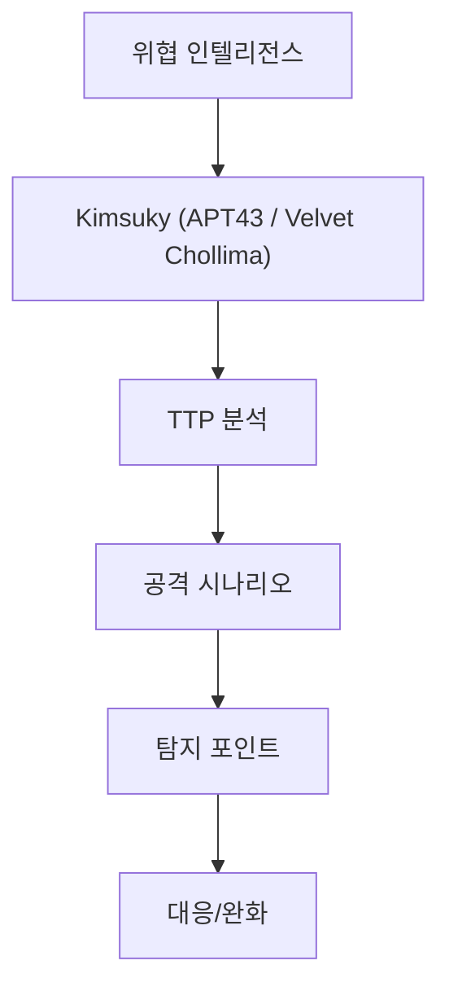

# Kimsuky (APT43 / Velvet Chollima)
## 구조 다이어그램




## 개요

| 항목 | 내용 |
|------|------|
| **활동 시기** | 2012년 ~ 현재 |
| **소속** | 북한 정찰총국 (RGB) |
| **표적 지역** | 한국, 미국, 일본, 유럽 |
| **표적 섹터** | 통일/외교/안보 분야 전문가, 정부기관, 싱크탱크, 언론, 학계 |
| **공격 목적** | 정보 수집 (북한 핵/미사일 정책 관련 정보, 대북 정책 동향) |
| **주요 기법** | Spearphishing, 자격증명 탈취, 문서형 악성코드 |

---

## 캠페인 특성

Kimsuky는 북한의 대표적인 사이버 첩보 그룹으로, **사회공학(Social Engineering)**에 특화되어 있습니다. 기술적으로 정교한 공격보다는 표적에 대한 철저한 사전 조사를 통해 신뢰를 구축한 후 공격하는 방식을 선호합니다.

**특징적 패턴:**
- 학술 세미나 초청, 논문 검토 요청 등 **정상 메일을 먼저 발송**하여 신뢰 구축
- 수일~수주 후 악성 첨부파일 또는 피싱 링크 발송
- `.hwp`, `.docx`, `.pdf` 문서형 악성코드 적극 활용
- 한국 주요 포털(Naver, Daum) 사칭 로그인 페이지로 자격증명 탈취
- 피해자의 이메일 자동 전달 규칙 설정으로 **지속적 정보 수집**

---

## 주요 악성코드

| 악성코드 | 유형 | 설명 |
|----------|------|------|
| **BabyShark** | Script-based Backdoor | VBS/PowerShell 기반 정찰 → C2 통신 |
| **AppleSeed** | Backdoor | 키로깅, 스크린샷, 파일 수집, USB 전파 |
| **FlowerPower** | PowerShell Backdoor | 시스템 정보 수집 → C2 전송 |
| **RandomQuery** | Info-Stealer | 파일 목록/시스템 정보 수집 특화 |
| **GoldDragon** | Backdoor | 다단계 감염 체인의 최종 페이로드 |

---

## 공격 흐름

```
[사전 정찰]
  표적 프로파일링 (SNS, 논문, 발표자료 분석)
      ↓
[신뢰 구축 — Social Engineering]
  정상 메일 1~3회 발송 (학술 토론, 인터뷰 요청 등)
      ↓
[Initial Access — T1566.001, T1566.002]
  Case A: 악성 첨부파일 (.hwp/.docx 매크로, .lnk)
  Case B: 피싱 링크 (Naver/Daum 사칭 로그인 페이지)
      ↓
[Credential Harvesting — T1056.004]
  사칭 포털 로그인 페이지에서 ID/PW 수집
      ↓
[Email Access — T1114.002]
  탈취한 자격증명으로 피해자 이메일 접근
  자동 전달 규칙 설정 → 지속적 모니터링
      ↓
[Execution — T1059.001, T1059.005]
  문서 매크로 → PowerShell/VBScript 실행
  BabyShark / AppleSeed 드롭
      ↓
[Discovery — T1082, T1083, T1057]
  시스템 정보, 파일 목록, 프로세스 수집
      ↓
[Collection — T1005, T1056.001]
  키로깅, 스크린샷, 문서 파일 수집
      ↓
[Exfiltration — T1041]
  HTTP POST로 C2 서버에 수집 데이터 전송
```

---

## 주요 TTP (MITRE ATT&CK)

| Tactic | Technique ID | Technique Name | Kimsuky 구현 |
|--------|--------------|----------------|-------------|
| Reconnaissance | T1598.003 | Phishing for Information | 사전 정찰 메일, 표적 프로파일링 |
| Initial Access | T1566.001 | Spearphishing Attachment | .hwp/.docx/.lnk 악성 첨부 |
| Initial Access | T1566.002 | Spearphishing Link | 포털 사칭 피싱 페이지 |
| Execution | T1059.001 | PowerShell | BabyShark/FlowerPower 실행 |
| Execution | T1059.005 | Visual Basic | 문서 매크로 실행 |
| Execution | T1204.002 | User Execution: Malicious File | 사용자 문서 실행 유도 |
| Persistence | T1547.001 | Registry Run Keys | 자동 실행 등록 |
| Persistence | T1053.005 | Scheduled Task | 예약 작업 기반 지속성 |
| Defense Evasion | T1027 | Obfuscated Files | 스크립트 난독화 |
| Credential Access | T1056.004 | Credential API Hooking | 웹 자격증명 수집 |
| Discovery | T1082 | System Information Discovery | 시스템 정보 수집 |
| Discovery | T1057 | Process Discovery | 프로세스 목록 수집 |
| Collection | T1005 | Data from Local System | 문서 파일 수집 |
| Collection | T1056.001 | Keylogging | 키 입력 기록 |
| Collection | T1113 | Screen Capture | 스크린샷 캡처 |
| Exfiltration | T1041 | Exfiltration Over C2 Channel | HTTP POST 기반 전송 |
| Credential Access | T1114.002 | Remote Email Collection | 이메일 자동 전달 설정 |

---

## 탐지 포인트

### 이메일 기반
- 한국 포털(Naver, Daum) 사칭 도메인 차단 (`naver-login[.]com`, `daum-verify[.]net` 등)
- 이메일 자동 전달 규칙 변경 모니터링
- `.lnk` 파일이 포함된 `.zip` 첨부 탐지

### 엔드포인트
- HWP 프로세스(`hwp.exe`)에서 `cmd.exe` / `powershell.exe` 자식 프로세스 생성
- `%APPDATA%`, `%TEMP%` 경로에서 VBS/PS1 스크립트 실행
- 비정상적인 Scheduled Task 등록 (이름이 시스템 서비스를 모방)

### 네트워크
- HTTP POST로 시스템 정보를 Base64 인코딩하여 전송하는 패턴
- 한국 포털 로그인 페이지를 모방한 피싱 인프라 접근

---

## 참고자료

1. [MITRE ATT&CK — Kimsuky](https://attack.mitre.org/groups/G0094/)
2. [CISA — North Korean APT Kimsuky](https://www.cisa.gov/news-events/cybersecurity-advisories/aa20-301a)
3. [AhnLab ASEC — Kimsuky 분석](https://asec.ahnlab.com/ko/tag/kimsuky/)
4. [Mandiant — APT43 Report](https://www.mandiant.com/resources/blog/apt43-north-korea-cybercrime-espionage)
5. [KISA — Kimsuky 공격 동향](https://www.boho.or.kr/)
