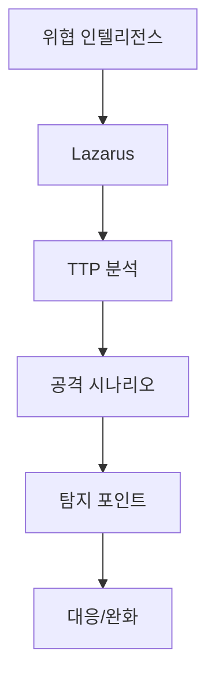

# Lazarus
## 구조 다이어그램

```mermaid
flowchart TD
    Intel["위협 인텔리전스"] --> Actor["Lazarus"]
    Actor --> TTP["TTP 분석"]
    TTP --> Scenario["공격 시나리오"]
    Scenario --> Detection["탐지 포인트"]
    Detection --> Response["대응/완화"]
```

Lazarus 관련 분석 및 시나리오 문서입니다.

- [Lazarus 도메인 정책 기반 인프라 장악 시나리오](Scenario-Domain-Policy-PMS.md)
- [Lazarus Magic Rat Campaign 분석 요약](Magic-Rat-Campaign.md)
