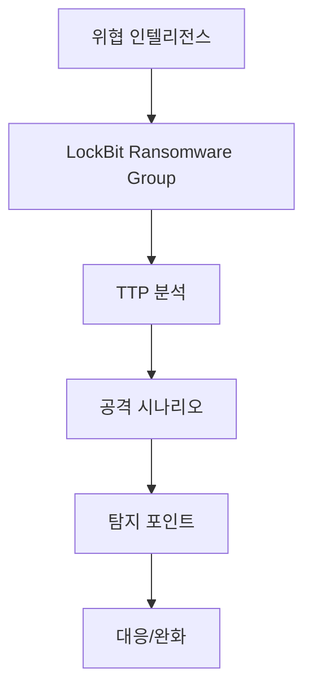

# LockBit Ransomware Group
## 구조 다이어그램

## 개요

| 항목 | 내용 |
|------|------|
| **활동 시기** | 2019년 ~ 현재 |
| **유형** | RaaS (Ransomware-as-a-Service) |
| **표적 지역** | 전 세계 (미국, 유럽, 아시아 등) |
| **표적 섹터** | 제조업, 의료, 금융, IT, 공공기관 |
| **공격 목적** | 금전 갈취 (이중 갈취: 암호화 + 데이터 유출) |
| **주요 기법** | Salsa20/ChaCha20 암호화, 자동 전파, UAC 우회 |

---

## 버전 히스토리

| 버전 | 시기 | 특징 |
|------|------|------|
| LockBit 1.0 | 2019 | `.abcd` 확장자, 기본 암호화 |
| **LockBit 2.0** | 2021 | StealBit 데이터 유출, 자동 전파, 속도 최적화 |
| LockBit 3.0 (Black) | 2022 | Bug Bounty 프로그램, 코드 유출 |
| LockBit Green | 2023 | Conti 코드 기반, ESXi 지원 |

---

## 분석 자료

| 문서 | 핵심 내용 |
|------|-----------|
| [LockBit 2.0 정적 분석 보고서](../../Malware-Analysis/LockBit-2.0/README.md) | Ghidra 기반 정적 분석, 암호화 흐름, IOC, YARA Rule |

---

## 주요 TTP

### Initial Access
- **T1566.001** Spearphishing Attachment — 악성 문서/매크로 첨부
- **T1078** Valid Accounts — RDP 자격증명 탈취/구매
- **T1190** Exploit Public-Facing Application — VPN/방화벽 취약점 악용

### Execution
- **T1059.001** PowerShell — 초기 로더 실행
- **T1204.002** User Execution: Malicious File — 사용자 실행 유도

### Persistence
- **T1547.001** Registry Run Keys — `HKLM\...\CurrentVersion\Run` 등록
- **T1053.005** Scheduled Task — 예약 작업 기반 지속성

### Privilege Escalation
- **T1548.002** Bypass UAC — UAC 우회 후 권한 상승

### Defense Evasion
- **T1562.001** Impair Defenses — 보안 서비스 비활성화
- **T1070.004** File Deletion — `fsutil` 기반 보안 삭제

### Credential Access
- **T1003.001** LSASS Memory Dump — Mimikatz 활용

### Discovery
- **T1082** System Information Discovery — 볼륨/드라이브 열거
- **T1083** File and Directory Discovery — 암호화 대상 탐색

### Lateral Movement
- **T1021.001** Remote Desktop Protocol — RDP 기반 횡이동
- **T1021.002** SMB/Windows Admin Shares — 네트워크 공유 전파

### Impact
- **T1486** Data Encrypted for Impact — Salsa20 + RSA 암호화
- **T1490** Inhibit System Recovery — VSS 삭제
- **T1489** Service Stop — 데이터베이스/백업 서비스 종료

---

## IOC 요약

### 네트워크
| 항목 | 값 |
|------|-----|
| Tor C2 | `lockbitapt6vx57t3eeqjofwgcglmutr3a35nygvokja5uuccip4ykyd.onion` |
| 대체 사이트 | `bigblog.at` |

### 파일
- `LockBit_Ransomware.hta`
- `RESTORE-MY-FILES.TXT`
- `*.lockbit` (암호화된 파일)

---

## 참고자료

1. [MITRE ATT&CK — LockBit](https://attack.mitre.org/software/S0690/)
2. [CISA — Understanding LockBit](https://www.cisa.gov/news-events/cybersecurity-advisories/aa23-165a)
3. [Trend Micro — LockBit Ransomware](https://www.trendmicro.com/vinfo/us/security/news/ransomware-spotlight/ransomware-spotlight-lockbit)
