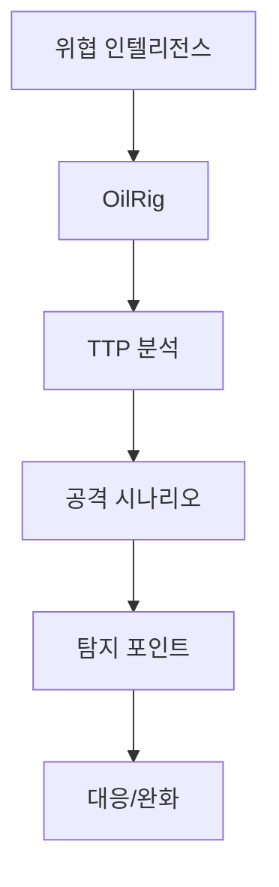

# OilRig
## 구조 다이어그램

```mermaid
flowchart TD
    Intel["위협 인텔리전스"] --> Actor["OilRig"]
    Actor --> TTP["TTP 분석"]
    TTP --> Scenario["공격 시나리오"]
    Scenario --> Detection["탐지 포인트"]
    Detection --> Response["대응/완화"]
```

OilRig 관련 분석 및 시나리오 문서입니다.

- [OilRig DB 백업 유출 시나리오](Scenario-DB-Backup-Exfil.md)
