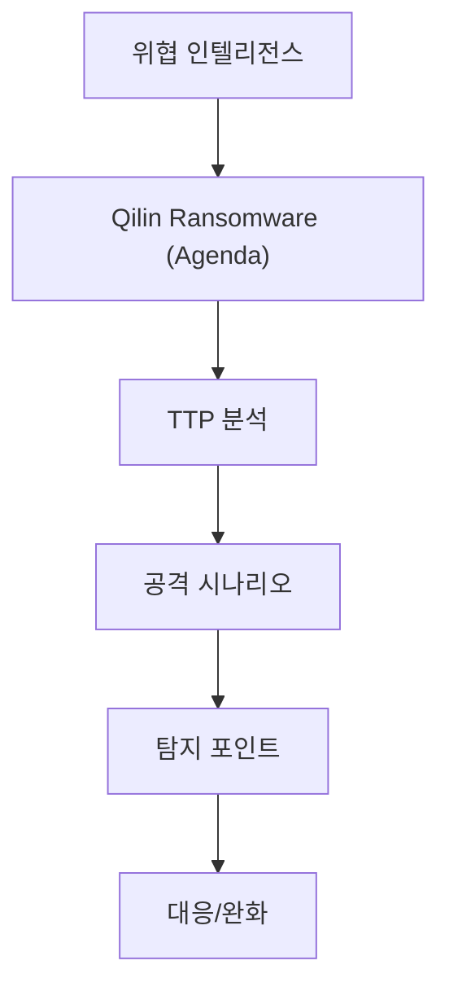

# Qilin Ransomware (Agenda)

  
  Image: cottonbro studio / Pexels

## 구조 다이어그램

## 개요

| 항목 | 내용 |
|------|------|
| **유형** | RaaS (Ransomware-as-a-Service) |
| **언어** | Rust (크로스 플랫폼: Windows, Linux, ESXi) |
| **암호화** | AES-CTR / ChaCha20 + RSA-4096 |
| **세대** | 3세대 — 다중 갈취 + 공급망 공격 |
| **주요 사건** | 2025.09 국내 금융권 MSP 침해 (28개+ 금융사 동시 감염) |

---

## 분석 자료

| 문서 | 핵심 내용 | ATT&CK |
|------|-----------|--------|
| [Ransomware Trend Analysis](Ransomware-Trend-Analysis.md) | 랜섬웨어 트렌드 변화, 금융권 공급망 공격 사례, 7단계 공격 분석, Cheiron 25 Procedures | T1486, T1490, T1562.001, T1112 |

---

## 주요 TTP

- **Defense Evasion**: SafeBoot 모드 전환으로 EDR 우회 (T1562.001)
- **Impact**: VSS 삭제 → 메모리 기반 암호화 → 배경화면 변경 (T1490, T1486, T1491.001)
- **Persistence**: Registry Run Key + Scheduled Task (T1547.001, T1053.005)
- **Lateral Movement**: RDP를 통한 측면 이동 (T1021.001)
- **Discovery**: Native API 기반 시스템/파일/네트워크 정찰 (T1082, T1083, T1135)
