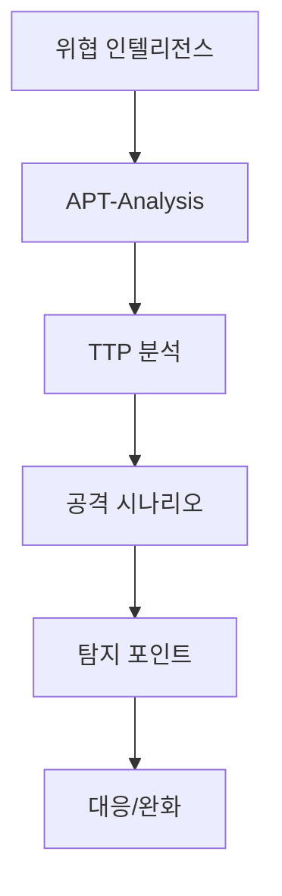

# APT-Analysis

  
  Image: cottonbro studio / Pexels

## 구조 다이어그램

APT 그룹별 자료를 모아둔 폴더입니다.

## Groups
- [Andariel](Andariel/README.md)
- [Kimsuky](Kimsuky/README.md)
- [Lazarus](Lazarus/README.md)
- [Lockbit](Lockbit/README.md)
- [OilRig](OilRig/README.md)
- [Qilin](Qilin/README.md)
- [SideWinder](SideWinder/README.md)

## Featured Scenarios
- [OilRig DB 백업 유출 시나리오](OilRig/Scenario-DB-Backup-Exfil.md)
- [Lazarus 도메인 정책 기반 인프라 장악 시나리오](Lazarus/Scenario-Domain-Policy-PMS.md)
- [SideWinder Template Injection to Stealer](SideWinder/Template-Injection-Stealer.md)
- [Qilin Ransomware Trend Analysis](Qilin/Ransomware-Trend-Analysis.md)
