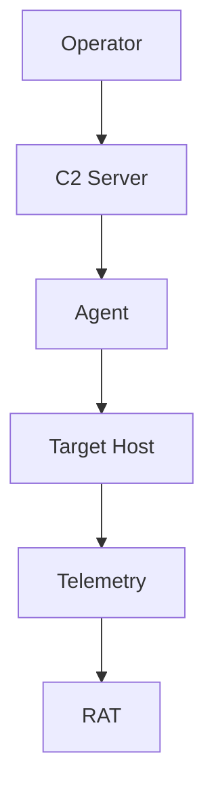

# RAT
## 구조 다이어그램

```mermaid
flowchart TD
    Operator["Operator"] --> Server["C2 Server"]
    Server --> Agent["Agent"]
    Agent --> Host["Target Host"]
    Host --> Telemetry["Telemetry"]
    Telemetry --> Report["RAT"]
```

Rat Testing
