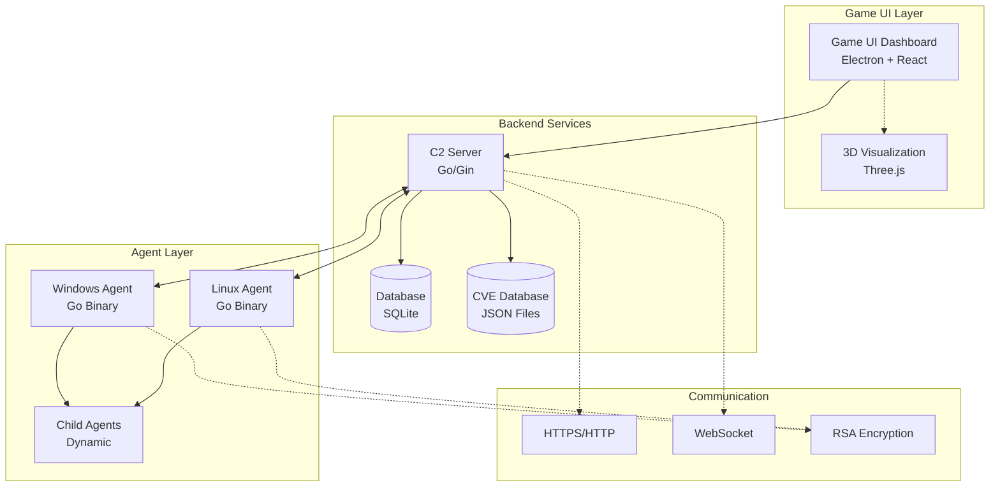
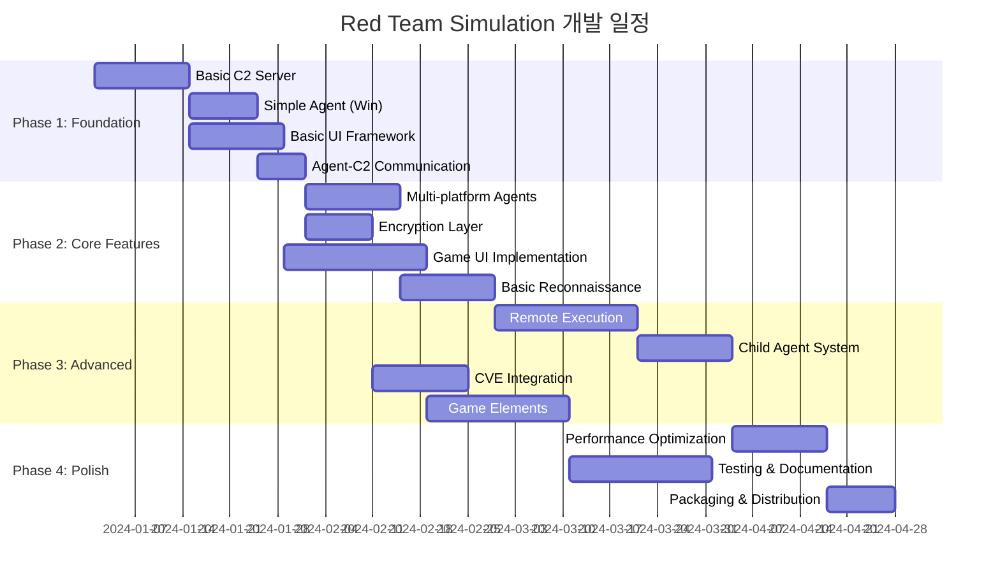
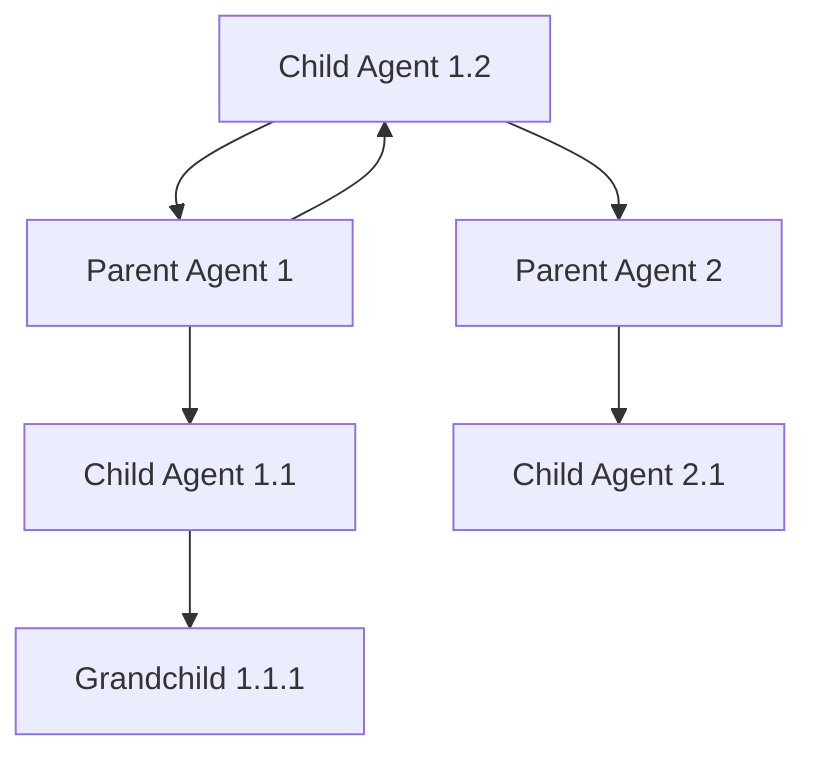
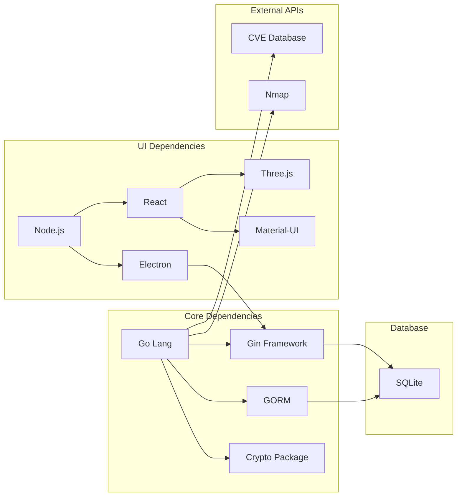

# Red Team Simulation 개인 개발 설계서

## 프로젝트 개요
게임 GUI를 활용한 공격 시뮬레이션 도구 개발 - 1인 개발자용 설계서

---

## 전체 아키텍처



---

## 1인 개발 최적화 전략

### 기술 스택 결정
- **Backend**: Go (단일 바이너리, 크로스 컴파일, 간단한 배포)
- **Frontend**: Electron + React (웹 기술 활용, 빠른 프로토타이핑)
- **Database**: SQLite (파일 기반, 설정 불필요)
- **Communication**: HTTP/WebSocket (표준 프로토콜)

### MVP(Minimum Viable Product) 접근
복잡한 기능을 단계별로 나누어 각 단계마다 동작하는 제품을 만들어 나가는 방식

---

## 개발 로드맵 및 의존성



---

## Phase 1: Foundation (5주)

### 1.1 Basic C2 Server (2주)
**우선순위**: 최고 ⭐⭐⭐⭐⭐  
**의존성**: 없음

#### 구현 목표
- HTTP API 서버 (Go + Gin)
- 에이전트 등록/해제
- 기본 명령 전송/수신
- SQLite 데이터베이스 연동

#### 핵심 API 엔드포인트
```go
// 에이전트 관리
POST   /api/agents/register    // 에이전트 등록
GET    /api/agents             // 에이전트 목록
DELETE /api/agents/{id}        // 에이전트 삭제

// 명령 관리
POST   /api/commands           // 명령 전송
GET    /api/commands/{agent_id} // 명령 결과 조회
```

#### 기술 스택
- **Framework**: Gin-Gonic
- **Database**: GORM + SQLite
- **Logging**: Logrus

#### 참고 자료
- [Gin Framework Documentation](https://gin-gonic.com/docs/)
- [GORM Documentation](https://gorm.io/docs/)

### 1.2 Simple Windows Agent (1.5주)
**우선순위**: 최고 ⭐⭐⭐⭐⭐  
**의존성**: Basic C2 Server 완료

#### 구현 목표
- Windows 실행 파일 생성
- C2 서버 연결 및 등록
- 기본 명령 실행 (cmd 명령)
- 하트비트 전송

#### 핵심 기능
```go
type Agent struct {
    ID       string
    Hostname string
    OS       string
    Arch     string
    User     string
}

// 기본 명령 실행
func ExecuteCommand(cmd string) (string, error)
// 하트비트 전송  
func SendHeartbeat() error
// C2 연결
func ConnectToC2(serverURL string) error
```

#### 빌드 스크립트
```bash
# Windows 64bit
GOOS=windows GOARCH=amd64 go build -o agent_win64.exe ./cmd/agent

# Windows 32bit  
GOOS=windows GOARCH=386 go build -o agent_win32.exe ./cmd/agent
```

### 1.3 Basic UI Framework (2주)
**우선순위**: 높음 ⭐⭐⭐⭐  
**의존성**: 없음 (병렬 개발 가능)

#### 구현 목표
- Electron 앱 기본 구조
- React 컴포넌트 설정
- C2 서버 API 연동
- 에이전트 목록 표시

#### 프로젝트 구조
```
ui/
├── public/
├── src/
│   ├── components/
│   │   ├── Dashboard.tsx
│   │   ├── AgentList.tsx
│   │   └── CommandPanel.tsx
│   ├── services/
│   │   └── api.ts
│   └── App.tsx
├── package.json
└── electron.js
```

#### 핵심 컴포넌트
- **Dashboard**: 메인 대시보드
- **AgentList**: 에이전트 목록 및 상태
- **CommandPanel**: 명령 입력 및 결과 표시

### 1.4 Agent-C2 Communication (1주)
**우선순위**: 최고 ⭐⭐⭐⭐⭐  
**의존성**: Basic C2 Server, Simple Agent 완료

#### 구현 목표
- HTTP 통신 안정화
- 에러 처리 및 재연결 로직
- 기본 보안 (API 키)
- 통신 로깅

#### 통신 프로토콜
```json
// 등록 요청
{
  "agent_id": "uuid",
  "hostname": "PC-001",
  "os": "windows",
  "arch": "amd64",
  "user": "Administrator"
}

// 명령 요청/응답
{
  "command_id": "uuid",
  "command": "whoami",
  "result": "DOMAIN\\user",
  "status": "completed",
  "timestamp": "2024-01-01T12:00:00Z"
}
```

---

## Phase 2: Core Features (7주)

### 2.1 Multi-platform Agents (2주)
**우선순위**: 높음 ⭐⭐⭐⭐  
**의존성**: Phase 1 완료

#### 구현 목표
- Linux 에이전트 추가
- Ubuntu/RedHat 호환성
- 플랫폼별 빌드 자동화
- 에이전트 버전 관리

#### 빌드 스크립트 확장
```bash
#!/bin/bash
# build.sh

platforms=(
    "windows/amd64"
    "windows/386" 
    "linux/amd64"
    "linux/386"
    "linux/arm64"
)

for platform in "${platforms[@]}"
do
    platform_split=(${platform//\// })
    GOOS=${platform_split[0]}
    GOARCH=${platform_split[1]}
    
    output_name="agent_${GOOS}_${GOARCH}"
    if [ $GOOS = "windows" ]; then
        output_name+='.exe'
    fi
    
    env GOOS=$GOOS GOARCH=$GOARCH go build -o dist/$output_name ./cmd/agent
done
```

### 2.2 Encryption Layer (1.5주)
**우선순위**: 높음 ⭐⭐⭐⭐  
**의존성**: Multi-platform Agents 완료

#### 구현 목표
- RSA 키 교환
- AES 대칭 암호화
- HTTPS 통신
- 키 관리 시스템

#### 암호화 구조
```go
type CryptoManager struct {
    PrivateKey *rsa.PrivateKey
    PublicKey  *rsa.PublicKey
    AESKey     []byte
}

func (cm *CryptoManager) GenerateKeyPair() error
func (cm *CryptoManager) EncryptCommand(data []byte) ([]byte, error)
func (cm *CryptoManager) DecryptResponse(data []byte) ([]byte, error)
```

### 2.3 Game UI Implementation (3주)
**우선순위**: 중상 ⭐⭐⭐  
**의존성**: Basic UI Framework 완료

#### 구현 목표
- 호요버스 스타레일 스타일 UI
- 3D 네트워크 시각화
- 실시간 상태 업데이트
- 애니메이션 효과

#### 주요 컴포넌트
- **3D Network Map**: Three.js로 네트워크 토폴로지 표시
- **Agent Status Cards**: 각 에이전트의 상태를 카드 형태로 표시
- **Command Terminal**: 게임 스타일 터미널
- **Mission Progress**: 진행도 표시

#### 기술 스택
- **3D Graphics**: Three.js
- **UI Components**: Material-UI 또는 Ant Design
- **Animation**: Framer Motion
- **State Management**: Redux Toolkit

### 2.4 Basic Reconnaissance (2주)
**우선순위**: 중상 ⭐⭐⭐  
**의존성**: Encryption Layer 완료

#### 구현 목표
- 호스트 디스커버리
- 포트 스캐닝
- 서비스 열거
- OS 핑거프린팅

#### 정찰 모듈
```go
type ReconModule struct {
    Target string
    Ports  []int
}

func (r *ReconModule) DiscoverHosts(network string) ([]string, error)
func (r *ReconModule) ScanPorts(host string) ([]Port, error)
func (r *ReconModule) EnumerateServices(host string, port int) (*Service, error)
```

---

## Phase 3: Advanced Features (10주)

### 3.1 Remote Execution (3주)
**우선순위**: 최고 ⭐⭐⭐⭐⭐  
**의존성**: Phase 2 완료

#### 구현 목표
- WMI/WMIC 명령 실행
- DCOM 객체 활용
- WinRM 연결
- PSExec 스타일 실행

#### 원격 실행 구조
```go
type RemoteExecutor interface {
    ExecuteCommand(target, command string, creds *Credentials) (*Result, error)
}

type WMIExecutor struct{}
type DCOMExecutor struct{}
type WinRMExecutor struct{}
type PSExecExecutor struct{}
```

#### 단계별 구현
1. **주 1-2**: WMI 기반 실행
2. **주 3**: DCOM 객체 활용
3. **주 4**: WinRM 구현
4. **주 5**: PSExec 스타일

### 3.2 Child Agent System (2주)
**우선순위**: 높음 ⭐⭐⭐⭐  
**의존성**: Remote Execution 완료

#### 구현 목표
- 동적 페이로드 생성
- 부모-자식 통신
- 에이전트 계층 관리
- 실패 복구 로직

#### 에이전트 계층 구조


### 3.3 CVE Integration (2주)
**우선순위**: 중 ⭐⭐⭐  
**의존성**: Basic Reconnaissance 완료

#### 구현 목표
- CVE 데이터베이스 구축
- 취약점 매칭 시스템
- 익스플로잇 제안
- 자동 업데이트

#### CVE 데이터 구조
```go
type CVE struct {
    ID          string    `json:"cve_id"`
    CVSS        float64   `json:"cvss_score"`
    Description string    `json:"description"`
    Affected    []string  `json:"affected_products"`
    Exploits    []Exploit `json:"available_exploits"`
}

type VulnScanner struct {
    CVEDatabase []CVE
}

func (vs *VulnScanner) ScanForVulnerabilities(services []Service) []CVE
```

### 3.4 Game Elements (3주)
**우선순위**: 중하 ⭐⭐  
**의존성**: Game UI Implementation 완료

#### 구현 목표
- 스킬 트리 시스템
- 진행도 추적
- 성취 시스템
- 시나리오 모드

#### 게임화 요소
```go
type Player struct {
    Level       int
    Experience  int
    Skills      map[string]int
    Achievements []Achievement
}

type Mission struct {
    ID          string
    Title       string
    Objectives  []Objective
    Reward      Reward
    Difficulty  int
}
```

---

## Phase 4: Polish & Release (6주)

### 4.1 Performance Optimization (2주)
**우선순위**: 중 ⭐⭐⭐  
**의존성**: Phase 3 완료

#### 최적화 목표
- 메모리 사용량 최적화
- 네트워크 트래픽 압축
- UI 렌더링 최적화
- 데이터베이스 쿼리 최적화

### 4.2 Testing & Documentation (3주)
**우선순위**: 높음 ⭐⭐⭐⭐  
**의존성**: Performance Optimization 완료

#### 테스트 계획
- 단위 테스트 (Go 백엔드)
- 통합 테스트 (API)
- E2E 테스트 (UI)
- 부하 테스트

### 4.3 Packaging & Distribution (1주)
**우선순위**: 중 ⭐⭐⭐  
**의존성**: Testing 완료

#### 배포 목표
- Electron 앱 패키징
- 플랫폼별 인스톨러
- 자동 업데이트 시스템
- 사용자 매뉴얼

---

## 기술적 의존성 맵



---

## 리스크 관리

### 높은 리스크 항목
1. **원격 실행 모듈**: 가장 복잡한 부분, 플랫폼별 차이 큼
2. **암호화 통신**: 보안 구현의 복잡성
3. **게임 UI**: 디자인 및 UX 경험 필요

### 리스크 완화 전략
- **프로토타입 우선**: 각 기능의 간단한 버전을 먼저 구현
- **점진적 개선**: MVP → 기능 확장 → 최적화 순서
- **외부 라이브러리 활용**: 바닥부터 구현하지 말고 검증된 라이브러리 사용

---

## 개발 환경 설정

### 필수 도구
```bash
# Go 설치 (1.21+)
go version

# Node.js 설치 (18+)
node --version
npm --version

# Git
git --version

# 에디터 (VS Code 추천)
# Go Extension
# ES7+ React Extension
```

### 프로젝트 구조
```
red-team-sim/
├── cmd/
│   ├── server/         # C2 서버
│   └── agent/          # 에이전트
├── internal/
│   ├── agent/          # 에이전트 로직
│   ├── server/         # 서버 로직
│   ├── crypto/         # 암호화
│   └── recon/          # 정찰 모듈
├── ui/                 # Electron UI
├── build/              # 빌드 스크립트
├── docs/               # 문서
└── test/               # 테스트
```

---

## 총 개발 예상 기간: 28주 (약 7개월)

이 설계서는 1인 개발자가 체계적으로 접근할 수 있도록 작성되었습니다. 각 단계마다 동작하는 제품을 만들어 나가므로 중간에 우선순위를 조정하거나 일부 기능을 생략할 수 있는 유연성을 제공합니다.