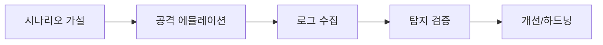

# BAS Scenarios
## 구조 다이어그램

BAS(Breach & Attack Simulation) 기반 공격 시나리오 목록입니다.  
각 시나리오는 **공격 흐름 → 시뮬레이션 커맨드 → 탐지(Sigma/YARA Rule) → 대응 방안** 구조로 작성되었습니다.

---

## 시나리오 목록

| 시나리오 | 핵심 기법 | ATT&CK |
|----------|-----------|--------|
| [Visual Studio 취약점 기반 감염](Scenario-Visual-Studio-Infection.md) | CVE-2024-20656, Reflective Injection | T1190, T1055 |
| [CIS Benchmark 점검](Scenario-CIS-Benchmark-Audit.md) | CIS Benchmark 자동화 점검 | - |
| [Qilin SafeMode 우회](Scenario-Qilin-SafeMode.md) | bcdedit SafeMode → EDR 비활성화 → 랜섬웨어 | T1562.009, T1486 |
| [SideWinder DLL Sideloading](Scenario-SideWinder-DLL-Sideloading.md) | vsstrace.dll Sideloading, ConfuserEx | T1574.002, T1027 |
| [Git Credential 탈취](Scenario-Git-Credential-Theft.md) | credential.helper store 평문 저장 | T1552.001 |
