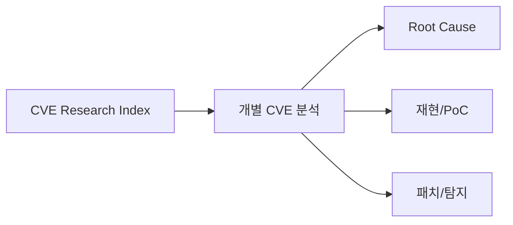

# 2017
## 구조 다이어그램

```mermaid
flowchart LR
    Index["CVE Research Index"] --> Entries["개별 CVE 분석"]
    Entries --> RootCause["Root Cause"]
    Entries --> Repro["재현/PoC"]
    Entries --> Defense["패치/탐지"]
```

- [CVE-2017-10217](#/CVE-Research/2017/CVE-2017-10217/README)
