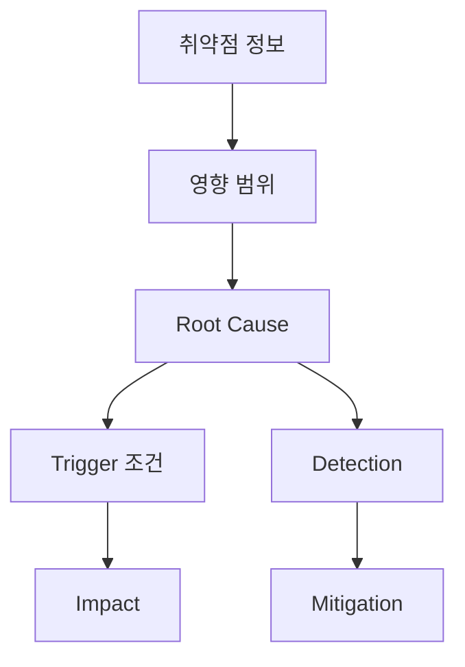

  
  Image: TimSon Foox / Pexels

## 구조 다이어그램

## Escalation Info
**Update:** This exploit is now getting patched. 

Link: https://www.cve.org/CVERecord?id=CVE-2024-26169  
Video PoC: https://vimeo.com/928483618

## Notes
**The exploit cannot be executed twice.** 
