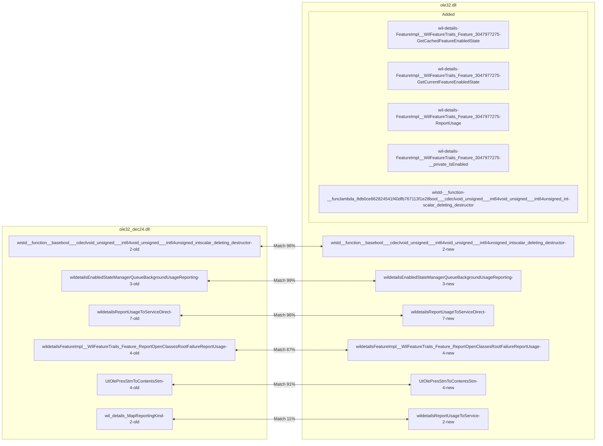
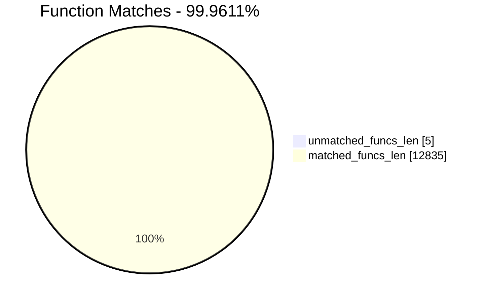
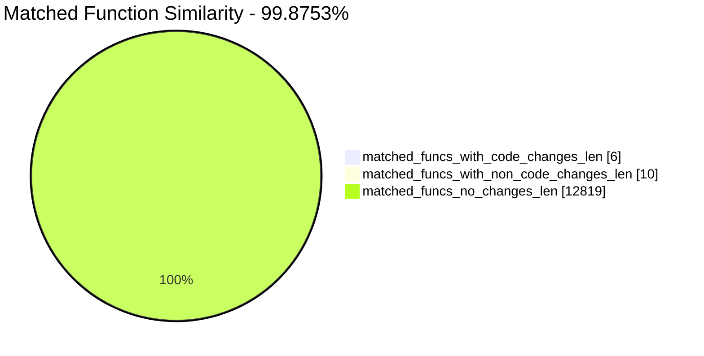
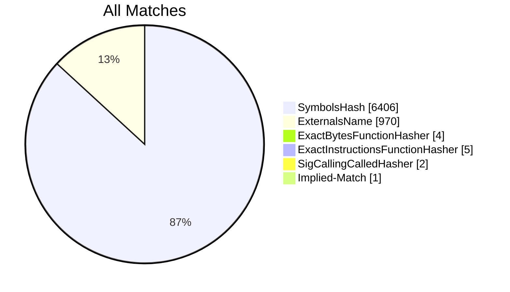
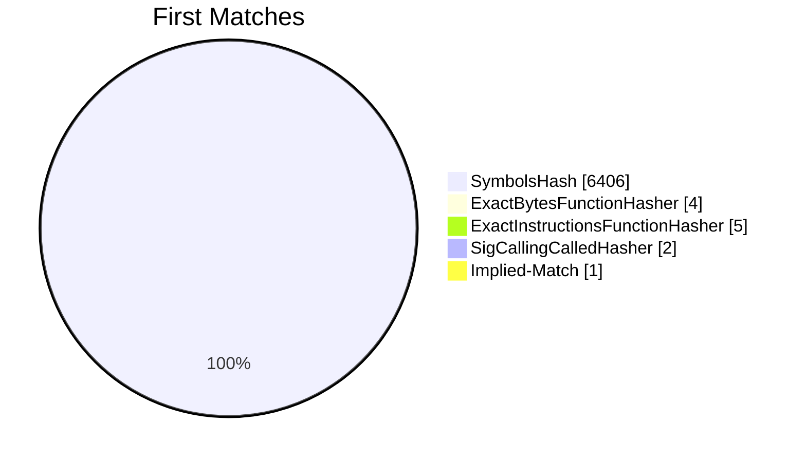
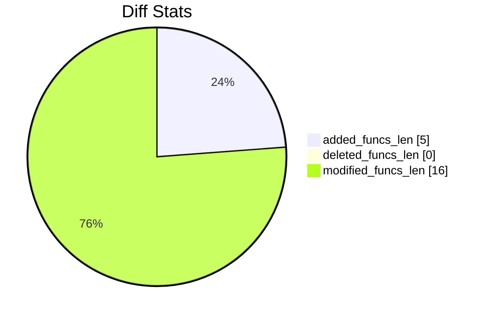
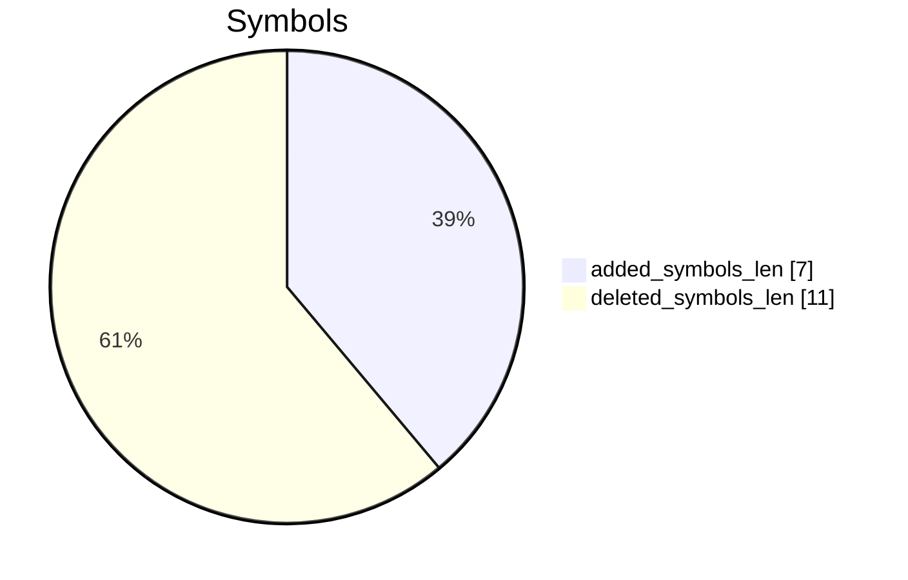

# ole32_dec24.dll-ole32.dll Diff

# TOC

* [Visual Chart Diff](#visual-chart-diff)
* [Metadata](#metadata)
	* [Ghidra Diff Engine](#ghidra-diff-engine)
		* [Command Line](#command-line)
	* [Binary Metadata Diff](#binary-metadata-diff)
	* [Program Options](#program-options)
	* [Diff Stats](#diff-stats)
	* [Strings](#strings)
* [Deleted](#deleted)
* [Added](#added)
	* [wil::details::FeatureImpl<__WilFeatureTraits_Feature_3047977275>::GetCachedFeatureEnabledState](#wildetailsfeatureimpl__wilfeaturetraits_feature_3047977275getcachedfeatureenabledstate)
	* [wil::details::FeatureImpl<__WilFeatureTraits_Feature_3047977275>::GetCurrentFeatureEnabledState](#wildetailsfeatureimpl__wilfeaturetraits_feature_3047977275getcurrentfeatureenabledstate)
	* [wil::details::FeatureImpl<__WilFeatureTraits_Feature_3047977275>::ReportUsage](#wildetailsfeatureimpl__wilfeaturetraits_feature_3047977275reportusage)
	* [wil::details::FeatureImpl<__WilFeatureTraits_Feature_3047977275>::__private_IsEnabled](#wildetailsfeatureimpl__wilfeaturetraits_feature_3047977275__private_isenabled)
	* [wistd::__function::__func<<lambda_8db0ce862824541f40dfb767113f1e28>,bool___cdecl(void_*,unsigned___int64,void_*,unsigned___int64,unsigned_int)>::`scalar_deleting_destructor'](#wistd__function__funclambda_8db0ce862824541f40dfb767113f1e28bool___cdeclvoid_unsigned___int64void_unsigned___int64unsigned_intscalar_deleting_destructor)
* [Modified](#modified)
	* [wistd::__function::__base<bool___cdecl(void_*,unsigned___int64,void_*,unsigned___int64,unsigned_int)>::`scalar_deleting_destructor'](#wistd__function__basebool___cdeclvoid_unsigned___int64void_unsigned___int64unsigned_intscalar_deleting_destructor)
	* [wil::details::EnabledStateManager::QueueBackgroundUsageReporting](#wildetailsenabledstatemanagerqueuebackgroundusagereporting)
	* [wil::details::ReportUsageToServiceDirect](#wildetailsreportusagetoservicedirect)
	* [wil::details::FeatureImpl<__WilFeatureTraits_Feature_ReportOpenClassesRootFailure>::ReportUsage](#wildetailsfeatureimpl__wilfeaturetraits_feature_reportopenclassesrootfailurereportusage)
	* [UtOlePresStmToContentsStm](#utolepresstmtocontentsstm)
	* [wil_details_MapReportingKind](#wil_details_mapreportingkind)
* [Modified (No Code Changes)](#modified-no-code-changes)
	* [SubscribeFeatureStateCacheToConfigurationChanges](#subscribefeaturestatecachetoconfigurationchanges)
	* [`dynamic_initializer_for_'g_enabledStateManager''](#dynamic_initializer_for_g_enabledstatemanager)
	* [EnsureSubscribedToFeatureConfigurationChanges](#ensuresubscribedtofeatureconfigurationchanges)
	* [USER32.DLL::LoadCursorW](#user32dllloadcursorw)
	* [MIDL_user_free](#midl_user_free)
	* [USER32.DLL::LoadIconW](#user32dllloadiconw)
	* [`dynamic_initializer_for_'g_sys''](#dynamic_initializer_for_g_sys)
	* [API-MS-WIN-CORE-REGISTRY-L1-1-0.DLL::RegLoadMUIStringW](#api-ms-win-core-registry-l1-1-0dllregloadmuistringw)
	* [operator_delete](#operator_delete)

# Visual Chart Diff










# Metadata

## Ghidra Diff Engine

### Command Line

#### Captured Command Line


```
ghidriff --project-location ghidra_projects --project-name ghidriff --symbols-path symbols --threaded --log-level INFO --file-log-level INFO --log-path ghidriff.log --min-func-len 10 --gdt [] --bsim --max-ram-percent 60.0 --max-section-funcs 200 ole32_dec24.dll ole32.dll
```


#### Verbose Args


<details>

```
--old ['ole32_dec24.dll'] --new [['ole32.dll']] --engine VersionTrackingDiff --output-path ghidriffs --summary False --project-location ghidra_projects --project-name ghidriff --symbols-path symbols --threaded True --force-analysis False --force-diff False --no-symbols False --log-level INFO --file-log-level INFO --log-path ghidriff.log --va False --min-func-len 10 --use-calling-counts False --gdt [] --bsim True --bsim-full False --max-ram-percent 60.0 --print-flags False --jvm-args None --side-by-side False --max-section-funcs 200 --md-title None
```


</details>

#### Download Original PEs


```
wget https://msdl.microsoft.com/download/symbols/OLE32.DLL/2467D92612B000/OLE32.DLL -O ole32.dll.x64.10.0.19041.4355
wget https://msdl.microsoft.com/download/symbols/OLE32.DLL/052AFC3212B000/OLE32.DLL -O ole32.dll.x64.10.0.19041.5369
```


## Binary Metadata Diff


```diff
--- ole32_dec24.dll Meta
+++ ole32.dll Meta
@@ -1,44 +1,44 @@
-Program Name: ole32_dec24.dll
+Program Name: ole32.dll
 Language ID: x86:LE:64:default (4.1)
 Compiler ID: windows
 Processor: x86
 Endian: Little
 Address Size: 64
 Minimum Address: 180000000
 Maximum Address: ff0000184f
-# of Bytes: 1208944
+# of Bytes: 1209456
 # of Memory Blocks: 9
-# of Instructions: 204524
-# of Defined Data: 16198
-# of Functions: 6417
-# of Symbols: 47000
-# of Data Types: 45253
-# of Data Type Categories: 1714
+# of Instructions: 204725
+# of Defined Data: 16200
+# of Functions: 6423
+# of Symbols: 47332
+# of Data Types: 45605
+# of Data Type Categories: 1715
 Analyzed: true
 Compiler: visualstudio:unknown
 Created With Ghidra Version: 11.2.1
-Date Created: Sat Jan 18 11:41:32 CET 2025
+Date Created: Sat Jan 18 11:41:51 CET 2025
 Executable Format: Portable Executable (PE)
-Executable Location: /home/ynwarcs/ole32_dec24.dll
-Executable MD5: 9b9aa2f761f9c96f1c8d7b6ac6f918f6
-Executable SHA256: 2ff2022ffd19510ac7568719370df4c3d6912edbe70b47eb8a990b47e878d1e2
-FSRL: file:///home/ynwarcs/ole32_dec24.dll?MD5=9b9aa2f761f9c96f1c8d7b6ac6f918f6
+Executable Location: /home/ynwarcs/ole32.dll
+Executable MD5: 075cb93f164475932a43919f84503b63
+Executable SHA256: d3772340eb37e487a4a5eb3380dfafd8a02af5de0921cbd8303963f3d1d9f52b
+FSRL: file:///home/ynwarcs/ole32.dll?MD5=075cb93f164475932a43919f84503b63
 PDB Age: 1
 PDB File: ole32.pdb
-PDB GUID: 55f4c311-3070-3fbf-5507-32be09c504c3
+PDB GUID: 339c961b-3023-fc92-b1e3-b8aa5f5478ac
 PDB Loaded: true
 PDB Version: RSDS
 PE Property[CompanyName]: Microsoft Corporation
 PE Property[FileDescription]: Microsoft OLE for Windows
-PE Property[FileVersion]: 10.0.19041.4355 (WinBuild.160101.0800)
+PE Property[FileVersion]: 10.0.19041.5369 (WinBuild.160101.0800)
 PE Property[InternalName]: OLE32.DLL
 PE Property[LegalCopyright]: © Microsoft Corporation. All rights reserved.
 PE Property[OriginalFilename]: OLE32.DLL
 PE Property[ProductName]: Microsoft® Windows® Operating System
-PE Property[ProductVersion]: 10.0.19041.4355
+PE Property[ProductVersion]: 10.0.19041.5369
 PE Property[Translation]: 4b00409
 Preferred Root Namespace Category: 
 RTTI Found: true
 Relocatable: true
 SectionAlignment: 4096
 Should Ask To Analyze: false

```


## Program Options


<details>
<summary>Ghidra ole32_dec24.dll Decompiler Options</summary>


|Decompiler Option|Value|
| :---: | :---: |
|Prototype Evaluation|__fastcall|

</details>


<details>
<summary>Ghidra ole32_dec24.dll Specification extensions Options</summary>


|Specification extensions Option|Value|
| :---: | :---: |
|FormatVersion|0|
|VersionCounter|0|

</details>


<details>
<summary>Ghidra ole32_dec24.dll Analyzers Options</summary>


|Analyzers Option|Value|
| :---: | :---: |
|ASCII Strings|true|
|ASCII Strings.Create Strings Containing Existing Strings|true|
|ASCII Strings.Create Strings Containing References|true|
|ASCII Strings.Force Model Reload|false|
|ASCII Strings.Minimum String Length|LEN_5|
|ASCII Strings.Model File|StringModel.sng|
|ASCII Strings.Require Null Termination for String|true|
|ASCII Strings.Search Only in Accessible Memory Blocks|true|
|ASCII Strings.String Start Alignment|ALIGN_1|
|ASCII Strings.String end alignment|4|
|Aggressive Instruction Finder|false|
|Aggressive Instruction Finder.Create Analysis Bookmarks|true|
|Apply Data Archives|true|
|Apply Data Archives.Archive Chooser|[Auto-Detect]|
|Apply Data Archives.Create Analysis Bookmarks|true|
|Apply Data Archives.GDT User File Archive Path|None|
|Apply Data Archives.User Project Archive Path|None|
|Call Convention ID|true|
|Call Convention ID.Analysis Decompiler Timeout (sec)|60|
|Call-Fixup Installer|true|
|Condense Filler Bytes|false|
|Condense Filler Bytes.Filler Value|Auto|
|Condense Filler Bytes.Minimum number of sequential bytes|1|
|Create Address Tables|true|
|Create Address Tables.Allow Offcut References|false|
|Create Address Tables.Auto Label Table|false|
|Create Address Tables.Create Analysis Bookmarks|true|
|Create Address Tables.Maxmimum Pointer Distance|16777215|
|Create Address Tables.Minimum Pointer Address|4132|
|Create Address Tables.Minimum Table Size|2|
|Create Address Tables.Pointer Alignment|1|
|Create Address Tables.Relocation Table Guide|true|
|Create Address Tables.Table Alignment|4|
|Data Reference|true|
|Data Reference.Address Table Alignment|1|
|Data Reference.Address Table Minimum Size|2|
|Data Reference.Align End of Strings|false|
|Data Reference.Ascii String References|true|
|Data Reference.Create Address Tables|true|
|Data Reference.Minimum String Length|5|
|Data Reference.References to Pointers|true|
|Data Reference.Relocation Table Guide|true|
|Data Reference.Respect Execute Flag|true|
|Data Reference.Subroutine References|true|
|Data Reference.Switch Table References|false|
|Data Reference.Unicode String References|true|
|Decompiler Parameter ID|true|
|Decompiler Parameter ID.Analysis Clear Level|ANALYSIS|
|Decompiler Parameter ID.Analysis Decompiler Timeout (sec)|60|
|Decompiler Parameter ID.Commit Data Types|true|
|Decompiler Parameter ID.Commit Void Return Values|false|
|Decompiler Parameter ID.Prototype Evaluation|__fastcall|
|Decompiler Switch Analysis|true|
|Decompiler Switch Analysis.Analysis Decompiler Timeout (sec)|60|
|Demangler Microsoft|true|
|Demangler Microsoft.Apply Function Calling Conventions|true|
|Demangler Microsoft.Apply Function Signatures|true|
|Disassemble Entry Points|true|
|Disassemble Entry Points.Respect Execute Flag|true|
|Embedded Media|true|
|Embedded Media.Create Analysis Bookmarks|true|
|External Entry References|true|
|Function ID|true|
|Function ID.Always Apply FID Labels|false|
|Function ID.Create Analysis Bookmarks|true|
|Function ID.Instruction Count Threshold|14.6|
|Function ID.Multiple Match Threshold|30.0|
|Function Start Search|true|
|Function Start Search.Bookmark Functions|false|
|Function Start Search.Search Data Blocks|false|
|Non-Returning Functions - Discovered|true|
|Non-Returning Functions - Discovered.Create Analysis Bookmarks|true|
|Non-Returning Functions - Discovered.Function Non-return Threshold|3|
|Non-Returning Functions - Discovered.Repair Flow Damage|true|
|Non-Returning Functions - Known|true|
|Non-Returning Functions - Known.Create Analysis Bookmarks|true|
|PDB MSDIA|false|
|PDB MSDIA.Search untrusted symbol servers|false|
|PDB Universal|true|
|PDB Universal.Search untrusted symbol servers|false|
|Reference|true|
|Reference.Address Table Alignment|1|
|Reference.Address Table Minimum Size|2|
|Reference.Align End of Strings|false|
|Reference.Ascii String References|true|
|Reference.Create Address Tables|true|
|Reference.Minimum String Length|5|
|Reference.References to Pointers|true|
|Reference.Relocation Table Guide|true|
|Reference.Respect Execute Flag|true|
|Reference.Subroutine References|true|
|Reference.Switch Table References|false|
|Reference.Unicode String References|true|
|Scalar Operand References|true|
|Scalar Operand References.Relocation Table Guide|true|
|Shared Return Calls|true|
|Shared Return Calls.Allow Conditional Jumps|false|
|Shared Return Calls.Assume Contiguous Functions Only|false|
|Stack|true|
|Stack.Create Local Variables|true|
|Stack.Create Param Variables|true|
|Stack.useNewFunctionStackAnalysis|true|
|Subroutine References|true|
|Subroutine References.Create Thunks Early|true|
|Variadic Function Signature Override|false|
|Variadic Function Signature Override.Create Analysis Bookmarks|false|
|Windows x86 PE Exception Handling|true|
|Windows x86 PE RTTI Analyzer|true|
|Windows x86 Thread Environment Block (TEB) Analyzer|true|
|Windows x86 Thread Environment Block (TEB) Analyzer.Starting Address of the TEB||
|Windows x86 Thread Environment Block (TEB) Analyzer.Windows OS Version|Windows 7|
|WindowsPE x86 Propagate External Parameters|false|
|WindowsResourceReference|true|
|WindowsResourceReference.Create Analysis Bookmarks|true|
|x86 Constant Reference Analyzer|true|
|x86 Constant Reference Analyzer.Create Data from pointer|false|
|x86 Constant Reference Analyzer.Function parameter/return Pointer analysis|true|
|x86 Constant Reference Analyzer.Max Threads|2|
|x86 Constant Reference Analyzer.Min absolute reference|4|
|x86 Constant Reference Analyzer.Require pointer param data type|false|
|x86 Constant Reference Analyzer.Speculative reference max|256|
|x86 Constant Reference Analyzer.Speculative reference min|1024|
|x86 Constant Reference Analyzer.Stored Value Pointer analysis|true|
|x86 Constant Reference Analyzer.Trust values read from writable memory|true|

</details>


<details>
<summary>Ghidra ole32.dll Decompiler Options</summary>


|Decompiler Option|Value|
| :---: | :---: |
|Prototype Evaluation|__fastcall|

</details>


<details>
<summary>Ghidra ole32.dll Specification extensions Options</summary>


|Specification extensions Option|Value|
| :---: | :---: |
|FormatVersion|0|
|VersionCounter|0|

</details>


<details>
<summary>Ghidra ole32.dll Analyzers Options</summary>


|Analyzers Option|Value|
| :---: | :---: |
|ASCII Strings|true|
|ASCII Strings.Create Strings Containing Existing Strings|true|
|ASCII Strings.Create Strings Containing References|true|
|ASCII Strings.Force Model Reload|false|
|ASCII Strings.Minimum String Length|LEN_5|
|ASCII Strings.Model File|StringModel.sng|
|ASCII Strings.Require Null Termination for String|true|
|ASCII Strings.Search Only in Accessible Memory Blocks|true|
|ASCII Strings.String Start Alignment|ALIGN_1|
|ASCII Strings.String end alignment|4|
|Aggressive Instruction Finder|false|
|Aggressive Instruction Finder.Create Analysis Bookmarks|true|
|Apply Data Archives|true|
|Apply Data Archives.Archive Chooser|[Auto-Detect]|
|Apply Data Archives.Create Analysis Bookmarks|true|
|Apply Data Archives.GDT User File Archive Path|None|
|Apply Data Archives.User Project Archive Path|None|
|Call Convention ID|true|
|Call Convention ID.Analysis Decompiler Timeout (sec)|60|
|Call-Fixup Installer|true|
|Condense Filler Bytes|false|
|Condense Filler Bytes.Filler Value|Auto|
|Condense Filler Bytes.Minimum number of sequential bytes|1|
|Create Address Tables|true|
|Create Address Tables.Allow Offcut References|false|
|Create Address Tables.Auto Label Table|false|
|Create Address Tables.Create Analysis Bookmarks|true|
|Create Address Tables.Maxmimum Pointer Distance|16777215|
|Create Address Tables.Minimum Pointer Address|4132|
|Create Address Tables.Minimum Table Size|2|
|Create Address Tables.Pointer Alignment|1|
|Create Address Tables.Relocation Table Guide|true|
|Create Address Tables.Table Alignment|4|
|Data Reference|true|
|Data Reference.Address Table Alignment|1|
|Data Reference.Address Table Minimum Size|2|
|Data Reference.Align End of Strings|false|
|Data Reference.Ascii String References|true|
|Data Reference.Create Address Tables|true|
|Data Reference.Minimum String Length|5|
|Data Reference.References to Pointers|true|
|Data Reference.Relocation Table Guide|true|
|Data Reference.Respect Execute Flag|true|
|Data Reference.Subroutine References|true|
|Data Reference.Switch Table References|false|
|Data Reference.Unicode String References|true|
|Decompiler Parameter ID|true|
|Decompiler Parameter ID.Analysis Clear Level|ANALYSIS|
|Decompiler Parameter ID.Analysis Decompiler Timeout (sec)|60|
|Decompiler Parameter ID.Commit Data Types|true|
|Decompiler Parameter ID.Commit Void Return Values|false|
|Decompiler Parameter ID.Prototype Evaluation|__fastcall|
|Decompiler Switch Analysis|true|
|Decompiler Switch Analysis.Analysis Decompiler Timeout (sec)|60|
|Demangler Microsoft|true|
|Demangler Microsoft.Apply Function Calling Conventions|true|
|Demangler Microsoft.Apply Function Signatures|true|
|Disassemble Entry Points|true|
|Disassemble Entry Points.Respect Execute Flag|true|
|Embedded Media|true|
|Embedded Media.Create Analysis Bookmarks|true|
|External Entry References|true|
|Function ID|true|
|Function ID.Always Apply FID Labels|false|
|Function ID.Create Analysis Bookmarks|true|
|Function ID.Instruction Count Threshold|14.6|
|Function ID.Multiple Match Threshold|30.0|
|Function Start Search|true|
|Function Start Search.Bookmark Functions|false|
|Function Start Search.Search Data Blocks|false|
|Non-Returning Functions - Discovered|true|
|Non-Returning Functions - Discovered.Create Analysis Bookmarks|true|
|Non-Returning Functions - Discovered.Function Non-return Threshold|3|
|Non-Returning Functions - Discovered.Repair Flow Damage|true|
|Non-Returning Functions - Known|true|
|Non-Returning Functions - Known.Create Analysis Bookmarks|true|
|PDB MSDIA|false|
|PDB MSDIA.Search untrusted symbol servers|false|
|PDB Universal|true|
|PDB Universal.Search untrusted symbol servers|false|
|Reference|true|
|Reference.Address Table Alignment|1|
|Reference.Address Table Minimum Size|2|
|Reference.Align End of Strings|false|
|Reference.Ascii String References|true|
|Reference.Create Address Tables|true|
|Reference.Minimum String Length|5|
|Reference.References to Pointers|true|
|Reference.Relocation Table Guide|true|
|Reference.Respect Execute Flag|true|
|Reference.Subroutine References|true|
|Reference.Switch Table References|false|
|Reference.Unicode String References|true|
|Scalar Operand References|true|
|Scalar Operand References.Relocation Table Guide|true|
|Shared Return Calls|true|
|Shared Return Calls.Allow Conditional Jumps|false|
|Shared Return Calls.Assume Contiguous Functions Only|false|
|Stack|true|
|Stack.Create Local Variables|true|
|Stack.Create Param Variables|true|
|Stack.useNewFunctionStackAnalysis|true|
|Subroutine References|true|
|Subroutine References.Create Thunks Early|true|
|Variadic Function Signature Override|false|
|Variadic Function Signature Override.Create Analysis Bookmarks|false|
|Windows x86 PE Exception Handling|true|
|Windows x86 PE RTTI Analyzer|true|
|Windows x86 Thread Environment Block (TEB) Analyzer|true|
|Windows x86 Thread Environment Block (TEB) Analyzer.Starting Address of the TEB||
|Windows x86 Thread Environment Block (TEB) Analyzer.Windows OS Version|Windows 7|
|WindowsPE x86 Propagate External Parameters|false|
|WindowsResourceReference|true|
|WindowsResourceReference.Create Analysis Bookmarks|true|
|x86 Constant Reference Analyzer|true|
|x86 Constant Reference Analyzer.Create Data from pointer|false|
|x86 Constant Reference Analyzer.Function parameter/return Pointer analysis|true|
|x86 Constant Reference Analyzer.Max Threads|2|
|x86 Constant Reference Analyzer.Min absolute reference|4|
|x86 Constant Reference Analyzer.Require pointer param data type|false|
|x86 Constant Reference Analyzer.Speculative reference max|256|
|x86 Constant Reference Analyzer.Speculative reference min|1024|
|x86 Constant Reference Analyzer.Stored Value Pointer analysis|true|
|x86 Constant Reference Analyzer.Trust values read from writable memory|true|

</details>

## Diff Stats


|Stat|Value|
| :---: | :---: |
|added_funcs_len|5|
|deleted_funcs_len|0|
|modified_funcs_len|16|
|added_symbols_len|7|
|deleted_symbols_len|11|
|diff_time|63.58403396606445|
|deleted_strings_len|0|
|added_strings_len|0|
|match_types|Counter({'SymbolsHash': 6406, 'ExternalsName': 970, 'ExactInstructionsFunctionHasher': 5, 'ExactBytesFunctionHasher': 4, 'SigCallingCalledHasher': 2, 'Implied Match': 1})|
|items_to_process|39|
|diff_types|Counter({'address': 13, 'refcount': 12, 'calling': 10, 'code': 6, 'length': 6, 'called': 4, 'name': 1, 'fullname': 1, 'sig': 1, 'parent': 1})|
|unmatched_funcs_len|5|
|total_funcs_len|12840|
|matched_funcs_len|12835|
|matched_funcs_with_code_changes_len|6|
|matched_funcs_with_non_code_changes_len|10|
|matched_funcs_no_changes_len|12819|
|match_func_similarity_percent|99.8753%|
|func_match_overall_percent|99.9611%|
|first_matches|Counter({'SymbolsHash': 6406, 'ExactInstructionsFunctionHasher': 5, 'ExactBytesFunctionHasher': 4, 'SigCallingCalledHasher': 2, 'Implied Match': 1})|













## Strings


*No string differences found*

# Deleted

# Added

## wil::details::FeatureImpl<__WilFeatureTraits_Feature_3047977275>::GetCachedFeatureEnabledState

### Function Meta


|Key|ole32.dll|
| :---: | :---: |
|name|GetCachedFeatureEnabledState|
|fullname|wil::details::FeatureImpl<__WilFeatureTraits_Feature_3047977275>::GetCachedFeatureEnabledState|
|refcount|3|
|length|190|
|called|wil::details::EnsureSubscribedToFeatureConfigurationChanges<br>wil::details::FeatureImpl<__WilFeatureTraits_Feature_3047977275>::GetCurrentFeatureEnabledState<br>wil::details::SubscribeFeatureStateCacheToConfigurationChanges|
|calling|wil::details::FeatureImpl<__WilFeatureTraits_Feature_3047977275>::ReportUsage<br>wil::details::FeatureImpl<__WilFeatureTraits_Feature_3047977275>::__private_IsEnabled|
|paramcount|1|
|address|18002aff0|
|sig|wil_details_FeatureStateCache __thiscall GetCachedFeatureEnabledState(FeatureImpl<__WilFeatureTraits_Feature_3047977275> * this)|
|sym_type|Function|
|sym_source|IMPORTED|
|external|False|


```diff
--- wil::details::FeatureImpl<__WilFeatureTraits_Feature_3047977275>::GetCachedFeatureEnabledState
+++ wil::details::FeatureImpl<__WilFeatureTraits_Feature_3047977275>::GetCachedFeatureEnabledState
@@ -0,0 +1,57 @@
+
+wil_details_FeatureStateCache __thiscall
+wil::details::FeatureImpl<__WilFeatureTraits_Feature_3047977275>::GetCachedFeatureEnabledState
+          (FeatureImpl<__WilFeatureTraits_Feature_3047977275> *this)
+
+{
+  uint uVar1;
+  uint uVar2;
+  uint uVar3;
+  FeatureImpl<__WilFeatureTraits_Feature_3047977275> *this_00;
+  uint uVar4;
+  uint *in_RDX;
+  uint uVar5;
+  bool bVar6;
+  int local_res8;
+  uint local_res10 [2];
+  
+  uVar3 = (this->m_storage).m_featureStateCache.exchange;
+  *in_RDX = uVar3;
+  if (((byte)uVar3 & 6) != 6) {
+    this_00 = this;
+    uVar2 = EnsureSubscribedToFeatureConfigurationChanges();
+    GetCurrentFeatureEnabledState(this_00,(int *)local_res10);
+    uVar3 = *in_RDX;
+    do {
+      *in_RDX = uVar3;
+      uVar4 = uVar3;
+      if ((local_res8 != 0) && ((uVar3 & 2) == 0)) {
+        uVar4 = (uVar3 ^ local_res10[0]) & 0x9c1 ^ uVar3 | 2;
+        *in_RDX = uVar4;
+      }
+      uVar5 = uVar3 & 4;
+      if (uVar5 == 0) {
+        uVar4 = uVar4 ^ (uVar4 ^ local_res10[0]) & 0x400 | 4;
+        *in_RDX = uVar4;
+      }
+      LOCK();
+      uVar1 = (this->m_storage).m_featureStateCache.exchange;
+      bVar6 = uVar3 == uVar1;
+      if (bVar6) {
+        (this->m_storage).m_featureStateCache.exchange = uVar4;
+        uVar1 = uVar3;
+      }
+      uVar3 = uVar1;
+      UNLOCK();
+    } while (!bVar6);
+    if (uVar5 == 0) {
+      SubscribeFeatureStateCacheToConfigurationChanges
+                ((wil_details_FeatureStateCache *)this,wil_FeatureChangeTime_OnReboot,uVar2);
+    }
+    if ((*(byte *)in_RDX & 2) == 0) {
+      *in_RDX = *in_RDX ^ (*in_RDX ^ local_res10[0]) & 0x9c1;
+    }
+  }
+  return (wil_details_FeatureStateCache)(uint)in_RDX;
+}
+

```


## wil::details::FeatureImpl<__WilFeatureTraits_Feature_3047977275>::GetCurrentFeatureEnabledState

### Function Meta


|Key|ole32.dll|
| :---: | :---: |
|name|GetCurrentFeatureEnabledState|
|fullname|wil::details::FeatureImpl<__WilFeatureTraits_Feature_3047977275>::GetCurrentFeatureEnabledState|
|refcount|2|
|length|155|
|called|_guard_dispatch_icall_nop|
|calling|wil::details::FeatureImpl<__WilFeatureTraits_Feature_3047977275>::GetCachedFeatureEnabledState|
|paramcount|2|
|address|18002b0b8|
|sig|wil_details_FeatureStateCache __thiscall GetCurrentFeatureEnabledState(FeatureImpl<__WilFeatureTraits_Feature_3047977275> * this, int * param_1)|
|sym_type|Function|
|sym_source|IMPORTED|
|external|False|


```diff
--- wil::details::FeatureImpl<__WilFeatureTraits_Feature_3047977275>::GetCurrentFeatureEnabledState
+++ wil::details::FeatureImpl<__WilFeatureTraits_Feature_3047977275>::GetCurrentFeatureEnabledState
@@ -0,0 +1,28 @@
+
+wil_details_FeatureStateCache __thiscall
+wil::details::FeatureImpl<__WilFeatureTraits_Feature_3047977275>::GetCurrentFeatureEnabledState
+          (FeatureImpl<__WilFeatureTraits_Feature_3047977275> *this,int *param_1)
+
+{
+  uint extraout_EAX;
+  uint uVar1;
+  uint uVar2;
+  
+  if ((g_wil_details_internalGetFeatureEnabledState !=
+       (_func___cdecl_FEATURE_ENABLED_STATE_uint_FEATURE_CHANGE_TIME_int_ptr *)0x0) ||
+     (uVar1 = 0,
+     g_wil_details_apiGetFeatureEnabledState !=
+     (_func___cdecl_FEATURE_ENABLED_STATE_uint_FEATURE_CHANGE_TIME_int_ptr *)0x0)) {
+    _guard_dispatch_icall_nop();
+    uVar1 = extraout_EAX;
+  }
+  param_1[0] = 0;
+  param_1[1] = 0;
+  uVar2 = 0x40;
+  if (((uVar1 & 0xffffff3f) != 0) && (uVar2 = 0, (uVar1 & 0xffffff3f) == 2)) {
+    uVar2 = 0x40;
+  }
+  *param_1 = uVar2 >> 6 | (((uVar1 & 3) << 2 | uVar1 & 0x40) << 2 | uVar1 & 0x80) << 3 | uVar2;
+  return (wil_details_FeatureStateCache)((wil_details_FeatureStateCache)param_1).exchange64;
+}
+

```


## wil::details::FeatureImpl<__WilFeatureTraits_Feature_3047977275>::ReportUsage

### Function Meta


|Key|ole32.dll|
| :---: | :---: |
|name|ReportUsage|
|fullname|wil::details::FeatureImpl<__WilFeatureTraits_Feature_3047977275>::ReportUsage|
|refcount|2|
|length|131|
|called|wil::details::FeatureImpl<__WilFeatureTraits_Feature_3047977275>::GetCachedFeatureEnabledState<br>wil::details::ReportUsageToService|
|calling|wil::details::FeatureImpl<__WilFeatureTraits_Feature_3047977275>::__private_IsEnabled|
|paramcount|4|
|address|18002b354|
|sig|void __thiscall ReportUsage(FeatureImpl<__WilFeatureTraits_Feature_3047977275> * this, bool param_1, ReportingKind param_2, ulong64 param_3)|
|sym_type|Function|
|sym_source|IMPORTED|
|external|False|


```diff
--- wil::details::FeatureImpl<__WilFeatureTraits_Feature_3047977275>::ReportUsage
+++ wil::details::FeatureImpl<__WilFeatureTraits_Feature_3047977275>::ReportUsage
@@ -0,0 +1,34 @@
+
+void __thiscall
+wil::details::FeatureImpl<__WilFeatureTraits_Feature_3047977275>::ReportUsage
+          (FeatureImpl<__WilFeatureTraits_Feature_3047977275> *this,bool param_1,
+          ReportingKind param_2,ulong64 param_3)
+
+{
+  uint uVar1;
+  wil_details_FeatureStateCache wVar2;
+  ulonglong uVar3;
+  FEATURE_LOGGED_TRAITS local_res8;
+  ulonglong local_res20;
+  wil_ReportingKind in_stack_ffffffffffffffe8;
+  ulong64 in_stack_fffffffffffffff0;
+  
+  uVar1 = (this->m_storage).m_featureStateCache.exchange;
+  uVar3 = (ulonglong)uVar1;
+  local_res20 = param_3;
+  if ((uVar1 & 4) == 0) {
+    wVar2 = GetCachedFeatureEnabledState(this);
+    uVar3 = *(ulonglong *)wVar2;
+    local_res20 = uVar3;
+  }
+  local_res20 = CONCAT35(local_res20._5_3_,0x200000000);
+  local_res8._4_2_ = (undefined2)(local_res20 >> 0x20);
+  local_res8.version = 0;
+  local_res8.baseVersion = 0;
+  ReportUsageToService
+            (&(this->m_storage).m_featureReporting,0x34035b3,(uint)uVar3 >> 10 & 1,
+             (uint)(uVar3 >> 0xb) & 1,&local_res8,(uint)param_1,in_stack_ffffffffffffffe8,
+             in_stack_fffffffffffffff0);
+  return;
+}
+

```


## wil::details::FeatureImpl<__WilFeatureTraits_Feature_3047977275>::__private_IsEnabled

### Function Meta


|Key|ole32.dll|
| :---: | :---: |
|name|__private_IsEnabled|
|fullname|wil::details::FeatureImpl<__WilFeatureTraits_Feature_3047977275>::__private_IsEnabled|
|refcount|3|
|length|53|
|called|wil::details::FeatureImpl<__WilFeatureTraits_Feature_3047977275>::GetCachedFeatureEnabledState<br>wil::details::FeatureImpl<__WilFeatureTraits_Feature_3047977275>::ReportUsage|
|calling|UtOlePresStmToContentsStm|
|paramcount|1|
|address|18002b6ec|
|sig|bool __thiscall __private_IsEnabled(FeatureImpl<__WilFeatureTraits_Feature_3047977275> * this)|
|sym_type|Function|
|sym_source|IMPORTED|
|external|False|


```diff
--- wil::details::FeatureImpl<__WilFeatureTraits_Feature_3047977275>::__private_IsEnabled
+++ wil::details::FeatureImpl<__WilFeatureTraits_Feature_3047977275>::__private_IsEnabled
@@ -0,0 +1,15 @@
+
+bool __thiscall
+wil::details::FeatureImpl<__WilFeatureTraits_Feature_3047977275>::__private_IsEnabled
+          (FeatureImpl<__WilFeatureTraits_Feature_3047977275> *this)
+
+{
+  ReportingKind in_R8B;
+  ulong64 in_R9;
+  undefined local_res10;
+  
+  GetCachedFeatureEnabledState(this);
+  ReportUsage(this,(bool)(local_res10 & 1),in_R8B,in_R9);
+  return (bool)(local_res10 & 1);
+}
+

```


## wistd::__function::__func<<lambda_8db0ce862824541f40dfb767113f1e28>,bool___cdecl(void_*,unsigned___int64,void_*,unsigned___int64,unsigned_int)>::`scalar_deleting_destructor'

### Function Meta


|Key|ole32.dll|
| :---: | :---: |
|name|`scalar_deleting_destructor'|
|fullname|wistd::__function::__func<<lambda_8db0ce862824541f40dfb767113f1e28>,bool___cdecl(void_*,unsigned___int64,void_*,unsigned___int64,unsigned_int)>::`scalar_deleting_destructor'|
|refcount|3|
|length|43|
|called|operator_delete|
|calling||
|paramcount|2|
|address|1800a45d0|
|sig|void * __thiscall `scalar_deleting_destructor'(__func<<lambda_8db0ce862824541f40dfb767113f1e28>,bool___cdecl(void_*,unsigned___int64,void_*,unsigned___int64,unsigned_int)> * this, uint param_1)|
|sym_type|Function|
|sym_source|IMPORTED|
|external|False|


```diff
--- wistd::__function::__func<<lambda_8db0ce862824541f40dfb767113f1e28>,bool___cdecl(void_*,unsigned___int64,void_*,unsigned___int64,unsigned_int)>::`scalar_deleting_destructor'
+++ wistd::__function::__func<<lambda_8db0ce862824541f40dfb767113f1e28>,bool___cdecl(void_*,unsigned___int64,void_*,unsigned___int64,unsigned_int)>::`scalar_deleting_destructor'
@@ -0,0 +1,18 @@
+
+void * __thiscall
+wistd::__function::
+__func<<lambda_8db0ce862824541f40dfb767113f1e28>,bool___cdecl(void_*,unsigned___int64,void_*,unsigned___int64,unsigned_int)>
+::_scalar_deleting_destructor_
+          (__func<<lambda_8db0ce862824541f40dfb767113f1e28>,bool___cdecl(void_*,unsigned___int64,void_*,unsigned___int64,unsigned_int)>
+           *this,uint param_1)
+
+{
+  *(_func___cdecl_void ***)this =
+       __base<bool___cdecl(void_*,unsigned___int64,void_*,unsigned___int64,unsigned_int)>::_vftable_
+  ;
+  if ((param_1 & 1) != 0) {
+    operator_delete(this,0x20);
+  }
+  return this;
+}
+

```


# Modified


*Modified functions contain code changes*
## wistd::__function::__base<bool___cdecl(void_*,unsigned___int64,void_*,unsigned___int64,unsigned_int)>::`scalar_deleting_destructor'

### Match Info


|Key|ole32_dec24.dll - ole32.dll|
| :---: | :---: |
|diff_type|code,refcount,length,address,called|
|ratio|0.89|
|i_ratio|0.72|
|m_ratio|0.96|
|b_ratio|0.96|
|match_types|SymbolsHash|

### Function Meta Diff


|Key|ole32_dec24.dll|ole32.dll|
| :---: | :---: | :---: |
|name|`scalar_deleting_destructor'|`scalar_deleting_destructor'|
|fullname|wistd::__function::__base<bool___cdecl(void_*,unsigned___int64,void_*,unsigned___int64,unsigned_int)>::`scalar_deleting_destructor'|wistd::__function::__base<bool___cdecl(void_*,unsigned___int64,void_*,unsigned___int64,unsigned_int)>::`scalar_deleting_destructor'|
|`refcount`|4|3|
|`length`|38|43|
|`called`|MIDL_user_free|operator_delete|
|calling|||
|paramcount|2|2|
|`address`|1800c2b50|1800a4590|
|sig|void * __thiscall `scalar_deleting_destructor'(__base<bool___cdecl(void_*,unsigned___int64,void_*,unsigned___int64,unsigned_int)> * this, uint param_1)|void * __thiscall `scalar_deleting_destructor'(__base<bool___cdecl(void_*,unsigned___int64,void_*,unsigned___int64,unsigned_int)> * this, uint param_1)|
|sym_type|Function|Function|
|sym_source|IMPORTED|IMPORTED|
|external|False|False|

### wistd::__function::__base<bool___cdecl(void_*,unsigned___int64,void_*,unsigned___int64,unsigned_int)>::`scalar_deleting_destructor' Called Diff


```diff
--- wistd::__function::__base<bool___cdecl(void_*,unsigned___int64,void_*,unsigned___int64,unsigned_int)>::`scalar_deleting_destructor' called
+++ wistd::__function::__base<bool___cdecl(void_*,unsigned___int64,void_*,unsigned___int64,unsigned_int)>::`scalar_deleting_destructor' called
@@ -1 +1 @@
-MIDL_user_free
+operator_delete
```


### wistd::__function::__base<bool___cdecl(void_*,unsigned___int64,void_*,unsigned___int64,unsigned_int)>::`scalar_deleting_destructor' Diff


```diff
--- wistd::__function::__base<bool___cdecl(void_*,unsigned___int64,void_*,unsigned___int64,unsigned_int)>::`scalar_deleting_destructor'
+++ wistd::__function::__base<bool___cdecl(void_*,unsigned___int64,void_*,unsigned___int64,unsigned_int)>::`scalar_deleting_destructor'
@@ -1,17 +1,17 @@
 
 void * __thiscall
 wistd::__function::
 __base<bool___cdecl(void_*,unsigned___int64,void_*,unsigned___int64,unsigned_int)>::
 _scalar_deleting_destructor_
           (__base<bool___cdecl(void_*,unsigned___int64,void_*,unsigned___int64,unsigned_int)> *this,
           uint param_1)
 
 {
   *this = (__base<bool___cdecl(void_*,unsigned___int64,void_*,unsigned___int64,unsigned_int)>)
           _vftable_;
   if ((param_1 & 1) != 0) {
-    MIDL_user_free(this);
+    operator_delete(this,8);
   }
   return this;
 }
 

```


## wil::details::EnabledStateManager::QueueBackgroundUsageReporting

### Match Info


|Key|ole32_dec24.dll - ole32.dll|
| :---: | :---: |
|diff_type|code,length,address|
|ratio|0.95|
|i_ratio|0.75|
|m_ratio|0.99|
|b_ratio|0.99|
|match_types|SymbolsHash|

### Function Meta Diff


|Key|ole32_dec24.dll|ole32.dll|
| :---: | :---: | :---: |
|name|QueueBackgroundUsageReporting|QueueBackgroundUsageReporting|
|fullname|wil::details::EnabledStateManager::QueueBackgroundUsageReporting|wil::details::EnabledStateManager::QueueBackgroundUsageReporting|
|refcount|2|2|
|`length`|217|215|
|called|<lambda_0374aa0a5d1201b2358c6bce99369c58>::<lambda_invoker_cdecl><br>API-MS-WIN-CORE-ERRORHANDLING-L1-1-0.DLL::GetLastError<br>API-MS-WIN-CORE-THREADPOOL-L1-2-0.DLL::CreateThreadpoolTimer<br>wil::ProcessShutdownInProgress<br>wil::details::EnsureCoalescedTimer_SetTimer<br>wil::details::unique_storage<wil::details::resource_policy<_TP_TIMER_*,void_(__cdecl*)(_TP_TIMER_*),&wil::details::DestroyThreadPoolTimer<wil::details::SystemThreadPoolMethods,0>::Destroy,wistd::integral_constant<unsigned___int64,0>,_TP_TIMER_*,_TP_TIMER_*,0,std::nullptr_t>_>::reset<br>wil::details_abi::heap_buffer::push_back<br>wil::last_error_context::~last_error_context<br>wil::srwlock::lock_exclusive<br>wil::unique_any_t<wil::details::unique_storage<wil::details::resource_policy<_RTL_SRWLOCK_*,void_(__cdecl*)(_RTL_SRWLOCK_*),&ReleaseSRWLockExclusive,wistd::integral_constant<unsigned___int64,1>,_RTL_SRWLOCK_*,_RTL_SRWLOCK_*,0,std::nullptr_t>_>_>::~unique_any_t<wil::details::unique_storage<wil::details::resource_policy<_RTL_SRWLOCK_*,void_(__cdecl*)(_RTL_SRWLOCK_*),&ReleaseSRWLockExclusive,wistd::integral_constant<unsigned___int64,1>,_RTL_SRWLOCK_*,_RTL_SRWLOCK_*,0,std::nullptr_t>_>_>|<lambda_0374aa0a5d1201b2358c6bce99369c58>::<lambda_invoker_cdecl><br>API-MS-WIN-CORE-ERRORHANDLING-L1-1-0.DLL::GetLastError<br>API-MS-WIN-CORE-THREADPOOL-L1-2-0.DLL::CreateThreadpoolTimer<br>wil::ProcessShutdownInProgress<br>wil::details::EnsureCoalescedTimer_SetTimer<br>wil::details::unique_storage<wil::details::resource_policy<_TP_TIMER_*,void_(__cdecl*)(_TP_TIMER_*),&wil::details::DestroyThreadPoolTimer<wil::details::SystemThreadPoolMethods,0>::Destroy,wistd::integral_constant<unsigned___int64,0>,_TP_TIMER_*,_TP_TIMER_*,0,std::nullptr_t>_>::reset<br>wil::details_abi::heap_buffer::push_back<br>wil::last_error_context::~last_error_context<br>wil::srwlock::lock_exclusive<br>wil::unique_any_t<wil::details::unique_storage<wil::details::resource_policy<_RTL_SRWLOCK_*,void_(__cdecl*)(_RTL_SRWLOCK_*),&ReleaseSRWLockExclusive,wistd::integral_constant<unsigned___int64,1>,_RTL_SRWLOCK_*,_RTL_SRWLOCK_*,0,std::nullptr_t>_>_>::~unique_any_t<wil::details::unique_storage<wil::details::resource_policy<_RTL_SRWLOCK_*,void_(__cdecl*)(_RTL_SRWLOCK_*),&ReleaseSRWLockExclusive,wistd::integral_constant<unsigned___int64,1>,_RTL_SRWLOCK_*,_RTL_SRWLOCK_*,0,std::nullptr_t>_>_>|
|calling|wil::details::ReportUsageToServiceDirect|wil::details::ReportUsageToServiceDirect|
|paramcount|3|3|
|`address`|18002c4f8|18002b274|
|sig|void __thiscall QueueBackgroundUsageReporting(EnabledStateManager * this, uint param_1, wil_details_FeatureReportingCache * param_2)|void __thiscall QueueBackgroundUsageReporting(EnabledStateManager * this, uint param_1, wil_details_FeatureReportingCache * param_2)|
|sym_type|Function|Function|
|sym_source|IMPORTED|IMPORTED|
|external|False|False|

### wil::details::EnabledStateManager::QueueBackgroundUsageReporting Diff


```diff
--- wil::details::EnabledStateManager::QueueBackgroundUsageReporting
+++ wil::details::EnabledStateManager::QueueBackgroundUsageReporting
@@ -1,47 +1,47 @@
 
 void __thiscall
 wil::details::EnabledStateManager::QueueBackgroundUsageReporting
           (EnabledStateManager *this,uint param_1,wil_details_FeatureReportingCache *param_2)
 
 {
   unique_any_t<wil::details::unique_storage<wil::details::resource_policy<_TP_TIMER_*,void_(__cdecl*)(_TP_TIMER_*),&public:_static_void___cdecl_wil::details::DestroyThreadPoolTimer<wil::details::SystemThreadPoolMethods,0>::Destroy(_TP_TIMER_*),wistd::integral_constant<unsigned___int64,0>,_TP_TIMER_*,_TP_TIMER_*,0,std::nullptr_t>_>_>
   *this_00;
   bool bVar1;
   PTP_TIMER p_Var2;
   last_error_context local_res8;
   undefined local_res20 [8];
-  undefined4 local_18 [2];
+  uint local_18 [2];
   wil_details_FeatureReportingCache *local_10;
   
   if (this->m_fInitialized != false) {
     bVar1 = ProcessShutdownInProgress();
     if (!bVar1) {
       srwlock::lock_exclusive(&this->m_lock);
-      local_18[0] = 0xdd45a6;
+      local_18[0] = param_1;
       local_10 = param_2;
       details_abi::heap_buffer::push_back(&(this->m_cachedUsageTrackingData).m_data,local_18,0x10);
       this_00 = &this->m_timer;
       if (this->m_timerSet == false) {
         if (*this_00 ==
             (unique_any_t<wil::details::unique_storage<wil::details::resource_policy<_TP_TIMER_*,void_(__cdecl*)(_TP_TIMER_*),&public:_static_void___cdecl_wil::details::DestroyThreadPoolTimer<wil::details::SystemThreadPoolMethods,0>::Destroy(_TP_TIMER_*),wistd::integral_constant<unsigned___int64,0>,_TP_TIMER_*,_TP_TIMER_*,0,std::nullptr_t>_>_>
              )0x0) {
           local_res8.m_dismissed = false;
           local_res8.m_error = GetLastError();
           p_Var2 = CreateThreadpoolTimer
                              (<lambda_0374aa0a5d1201b2358c6bce99369c58>::<lambda_invoker_cdecl>,this
                               ,(PTP_CALLBACK_ENVIRON)0x0);
           unique_storage<wil::details::resource_policy<_TP_TIMER_*,void_(__cdecl*)(_TP_TIMER_*),&wil::details::DestroyThreadPoolTimer<wil::details::SystemThreadPoolMethods,0>::Destroy,wistd::integral_constant<unsigned___int64,0>,_TP_TIMER_*,_TP_TIMER_*,0,std::nullptr_t>_>
           ::reset(this_00,(_TP_TIMER *)p_Var2);
           last_error_context::~last_error_context(&local_res8);
         }
         EnsureCoalescedTimer_SetTimer(this_00,&this->m_timerSet,300000);
       }
       unique_any_t<wil::details::unique_storage<wil::details::resource_policy<_RTL_SRWLOCK_*,void_(__cdecl*)(_RTL_SRWLOCK_*),&ReleaseSRWLockExclusive,wistd::integral_constant<unsigned___int64,1>,_RTL_SRWLOCK_*,_RTL_SRWLOCK_*,0,std::nullptr_t>_>_>
       ::
       ~unique_any_t<wil::details::unique_storage<wil::details::resource_policy<_RTL_SRWLOCK_*,void_(__cdecl*)(_RTL_SRWLOCK_*),&ReleaseSRWLockExclusive,wistd::integral_constant<unsigned___int64,1>,_RTL_SRWLOCK_*,_RTL_SRWLOCK_*,0,std::nullptr_t>_>_>
                 (local_res20);
     }
   }
   return;
 }
 

```


## wil::details::ReportUsageToServiceDirect

### Match Info


|Key|ole32_dec24.dll - ole32.dll|
| :---: | :---: |
|diff_type|code,length,address,calling|
|ratio|0.73|
|i_ratio|0.56|
|m_ratio|0.94|
|b_ratio|0.96|
|match_types|SymbolsHash|

### Function Meta Diff


|Key|ole32_dec24.dll|ole32.dll|
| :---: | :---: | :---: |
|name|ReportUsageToServiceDirect|ReportUsageToServiceDirect|
|fullname|wil::details::ReportUsageToServiceDirect|wil::details::ReportUsageToServiceDirect|
|refcount|2|2|
|`length`|261|255|
|called|<lambda_aa194dc0bf891154933407eb98fb868a>::<lambda_invoker_cdecl><br>_guard_dispatch_icall_nop<br>wil::details::EnabledStateManager::EnsureSubscribedToUsageFlush<br>wil::details::EnabledStateManager::QueueBackgroundUsageReporting<br>wil::details::WilApi_RecordFeatureUsage<br>wil_details_FeatureReporting_RecordUsageInCache|<lambda_aa194dc0bf891154933407eb98fb868a>::<lambda_invoker_cdecl><br>_guard_dispatch_icall_nop<br>wil::details::EnabledStateManager::EnsureSubscribedToUsageFlush<br>wil::details::EnabledStateManager::QueueBackgroundUsageReporting<br>wil::details::WilApi_RecordFeatureUsage<br>wil_details_FeatureReporting_RecordUsageInCache|
|`calling`|wil::details::FeatureImpl<__WilFeatureTraits_Feature_ReportOpenClassesRootFailure>::ReportUsage|wil::details::ReportUsageToService|
|paramcount|7|7|
|`address`|18002c6b0|18002b470|
|sig|int __cdecl ReportUsageToServiceDirect(wil_details_FeatureReportingCache * param_1, uint param_2, int param_3, int param_4, wil_details_ServiceReportingKind param_5, uint param_6, ulong64 param_7)|int __cdecl ReportUsageToServiceDirect(wil_details_FeatureReportingCache * param_1, uint param_2, int param_3, int param_4, wil_details_ServiceReportingKind param_5, uint param_6, ulong64 param_7)|
|sym_type|Function|Function|
|sym_source|IMPORTED|IMPORTED|
|external|False|False|

### wil::details::ReportUsageToServiceDirect Calling Diff


```diff
--- wil::details::ReportUsageToServiceDirect calling
+++ wil::details::ReportUsageToServiceDirect calling
@@ -1 +1 @@
-wil::details::FeatureImpl<__WilFeatureTraits_Feature_ReportOpenClassesRootFailure>::ReportUsage
+wil::details::ReportUsageToService
```


### wil::details::ReportUsageToServiceDirect Diff


```diff
--- wil::details::ReportUsageToServiceDirect
+++ wil::details::ReportUsageToServiceDirect
@@ -1,55 +1,50 @@
 
 int __cdecl
 wil::details::ReportUsageToServiceDirect
           (wil_details_FeatureReportingCache *param_1,uint param_2,int param_3,int param_4,
           wil_details_ServiceReportingKind param_5,uint param_6,ulong64 param_7)
 
 {
   undefined8 uVar1;
   wil_details_ServiceReportingKind wVar2;
   int iVar3;
   uint uVar4;
   wil_details_RecordUsageResult *pwVar5;
-  wil_details_ServiceReportingKind wVar6;
-  uint in_stack_ffffffffffffffb8;
-  int local_28;
-  wil_details_RecordUsageResult local_20;
-  wil_details_FeatureReportingCache *pwVar7;
+  uint in_stack_ffffffffffffffa8;
+  int local_38;
+  wil_details_RecordUsageResult local_30;
   
-  pwVar7 = param_1;
   pwVar5 = wil_details_FeatureReporting_RecordUsageInCache
-                     (&local_20,param_1,param_5,param_4,in_stack_ffffffffffffffb8);
-  wVar6 = (wil_details_ServiceReportingKind)pwVar7;
+                     (&local_30,param_1,param_5,param_4,in_stack_ffffffffffffffa8);
   iVar3 = pwVar5->queueBackground;
   uVar4 = pwVar5->countImmediate;
   wVar2 = pwVar5->kindImmediate;
   uVar1._0_4_ = pwVar5->ignoredUse;
   uVar1._4_4_ = pwVar5->isVariantConfiguration;
   if ((g_wil_details_RecordSRUMFeatureUsage != (_func___cdecl_void_uint_uint_uint *)0x0) &&
      ((param_5 == wil_details_ServiceReportingKind_UniqueUsage || (param_5 + 0xffffff9c < 0x32)))) {
-    wVar6 = param_5;
     _guard_dispatch_icall_nop();
   }
   if (iVar3 != 0) {
     EnabledStateManager::QueueBackgroundUsageReporting
-              ((EnabledStateManager *)&g_enabledStateManager,wVar6,param_1);
+              ((EnabledStateManager *)&g_enabledStateManager,param_2,param_1);
   }
   if (uVar4 != 0) {
-    WilApi_RecordFeatureUsage(0xdd45a6,wVar2,uVar4,(char *)0x0);
+    WilApi_RecordFeatureUsage(param_2,wVar2,uVar4,(char *)0x0);
   }
-  local_28 = (int)uVar1;
-  if (local_28 == 0) {
+  local_38 = (int)uVar1;
+  if (local_38 == 0) {
     EnabledStateManager::EnsureSubscribedToUsageFlush
               ((EnabledStateManager *)&g_enabledStateManager,
                <lambda_aa194dc0bf891154933407eb98fb868a>::<lambda_invoker_cdecl>);
   }
   if (param_3 != 0) {
     wVar2 = param_5 | 0x80000000;
     if (param_4 == 0) {
       wVar2 = param_5;
     }
-    WilApi_RecordFeatureUsage(0xdd45a6,wVar2,0,(char *)0x0);
+    WilApi_RecordFeatureUsage(param_2,wVar2,0,(char *)0x0);
   }
-  return (int)(local_28 == 0);
+  return (int)(local_38 == 0);
 }
 

```


## wil::details::FeatureImpl<__WilFeatureTraits_Feature_ReportOpenClassesRootFailure>::ReportUsage

### Match Info


|Key|ole32_dec24.dll - ole32.dll|
| :---: | :---: |
|diff_type|code,length,address,called|
|ratio|0.2|
|i_ratio|0.24|
|m_ratio|0.6|
|b_ratio|0.67|
|match_types|SymbolsHash|

### Function Meta Diff


|Key|ole32_dec24.dll|ole32.dll|
| :---: | :---: | :---: |
|name|ReportUsage|ReportUsage|
|fullname|wil::details::FeatureImpl<__WilFeatureTraits_Feature_ReportOpenClassesRootFailure>::ReportUsage|wil::details::FeatureImpl<__WilFeatureTraits_Feature_ReportOpenClassesRootFailure>::ReportUsage|
|refcount|2|2|
|`length`|207|131|
|`called`|_guard_dispatch_icall_nop<br>wil::details::FeatureImpl<__WilFeatureTraits_Feature_ReportOpenClassesRootFailure>::GetCachedFeatureEnabledState<br>wil::details::ReportUsageToServiceDirect<br>wil_details_MapReportingKind|wil::details::FeatureImpl<__WilFeatureTraits_Feature_ReportOpenClassesRootFailure>::GetCachedFeatureEnabledState<br>wil::details::ReportUsageToService|
|calling|OpenClassesRootKeyExW|OpenClassesRootKeyExW|
|paramcount|4|4|
|`address`|18002c5d8|18002dec4|
|sig|void __thiscall ReportUsage(FeatureImpl<__WilFeatureTraits_Feature_ReportOpenClassesRootFailure> * this, bool param_1, ReportingKind param_2, ulong64 param_3)|void __thiscall ReportUsage(FeatureImpl<__WilFeatureTraits_Feature_ReportOpenClassesRootFailure> * this, bool param_1, ReportingKind param_2, ulong64 param_3)|
|sym_type|Function|Function|
|sym_source|IMPORTED|IMPORTED|
|external|False|False|

### wil::details::FeatureImpl<__WilFeatureTraits_Feature_ReportOpenClassesRootFailure>::ReportUsage Called Diff


```diff
--- wil::details::FeatureImpl<__WilFeatureTraits_Feature_ReportOpenClassesRootFailure>::ReportUsage called
+++ wil::details::FeatureImpl<__WilFeatureTraits_Feature_ReportOpenClassesRootFailure>::ReportUsage called
@@ -1 +0,0 @@
-_guard_dispatch_icall_nop
@@ -3,2 +2 @@
-wil::details::ReportUsageToServiceDirect
-wil_details_MapReportingKind
+wil::details::ReportUsageToService
```


### wil::details::FeatureImpl<__WilFeatureTraits_Feature_ReportOpenClassesRootFailure>::ReportUsage Diff


```diff
--- wil::details::FeatureImpl<__WilFeatureTraits_Feature_ReportOpenClassesRootFailure>::ReportUsage
+++ wil::details::FeatureImpl<__WilFeatureTraits_Feature_ReportOpenClassesRootFailure>::ReportUsage
@@ -1,37 +1,34 @@
 
 void __thiscall
 wil::details::FeatureImpl<__WilFeatureTraits_Feature_ReportOpenClassesRootFailure>::ReportUsage
           (FeatureImpl<__WilFeatureTraits_Feature_ReportOpenClassesRootFailure> *this,bool param_1,
           ReportingKind param_2,ulong64 param_3)
 
 {
-  wil_details_ServiceReportingKind wVar1;
-  int iVar2;
-  wil_details_FeatureStateCache wVar3;
-  uint uVar4;
-  ulonglong uVar5;
-  uint in_stack_ffffffffffffffc0;
-  undefined in_stack_ffffffffffffffc8;
-  undefined7 in_stack_ffffffffffffffc9;
+  uint uVar1;
+  wil_details_FeatureStateCache wVar2;
+  ulonglong uVar3;
+  FEATURE_LOGGED_TRAITS local_res8;
+  ulonglong local_res20;
+  wil_ReportingKind in_stack_ffffffffffffffe8;
+  ulong64 in_stack_fffffffffffffff0;
   
-  uVar4 = (this->m_storage).m_featureStateCache.exchange;
-  uVar5 = (ulonglong)uVar4;
-  if ((uVar4 & 4) == 0) {
-    wVar3 = GetCachedFeatureEnabledState(this);
-    uVar5 = *(ulonglong *)wVar3 & 0xffffffff;
+  uVar1 = (this->m_storage).m_featureStateCache.exchange;
+  uVar3 = (ulonglong)uVar1;
+  local_res20 = param_3;
+  if ((uVar1 & 4) == 0) {
+    wVar2 = GetCachedFeatureEnabledState(this);
+    uVar3 = *(ulonglong *)wVar2;
+    local_res20 = uVar3;
   }
-  uVar4 = (uint)param_1;
-  wVar1 = wil_details_MapReportingKind(wil_ReportingKind_DeviceUsage,uVar4);
-  iVar2 = ReportUsageToServiceDirect
-                    (&(this->m_storage).m_featureReporting,uVar4,(uint)uVar5 >> 10 & 1,
-                     (uint)(uVar5 >> 0xb) & 1,wVar1,in_stack_ffffffffffffffc0,
-                     CONCAT71(in_stack_ffffffffffffffc9,in_stack_ffffffffffffffc8));
-  if ((iVar2 != 0) &&
-     (g_wil_details_pfnFeatureLoggingHook !=
-      (_func___cdecl_void_uint_FEATURE_LOGGED_TRAITS_ptr_FEATURE_ERROR_ptr_int_wil_ReportingKind_ptr_wil_VariantReportingKind_ptr_uchar_ulong64
-       *)0x0)) {
-    _guard_dispatch_icall_nop();
-  }
+  local_res20 = CONCAT35(local_res20._5_3_,0x200000000);
+  local_res8._4_2_ = (undefined2)(local_res20 >> 0x20);
+  local_res8.version = 0;
+  local_res8.baseVersion = 0;
+  ReportUsageToService
+            (&(this->m_storage).m_featureReporting,0xdd45a6,(uint)uVar3 >> 10 & 1,
+             (uint)(uVar3 >> 0xb) & 1,&local_res8,(uint)param_1,in_stack_ffffffffffffffe8,
+             in_stack_fffffffffffffff0);
   return;
 }
 

```


## UtOlePresStmToContentsStm

### Match Info


|Key|ole32_dec24.dll - ole32.dll|
| :---: | :---: |
|diff_type|code,length,address,called|
|ratio|0.8|
|i_ratio|0.7|
|m_ratio|0.91|
|b_ratio|0.91|
|match_types|SymbolsHash|

### Function Meta Diff


|Key|ole32_dec24.dll|ole32.dll|
| :---: | :---: | :---: |
|name|UtOlePresStmToContentsStm|UtOlePresStmToContentsStm|
|fullname|UtOlePresStmToContentsStm|UtOlePresStmToContentsStm|
|refcount|4|4|
|`length`|603|653|
|`called`|API-MS-WIN-CORE-COM-L1-1-0.DLL::CoTaskMemFree<br>OpenOrCreateStream<br>UtDIBStmToDIBFileStm<br>UtMFStmToPlaceableMFStm<br>UtReadOlePresStmHeader<br>__security_check_cookie<br>_guard_dispatch_icall_nop|API-MS-WIN-CORE-COM-L1-1-0.DLL::CoTaskMemFree<br>OpenOrCreateStream<br>UtDIBStmToDIBFileStm<br>UtMFStmToPlaceableMFStm<br>UtReadOlePresStmHeader<br>__security_check_cookie<br>_guard_dispatch_icall_nop<br>wil::details::FeatureImpl<__WilFeatureTraits_Feature_3047977275>::__private_IsEnabled|
|calling|CDefObject::DoConversionIfSpecialClass<br>COleCache::Load<br>GenericObjectToIStorage|CDefObject::DoConversionIfSpecialClass<br>COleCache::Load<br>GenericObjectToIStorage|
|paramcount|4|4|
|`address`|1800a4ac0|1800a6f88|
|sig|T_HRESULT __cdecl UtOlePresStmToContentsStm(IStorage * param_1, wchar_t * param_2, int param_3, uint * param_4)|T_HRESULT __cdecl UtOlePresStmToContentsStm(IStorage * param_1, wchar_t * param_2, int param_3, uint * param_4)|
|sym_type|Function|Function|
|sym_source|IMPORTED|IMPORTED|
|external|False|False|

### UtOlePresStmToContentsStm Called Diff


```diff
--- UtOlePresStmToContentsStm called
+++ UtOlePresStmToContentsStm called
@@ -7,0 +8 @@
+wil::details::FeatureImpl<__WilFeatureTraits_Feature_3047977275>::__private_IsEnabled
```


### UtOlePresStmToContentsStm Diff


```diff
--- UtOlePresStmToContentsStm
+++ UtOlePresStmToContentsStm
@@ -1,82 +1,94 @@
 
 undefined4 __cdecl
 UtOlePresStmToContentsStm(IStorage *param_1,wchar_t *param_2,int param_3,uint *param_4)
 
 {
   bool bVar1;
+  bool bVar2;
   int extraout_EAX;
   int extraout_EAX_00;
   int extraout_EAX_01;
-  int iVar2;
+  int iVar3;
   int extraout_EAX_02;
   undefined4 extraout_EAX_03;
   undefined auStackY_b8 [32];
   IStream *local_78;
   IStream *local_70;
   tagFORMATETC local_68;
   long local_44;
   long local_40;
   ulong local_3c;
   ulonglong local_38;
   
   local_38 = __security_cookie ^ (ulonglong)auStackY_b8;
   *param_4 = 0;
   local_78 = (IStream *)0x0;
   bVar1 = true;
   _guard_dispatch_icall_nop();
   if (extraout_EAX == 0) {
     _guard_dispatch_icall_nop();
+    bVar2 = wil::details::FeatureImpl<__WilFeatureTraits_Feature_3047977275>::__private_IsEnabled
+                      ((FeatureImpl<__WilFeatureTraits_Feature_3047977275> *)
+                       &`private:_static_class_wil::details::FeatureImpl<struct___WilFeatureTraits_Feature_3047977275>&___ptr64___cdecl_wil::Feature<struct___WilFeatureTraits_Feature_3047977275>::GetImpl(void)'
+                        ::__l2::impl);
+    if (bVar2) {
+      local_78 = (IStream *)0x0;
+    }
     _guard_dispatch_icall_nop();
     _guard_dispatch_icall_nop();
     if (extraout_EAX_00 == 0) {
       local_68.ptd = (tagDVTARGETDEVICE *)0x0;
-      iVar2 = UtReadOlePresStmHeader(local_70,&local_68,(ulong *)0x0,(int *)0x0);
-      if ((-1 < iVar2) &&
-         (_guard_dispatch_icall_nop(), iVar2 = extraout_EAX_02, -1 < extraout_EAX_02)) {
-        iVar2 = OpenOrCreateStream(param_1,L"CONTENTS",&local_78);
-        if (iVar2 < 0) {
+      iVar3 = UtReadOlePresStmHeader(local_70,&local_68,(ulong *)0x0,(int *)0x0);
+      if ((-1 < iVar3) &&
+         (_guard_dispatch_icall_nop(), iVar3 = extraout_EAX_02, -1 < extraout_EAX_02)) {
+        iVar3 = OpenOrCreateStream(param_1,L"CONTENTS",&local_78);
+        if (iVar3 < 0) {
           *param_4 = *param_4 | 2;
         }
         else if (local_68.dwAspect == 4) {
           *param_4 = *param_4 | 4;
+          iVar3 = 0;
           bVar1 = false;
-          iVar2 = 0;
         }
         else if (local_68.cfFormat == 8) {
-          iVar2 = UtDIBStmToDIBFileStm(local_70,local_3c,local_78);
+          iVar3 = UtDIBStmToDIBFileStm(local_70,local_3c,local_78);
         }
         else if (local_68.cfFormat == 3) {
-          iVar2 = UtMFStmToPlaceableMFStm(local_70,local_3c,local_44,local_40,local_78);
+          iVar3 = UtMFStmToPlaceableMFStm(local_70,local_3c,local_44,local_40,local_78);
         }
         else {
-          iVar2 = -0x7ffbff96;
+          iVar3 = -0x7ffbff96;
         }
       }
       if (local_70 != (IStream *)0x0) {
         _guard_dispatch_icall_nop();
       }
       if (local_78 != (IStream *)0x0) {
         _guard_dispatch_icall_nop();
       }
       if (local_68.ptd != (tagDVTARGETDEVICE *)0x0) {
         CoTaskMemFree(local_68.ptd);
       }
-      if ((iVar2 != 0) || (bVar1)) {
+      if ((iVar3 != 0) || (bVar1)) {
         _guard_dispatch_icall_nop();
       }
     }
     else {
       *param_4 = *param_4 | 1;
       _guard_dispatch_icall_nop();
       if (extraout_EAX_01 == 0) {
         _guard_dispatch_icall_nop();
+        wil::details::FeatureImpl<__WilFeatureTraits_Feature_3047977275>::__private_IsEnabled
+                  ((FeatureImpl<__WilFeatureTraits_Feature_3047977275> *)
+                   &`private:_static_class_wil::details::FeatureImpl<struct___WilFeatureTraits_Feature_3047977275>&___ptr64___cdecl_wil::Feature<struct___WilFeatureTraits_Feature_3047977275>::GetImpl(void)'
+                    ::__l2::impl);
       }
       else {
         *param_4 = *param_4 | 2;
       }
     }
   }
   __security_check_cookie(local_38 ^ (ulonglong)auStackY_b8);
   return extraout_EAX_03;
 }
 

```


## wil_details_MapReportingKind

### Match Info


|Key|ole32_dec24.dll - ole32.dll|
| :---: | :---: |
|diff_type|code,name,fullname,refcount,length,sig,address,calling,called,parent|
|ratio|0.18|
|i_ratio|0.02|
|m_ratio|0.13|
|b_ratio|0.11|
|match_types|Implied Match|

### Function Meta Diff


|Key|ole32_dec24.dll|ole32.dll|
| :---: | :---: | :---: |
|`name`|wil_details_MapReportingKind|ReportUsageToService|
|`fullname`|wil_details_MapReportingKind|wil::details::ReportUsageToService|
|`refcount`|1|3|
|`length`|144|135|
|`called`||_guard_dispatch_icall_nop<br>wil::details::ReportUsageToServiceDirect<br>wil_details_MapReportingKind|
|`calling`|wil::details::FeatureImpl<__WilFeatureTraits_Feature_ReportOpenClassesRootFailure>::ReportUsage|wil::details::FeatureImpl<__WilFeatureTraits_Feature_3047977275>::ReportUsage<br>wil::details::FeatureImpl<__WilFeatureTraits_Feature_ReportOpenClassesRootFailure>::ReportUsage|
|paramcount|2|8|
|`address`|18002d0c4|18002b3e0|
|`sig`|wil_details_ServiceReportingKind __cdecl wil_details_MapReportingKind(wil_ReportingKind param_1, int param_2)|void __cdecl ReportUsageToService(wil_details_FeatureReportingCache * param_1, uint param_2, int param_3, int param_4, FEATURE_LOGGED_TRAITS * param_5, int param_6, wil_ReportingKind param_7, ulong64 param_8)|
|sym_type|Function|Function|
|sym_source|IMPORTED|IMPORTED|
|external|False|False|

### wil_details_MapReportingKind Called Diff


```diff
--- wil_details_MapReportingKind called
+++ wil::details::ReportUsageToService called
@@ -0,0 +1,3 @@
+_guard_dispatch_icall_nop
+wil::details::ReportUsageToServiceDirect
+wil_details_MapReportingKind
```


### wil_details_MapReportingKind Calling Diff


```diff
--- wil_details_MapReportingKind calling
+++ wil::details::ReportUsageToService calling
@@ -0,0 +1 @@
+wil::details::FeatureImpl<__WilFeatureTraits_Feature_3047977275>::ReportUsage
```


### wil_details_MapReportingKind Diff


```diff
--- wil_details_MapReportingKind
+++ wil::details::ReportUsageToService
@@ -1,39 +1,26 @@
 
-wil_details_ServiceReportingKind __cdecl
-wil_details_MapReportingKind(wil_ReportingKind param_1,int param_2)
+void __cdecl
+wil::details::ReportUsageToService
+          (wil_details_FeatureReportingCache *param_1,uint param_2,int param_3,int param_4,
+          FEATURE_LOGGED_TRAITS *param_5,int param_6,wil_ReportingKind param_7,ulong64 param_8)
 
 {
-  byte bVar1;
+  wil_details_ServiceReportingKind wVar1;
+  int iVar2;
+  uint in_stack_ffffffffffffffd0;
+  undefined in_stack_ffffffffffffffd8;
+  undefined7 in_stack_ffffffffffffffd9;
   
-  if (param_1 != wil_ReportingKind_None) {
-    if (param_1 == wil_ReportingKind_UniqueUsage) {
-      return ~-(uint)(param_2 != 0) & 4;
-    }
-    if (param_1 == wil_ReportingKind_UniqueOpportunity) {
-      return (-(uint)(param_2 != 0) & 0xfffffffc) +
-             wil_details_ServiceReportingKind_PotentialUniqueOpportunity;
-    }
-    if (param_1 == wil_ReportingKind_DeviceUsage) {
-      return (-(uint)(param_2 != 0) & 0xfffffffc) +
-             wil_details_ServiceReportingKind_PotentialDeviceUsage;
-    }
-    if (param_1 == wil_ReportingKind_DeviceOpportunity) {
-      return (-(uint)(param_2 != 0) & 0xfffffffc) +
-             wil_details_ServiceReportingKind_PotentialDeviceOpportunity;
-    }
-    if (param_1 == wil_ReportingKind_TotalDuration) {
-      return (-(uint)(param_2 != 0) & 0xfffffffe) +
-             wil_details_ServiceReportingKind_DisabledTotalDuration;
-    }
-    if (param_1 == wil_ReportingKind_PausedDuration) {
-      return (-(uint)(param_2 != 0) & 0xfffffffe) +
-             wil_details_ServiceReportingKind_DisabledPausedDuration;
-    }
-    bVar1 = (char)param_1 + 0x9c;
-    if (bVar1 < 0x32) {
-      return (-(uint)(param_2 != 0) & 0xffffffce) + 0x96 + (uint)bVar1;
-    }
+  wVar1 = wil_details_MapReportingKind(wil_ReportingKind_DeviceUsage,param_6);
+  iVar2 = ReportUsageToServiceDirect
+                    (param_1,param_2,param_3,param_4,wVar1,in_stack_ffffffffffffffd0,
+                     CONCAT71(in_stack_ffffffffffffffd9,in_stack_ffffffffffffffd8));
+  if ((iVar2 != 0) &&
+     (g_wil_details_pfnFeatureLoggingHook !=
+      (_func___cdecl_void_uint_FEATURE_LOGGED_TRAITS_ptr_FEATURE_ERROR_ptr_int_wil_ReportingKind_ptr_wil_VariantReportingKind_ptr_uchar_ulong64
+       *)0x0)) {
+    _guard_dispatch_icall_nop();
   }
-  return wil_details_ServiceReportingKind_None;
+  return;
 }
 

```


# Modified (No Code Changes)


*Slightly modified functions have no code changes, rather differnces in:*
- refcount
- length
- called
- calling
- name
- fullname

## SubscribeFeatureStateCacheToConfigurationChanges

### Match Info


|Key|ole32_dec24.dll - ole32.dll|
| :---: | :---: |
|diff_type|refcount,address,calling|
|ratio|1.0|
|i_ratio|0.81|
|m_ratio|1.0|
|b_ratio|1.0|
|match_types|SymbolsHash|

### Function Meta Diff


|Key|ole32_dec24.dll|ole32.dll|
| :---: | :---: | :---: |
|name|SubscribeFeatureStateCacheToConfigurationChanges|SubscribeFeatureStateCacheToConfigurationChanges|
|fullname|wil::details::SubscribeFeatureStateCacheToConfigurationChanges|wil::details::SubscribeFeatureStateCacheToConfigurationChanges|
|`refcount`|3|4|
|length|142|142|
|called|wil::details_abi::heap_buffer::push_back<br>wil::srwlock::lock_exclusive<br>wil::unique_any_t<wil::details::unique_storage<wil::details::resource_policy<_RTL_SRWLOCK_*,void_(__cdecl*)(_RTL_SRWLOCK_*),&ReleaseSRWLockExclusive,wistd::integral_constant<unsigned___int64,1>,_RTL_SRWLOCK_*,_RTL_SRWLOCK_*,0,std::nullptr_t>_>_>::~unique_any_t<wil::details::unique_storage<wil::details::resource_policy<_RTL_SRWLOCK_*,void_(__cdecl*)(_RTL_SRWLOCK_*),&ReleaseSRWLockExclusive,wistd::integral_constant<unsigned___int64,1>,_RTL_SRWLOCK_*,_RTL_SRWLOCK_*,0,std::nullptr_t>_>_>|wil::details_abi::heap_buffer::push_back<br>wil::srwlock::lock_exclusive<br>wil::unique_any_t<wil::details::unique_storage<wil::details::resource_policy<_RTL_SRWLOCK_*,void_(__cdecl*)(_RTL_SRWLOCK_*),&ReleaseSRWLockExclusive,wistd::integral_constant<unsigned___int64,1>,_RTL_SRWLOCK_*,_RTL_SRWLOCK_*,0,std::nullptr_t>_>_>::~unique_any_t<wil::details::unique_storage<wil::details::resource_policy<_RTL_SRWLOCK_*,void_(__cdecl*)(_RTL_SRWLOCK_*),&ReleaseSRWLockExclusive,wistd::integral_constant<unsigned___int64,1>,_RTL_SRWLOCK_*,_RTL_SRWLOCK_*,0,std::nullptr_t>_>_>|
|`calling`|wil::details::FeatureImpl<__WilFeatureTraits_Feature_ReportOpenClassesRootFailure>::GetCachedFeatureEnabledState<br>wil::details::IsFeatureConfigured|wil::details::FeatureImpl<__WilFeatureTraits_Feature_3047977275>::GetCachedFeatureEnabledState<br>wil::details::FeatureImpl<__WilFeatureTraits_Feature_ReportOpenClassesRootFailure>::GetCachedFeatureEnabledState<br>wil::details::IsFeatureConfigured|
|paramcount|3|3|
|`address`|18002c7bc|18002b578|
|sig|void __cdecl SubscribeFeatureStateCacheToConfigurationChanges(wil_details_FeatureStateCache * param_1, wil_FeatureChangeTime param_2, uint param_3)|void __cdecl SubscribeFeatureStateCacheToConfigurationChanges(wil_details_FeatureStateCache * param_1, wil_FeatureChangeTime param_2, uint param_3)|
|sym_type|Function|Function|
|sym_source|IMPORTED|IMPORTED|
|external|False|False|

### SubscribeFeatureStateCacheToConfigurationChanges Calling Diff


```diff
--- wil::details::SubscribeFeatureStateCacheToConfigurationChanges calling
+++ wil::details::SubscribeFeatureStateCacheToConfigurationChanges calling
@@ -0,0 +1 @@
+wil::details::FeatureImpl<__WilFeatureTraits_Feature_3047977275>::GetCachedFeatureEnabledState
```


## `dynamic_initializer_for_'g_enabledStateManager''

### Match Info


|Key|ole32_dec24.dll - ole32.dll|
| :---: | :---: |
|diff_type|refcount,address|
|ratio|1.0|
|i_ratio|0.6|
|m_ratio|1.0|
|b_ratio|1.0|
|match_types|SymbolsHash|

### Function Meta Diff


|Key|ole32_dec24.dll|ole32.dll|
| :---: | :---: | :---: |
|name|`dynamic_initializer_for_'g_enabledStateManager''|`dynamic_initializer_for_'g_enabledStateManager''|
|fullname|wil::details::`dynamic_initializer_for_'g_enabledStateManager''|wil::details::`dynamic_initializer_for_'g_enabledStateManager''|
|`refcount`|3|4|
|length|25|25|
|called|atexit<br>wil::details::`dynamic_atexit_destructor_for_'g_enabledStateManager''<br>wil::manually_managed_shutdown_aware_object<wil::details::EnabledStateManager>::construct|atexit<br>wil::details::`dynamic_atexit_destructor_for_'g_enabledStateManager''<br>wil::manually_managed_shutdown_aware_object<wil::details::EnabledStateManager>::construct|
|calling|||
|paramcount|0|0|
|`address`|180001500|1800014e0|
|sig|void __cdecl `dynamic_initializer_for_'g_enabledStateManager''(void)|void __cdecl `dynamic_initializer_for_'g_enabledStateManager''(void)|
|sym_type|Function|Function|
|sym_source|IMPORTED|IMPORTED|
|external|False|False|

## EnsureSubscribedToFeatureConfigurationChanges

### Match Info


|Key|ole32_dec24.dll - ole32.dll|
| :---: | :---: |
|diff_type|refcount,address,calling|
|ratio|1.0|
|i_ratio|0.75|
|m_ratio|1.0|
|b_ratio|1.0|
|match_types|SymbolsHash|

### Function Meta Diff


|Key|ole32_dec24.dll|ole32.dll|
| :---: | :---: | :---: |
|name|EnsureSubscribedToFeatureConfigurationChanges|EnsureSubscribedToFeatureConfigurationChanges|
|fullname|wil::details::EnsureSubscribedToFeatureConfigurationChanges|wil::details::EnsureSubscribedToFeatureConfigurationChanges|
|`refcount`|3|4|
|length|31|31|
|called|wil::details::EnabledStateManager::EnsureSubscribedToFeatureConfigurationChangesImpl|wil::details::EnabledStateManager::EnsureSubscribedToFeatureConfigurationChangesImpl|
|`calling`|wil::details::FeatureImpl<__WilFeatureTraits_Feature_ReportOpenClassesRootFailure>::GetCachedFeatureEnabledState<br>wil::details::IsFeatureConfigured|wil::details::FeatureImpl<__WilFeatureTraits_Feature_3047977275>::GetCachedFeatureEnabledState<br>wil::details::FeatureImpl<__WilFeatureTraits_Feature_ReportOpenClassesRootFailure>::GetCachedFeatureEnabledState<br>wil::details::IsFeatureConfigured|
|paramcount|0|0|
|`address`|18002c080|18002ae04|
|sig|uint __cdecl EnsureSubscribedToFeatureConfigurationChanges(void)|uint __cdecl EnsureSubscribedToFeatureConfigurationChanges(void)|
|sym_type|Function|Function|
|sym_source|IMPORTED|IMPORTED|
|external|False|False|

### EnsureSubscribedToFeatureConfigurationChanges Calling Diff


```diff
--- wil::details::EnsureSubscribedToFeatureConfigurationChanges calling
+++ wil::details::EnsureSubscribedToFeatureConfigurationChanges calling
@@ -0,0 +1 @@
+wil::details::FeatureImpl<__WilFeatureTraits_Feature_3047977275>::GetCachedFeatureEnabledState
```


## USER32.DLL::LoadCursorW

### Match Info


|Key|ole32_dec24.dll - ole32.dll|
| :---: | :---: |
|diff_type|refcount,calling|
|ratio|1.0|
|i_ratio|1.0|
|m_ratio|1.0|
|b_ratio|1.0|
|match_types|SymbolsHash,ExternalsName|

### Function Meta Diff


|Key|ole32_dec24.dll|ole32.dll|
| :---: | :---: | :---: |
|name|LoadCursorW|LoadCursorW|
|fullname|USER32.DLL::LoadCursorW|USER32.DLL::LoadCursorW|
|`refcount`|3|7|
|length|0|0|
|called|||
|`calling`|CDragOperation::PumpUIMessagesWhileWaitingForThread<br>CDragOperation::UpdateTarget|CDragDefaultCursors::Init<br>CDragOperation::PumpUIMessagesWhileWaitingForThread<br>CDragOperation::UpdateTarget|
|paramcount|2|2|
|address|EXTERNAL:00000305|EXTERNAL:00000305|
|sig|HCURSOR __stdcall LoadCursorW(HINSTANCE hInstance, LPCWSTR lpCursorName)|HCURSOR __stdcall LoadCursorW(HINSTANCE hInstance, LPCWSTR lpCursorName)|
|sym_type|Function|Function|
|sym_source|IMPORTED|IMPORTED|
|external|True|True|

### USER32.DLL::LoadCursorW Calling Diff


```diff
--- USER32.DLL::LoadCursorW calling
+++ USER32.DLL::LoadCursorW calling
@@ -0,0 +1 @@
+CDragDefaultCursors::Init
```


## MIDL_user_free

### Match Info


|Key|ole32_dec24.dll - ole32.dll|
| :---: | :---: |
|diff_type|refcount,calling|
|ratio|1.0|
|i_ratio|1.0|
|m_ratio|1.0|
|b_ratio|1.0|
|match_types|SymbolsHash|

### Function Meta Diff


|Key|ole32_dec24.dll|ole32.dll|
| :---: | :---: | :---: |
|name|MIDL_user_free|MIDL_user_free|
|fullname|MIDL_user_free|MIDL_user_free|
|`refcount`|7|6|
|length|19|19|
|called|API-MS-WIN-CORE-HEAP-L1-1-0.DLL::HeapFree|API-MS-WIN-CORE-HEAP-L1-1-0.DLL::HeapFree|
|`calling`|IsAppExcludedFromOLELinkConversionRegistrySetting<br>operator_delete<br>operator_delete[]<br>type_info::`scalar_deleting_destructor'<br>wistd::__function::__base<bool___cdecl(void_*,unsigned___int64,void_*,unsigned___int64,unsigned_int)>::`scalar_deleting_destructor'|IsAppExcludedFromOLELinkConversionRegistrySetting<br>operator_delete<br>operator_delete[]<br>type_info::`scalar_deleting_destructor'|
|paramcount|1|1|
|address|180009340|180009340|
|sig|void __stdcall MIDL_user_free(void * param_1)|void __stdcall MIDL_user_free(void * param_1)|
|sym_type|Function|Function|
|sym_source|IMPORTED|IMPORTED|
|external|False|False|

### MIDL_user_free Calling Diff


```diff
--- MIDL_user_free calling
+++ MIDL_user_free calling
@@ -5 +4,0 @@
-wistd::__function::__base<bool___cdecl(void_*,unsigned___int64,void_*,unsigned___int64,unsigned_int)>::`scalar_deleting_destructor'
```


## USER32.DLL::LoadIconW

### Match Info


|Key|ole32_dec24.dll - ole32.dll|
| :---: | :---: |
|diff_type|refcount,calling|
|ratio|1.0|
|i_ratio|1.0|
|m_ratio|1.0|
|b_ratio|1.0|
|match_types|SymbolsHash,ExternalsName|

### Function Meta Diff


|Key|ole32_dec24.dll|ole32.dll|
| :---: | :---: | :---: |
|name|LoadIconW|LoadIconW|
|fullname|USER32.DLL::LoadIconW|USER32.DLL::LoadIconW|
|`refcount`|1|3|
|length|0|0|
|called|||
|`calling`||OleGetIconOfClass<br>OleGetIconOfFile|
|paramcount|2|2|
|address|EXTERNAL:00000344|EXTERNAL:00000344|
|sig|HICON __stdcall LoadIconW(HINSTANCE hInstance, LPCWSTR lpIconName)|HICON __stdcall LoadIconW(HINSTANCE hInstance, LPCWSTR lpIconName)|
|sym_type|Function|Function|
|sym_source|IMPORTED|IMPORTED|
|external|True|True|

### USER32.DLL::LoadIconW Calling Diff


```diff
--- USER32.DLL::LoadIconW calling
+++ USER32.DLL::LoadIconW calling
@@ -0,0 +1,2 @@
+OleGetIconOfClass
+OleGetIconOfFile
```


## `dynamic_initializer_for_'g_sys''

### Match Info


|Key|ole32_dec24.dll - ole32.dll|
| :---: | :---: |
|diff_type|refcount,address|
|ratio|1.0|
|i_ratio|0.6|
|m_ratio|1.0|
|b_ratio|1.0|
|match_types|SymbolsHash|

### Function Meta Diff


|Key|ole32_dec24.dll|ole32.dll|
| :---: | :---: | :---: |
|name|`dynamic_initializer_for_'g_sys''|`dynamic_initializer_for_'g_sys''|
|fullname|`dynamic_initializer_for_'g_sys''|`dynamic_initializer_for_'g_sys''|
|`refcount`|4|3|
|length|25|25|
|called|SysInfo::SysInfo<br>`dynamic_atexit_destructor_for_'g_sys''<br>atexit|SysInfo::SysInfo<br>`dynamic_atexit_destructor_for_'g_sys''<br>atexit|
|calling|||
|paramcount|0|0|
|`address`|1800014e0|180001570|
|sig|void __cdecl `dynamic_initializer_for_'g_sys''(void)|void __cdecl `dynamic_initializer_for_'g_sys''(void)|
|sym_type|Function|Function|
|sym_source|IMPORTED|IMPORTED|
|external|False|False|

## API-MS-WIN-CORE-REGISTRY-L1-1-0.DLL::RegLoadMUIStringW

### Match Info


|Key|ole32_dec24.dll - ole32.dll|
| :---: | :---: |
|diff_type|refcount,address,calling|
|ratio|1.0|
|i_ratio|1.0|
|m_ratio|1.0|
|b_ratio|1.0|
|match_types|SymbolsHash,ExternalsName|

### Function Meta Diff


|Key|ole32_dec24.dll|ole32.dll|
| :---: | :---: | :---: |
|name|RegLoadMUIStringW|RegLoadMUIStringW|
|fullname|API-MS-WIN-CORE-REGISTRY-L1-1-0.DLL::RegLoadMUIStringW|API-MS-WIN-CORE-REGISTRY-L1-1-0.DLL::RegLoadMUIStringW|
|`refcount`|1|5|
|length|0|0|
|called|||
|`calling`||OleRegGetUserType<br>OleStdGetAuxUserType<br>RegistryVerb::GetDisplayName|
|paramcount|7|7|
|`address`|EXTERNAL:000001d7|EXTERNAL:000001da|
|sig|LSTATUS __stdcall RegLoadMUIStringW(HKEY hKey, LPCWSTR pszValue, LPWSTR pszOutBuf, DWORD cbOutBuf, LPDWORD pcbData, DWORD Flags, LPCWSTR pszDirectory)|LSTATUS __stdcall RegLoadMUIStringW(HKEY hKey, LPCWSTR pszValue, LPWSTR pszOutBuf, DWORD cbOutBuf, LPDWORD pcbData, DWORD Flags, LPCWSTR pszDirectory)|
|sym_type|Function|Function|
|sym_source|IMPORTED|IMPORTED|
|external|True|True|

### API-MS-WIN-CORE-REGISTRY-L1-1-0.DLL::RegLoadMUIStringW Calling Diff


```diff
--- API-MS-WIN-CORE-REGISTRY-L1-1-0.DLL::RegLoadMUIStringW calling
+++ API-MS-WIN-CORE-REGISTRY-L1-1-0.DLL::RegLoadMUIStringW calling
@@ -0,0 +1,3 @@
+OleRegGetUserType
+OleStdGetAuxUserType
+RegistryVerb::GetDisplayName
```


## operator_delete

### Match Info


|Key|ole32_dec24.dll - ole32.dll|
| :---: | :---: |
|diff_type|refcount,address,calling|
|ratio|1.0|
|i_ratio|1.0|
|m_ratio|1.0|
|b_ratio|1.0|
|match_types|SymbolsHash|

### Function Meta Diff


|Key|ole32_dec24.dll|ole32.dll|
| :---: | :---: | :---: |
|name|operator_delete|operator_delete|
|fullname|operator_delete|operator_delete|
|`refcount`|124|126|
|length|5|5|
|called|MIDL_user_free|MIDL_user_free|
|`calling`|<details><summary>Expand for full list:<br>CALLFRAME_CACHE<INTERFACE_HELPER_CLSID>::`scalar_deleting_destructor'<br>CALLFRAME_CACHE<TYPEINFOVTBL>::`scalar_deleting_destructor'<br>CALLFRAME_CACHE_ENTRY<INTERFACE_HELPER_CLSID>::`scalar_deleting_destructor'<br>CAbstractStream::`scalar_deleting_destructor'<br>CBaseMInterfacePointerMarshalingStream::`scalar_deleting_destructor'<br>CBindHost::`scalar_deleting_destructor'<br>CBindStatusCallback::Release<br>CBrokerInstanceHolder::`scalar_deleting_destructor'<br>CBrokeredClipDataObject::Release<br>CCacheStream::`scalar_deleting_destructor'<br>CClassMoniker::Release</summary>CClassObj::Release<br>CClipClientDataWrapper::`scalar_deleting_destructor'<br>CClipboardBroker::CClipboardBrokerExternalReference::`scalar_deleting_destructor'<br>CComCat::`scalar_deleting_destructor'<br>CDDEServer::Create<br>CDDEServer::FreeSrvrMem<br>CDdeObject::DeleteChannel<br>CDdeObject::DocumentLevelConnect<br>CDdeObject::SetTargetDevice<br>CDdeObject::~CDdeObject<br>CDragOperation::`scalar_deleting_destructor'<br>CEnumCategories::`scalar_deleting_destructor'<br>CEnumCategoriesOfCatalogClass::`scalar_deleting_destructor'<br>CEnumCategoriesOfClass::`scalar_deleting_destructor'<br>CEnumClassesOfCategories::`scalar_deleting_destructor'<br>CEnumConnectionsImpl::Release<br>CEnumFmt10::`scalar_deleting_destructor'<br>CEnumFmt::`scalar_deleting_destructor'<br>CFont::Release<br>CFormatOnlyDataObject::`scalar_deleting_destructor'<br>CGdiCustodian::`scalar_deleting_destructor'<br>CHlprDialog::`scalar_deleting_destructor'<br>CLimitedEnum<IEnumFORMATETC,tagFORMATETC>::`scalar_deleting_destructor'<br>CPackagerMoniker::Release<br>CPageHolder::`scalar_deleting_destructor'<br>CPictioFileStream::Release<br>CPicture::CleanStack<br>CPicture::PopDc<br>CPicture::Release<br>CProcessExtensionTbl::`scalar_deleting_destructor'<br>CProcessPatternTbl::`scalar_deleting_destructor'<br>CProperty::`scalar_deleting_destructor'<br>CPropertySection::`scalar_deleting_destructor'<br>CReadInterfaceDataWithSourceAttributesMarshalingStream::`scalar_deleting_destructor'<br>CSCMergedEnum<IEnumCATEGORYINFO,tagCATEGORYINFO>::`scalar_deleting_destructor'<br>CSCMergedEnum<IEnumGUID,_GUID>::`scalar_deleting_destructor'<br>CStdClassFactory::Release<br>CSyncSync::`scalar_deleting_destructor'<br>CUnknown::`scalar_deleting_destructor'<br>CUrlMonWrapper::Release<br>CWrapperBase<IStorage>::`scalar_deleting_destructor'<br>CWrapperBase<IStream>::`scalar_deleting_destructor'<br>CWrapperBase<IUnknown>::`scalar_deleting_destructor'<br>ClipboardDataObjectTask::`scalar_deleting_destructor'<br>ClpboardOwnerState::`scalar_deleting_destructor'<br>ComClassIterator::`scalar_deleting_destructor'<br>ComPsClassFactory::Release<br>ComTrace::`scalar_deleting_destructor'<br>CsCatInfo::`scalar_deleting_destructor'<br>DISPATCH_INTERCEPTOR::`scalar_deleting_destructor'<br>DefaultIBindStatusCallback::`scalar_deleting_destructor'<br>DragDropLogging::`scalar_deleting_destructor'<br>INTERFACE_HELPER_CLSID::`scalar_deleting_destructor'<br>Interceptor::ForOle32<br>Interceptor::`scalar_deleting_destructor'<br>Interceptor::~Interceptor<br>LEGACY_FRAME::`scalar_deleting_destructor'<br>LEGACY_INTERCEPTOR::`scalar_deleting_destructor'<br>MD_INTERFACE::`scalar_deleting_destructor'<br>MD_INTERFACE::~MD_INTERFACE<br>MD_INTERFACE_CACHE::`scalar_deleting_destructor'<br>Map<MAP_KEY_GUID,INTERFACE_HELPER_CLSID_*,MAP_HASHER<MAP_KEY_GUID>,AllocateThrow>::Assoc::`scalar_deleting_destructor'<br>Map<MAP_KEY_GUID,MD_INTERFACE_*,MAP_HASHER<MAP_KEY_GUID>,AllocateThrow>::Assoc::`scalar_deleting_destructor'<br>Map<MAP_KEY_GUID,TYPEINFOVTBL_*,MAP_HASHER<MAP_KEY_GUID>,AllocateThrow>::Assoc::`scalar_deleting_destructor'<br>MarshallingChannel::InnerRelease<br>Microsoft::WRL::Details::MakeAllocator<TypeLibRegistrationReader>::~MakeAllocator<TypeLibRegistrationReader><br>Microsoft::WRL::Details::WeakReferenceImpl::`scalar_deleting_destructor'<br>Microsoft::WRL::RuntimeClass<Microsoft::WRL::RuntimeClassFlags<2>,IDragDropBroker,Microsoft::WRL::FtmBase>::`scalar_deleting_destructor'<br>Microsoft::WRL::RuntimeClass<Microsoft::WRL::RuntimeClassFlags<2>,IUnknown>::`scalar_deleting_destructor'<br>Microsoft::WRL::RuntimeClass<Windows::Foundation::Collections::IIterator<Windows::Foundation::Collections::IKeyValuePair<HSTRING___*,IInspectable_*>_*>_>::`scalar_deleting_destructor'<br>Microsoft::WRL::RuntimeClass<Windows::Foundation::Collections::IMap<HSTRING___*,IInspectable_*>,Windows::Foundation::Collections::IIterable<Windows::Foundation::Collections::IKeyValuePair<HSTRING___*,IInspectable_*>_*>_>::`scalar_deleting_destructor'<br>OleClassInfoDataFormatIterator::`scalar_deleting_destructor'<br>OleClassInfoVerb::`scalar_deleting_destructor'<br>OleClassInfoVerbIterator::`scalar_deleting_destructor'<br>OleClipboardTracing::`scalar_deleting_destructor'<br>ReferencedRegistryKey::`scalar_deleting_destructor'<br>RegistryDataFormatIterator::`scalar_deleting_destructor'<br>RegistryTypeLibRegistration::`scalar_deleting_destructor'<br>RegistryVerb::`scalar_deleting_destructor'<br>RegistryVerbIterator::`scalar_deleting_destructor'<br>TYPEINFOVTBL::`scalar_deleting_destructor'<br>TypeLibRegistrationEnumerator::`scalar_deleting_destructor'<br>UtContentsStmTo10NativeStm<br>Windows::Foundation::Collections::Internal::HashMap<HSTRING___*,IInspectable_*,Windows::Foundation::Collections::Internal::DefaultHash<HSTRING___*>,Windows::Foundation::Collections::Internal::DefaultEqualityPredicate<HSTRING___*>,Windows::Foundation::Collections::Internal::DefaultLifetimeTraits<HSTRING___*>,Windows::Foundation::Collections::Internal::DefaultLifetimeTraits<IInspectable_*>,Windows::Foundation::Collections::Internal::DefaultHashMapOptions<HSTRING___*,IInspectable_*,Windows::Foundation::Collections::Internal::DefaultLifetimeTraits<HSTRING___*>_>_>::Iterator::`scalar_deleting_destructor'<br>Windows::Foundation::Collections::Internal::HashMap<HSTRING___*,IInspectable_*,Windows::Foundation::Collections::Internal::DefaultHash<HSTRING___*>,Windows::Foundation::Collections::Internal::DefaultEqualityPredicate<HSTRING___*>,Windows::Foundation::Collections::Internal::DefaultLifetimeTraits<HSTRING___*>,Windows::Foundation::Collections::Internal::DefaultLifetimeTraits<IInspectable_*>,Windows::Foundation::Collections::Internal::DefaultHashMapOptions<HSTRING___*,IInspectable_*,Windows::Foundation::Collections::Internal::DefaultLifetimeTraits<HSTRING___*>_>_>::View::`scalar_deleting_destructor'<br>Windows::Foundation::Collections::Internal::HashMap<HSTRING___*,IInspectable_*,Windows::Foundation::Collections::Internal::DefaultHash<HSTRING___*>,Windows::Foundation::Collections::Internal::DefaultEqualityPredicate<HSTRING___*>,Windows::Foundation::Collections::Internal::DefaultLifetimeTraits<HSTRING___*>,Windows::Foundation::Collections::Internal::DefaultLifetimeTraits<IInspectable_*>,Windows::Foundation::Collections::Internal::DefaultHashMapOptions<HSTRING___*,IInspectable_*,Windows::Foundation::Collections::Internal::DefaultLifetimeTraits<HSTRING___*>_>_>::`scalar_deleting_destructor'<br>Windows::Foundation::Collections::Internal::NaiveSplitView<HSTRING___*,IInspectable_*,Windows::Foundation::Collections::Internal::DefaultEqualityPredicate<HSTRING___*>,Windows::Foundation::Collections::Internal::DefaultLifetimeTraits<HSTRING___*>,Windows::Foundation::Collections::Internal::DefaultLifetimeTraits<IInspectable_*>,Windows::Foundation::Collections::Internal::DefaultHashMapOptions<HSTRING___*,IInspectable_*,Windows::Foundation::Collections::Internal::DefaultLifetimeTraits<HSTRING___*>_>_>::Chunk::`scalar_deleting_destructor'<br>Windows::Foundation::Collections::Internal::NaiveSplitView<HSTRING___*,IInspectable_*,Windows::Foundation::Collections::Internal::DefaultEqualityPredicate<HSTRING___*>,Windows::Foundation::Collections::Internal::DefaultLifetimeTraits<HSTRING___*>,Windows::Foundation::Collections::Internal::DefaultLifetimeTraits<IInspectable_*>,Windows::Foundation::Collections::Internal::DefaultHashMapOptions<HSTRING___*,IInspectable_*,Windows::Foundation::Collections::Internal::DefaultLifetimeTraits<HSTRING___*>_>_>::ChunkElementIterator::`scalar_deleting_destructor'<br>Windows::Foundation::Collections::Internal::NaiveSplitView<HSTRING___*,IInspectable_*,Windows::Foundation::Collections::Internal::DefaultEqualityPredicate<HSTRING___*>,Windows::Foundation::Collections::Internal::DefaultLifetimeTraits<HSTRING___*>,Windows::Foundation::Collections::Internal::DefaultLifetimeTraits<IInspectable_*>,Windows::Foundation::Collections::Internal::DefaultHashMapOptions<HSTRING___*,IInspectable_*,Windows::Foundation::Collections::Internal::DefaultLifetimeTraits<HSTRING___*>_>_>::ChunkView::`scalar_deleting_destructor'<br>Windows::Foundation::Collections::Internal::NaiveSplitView<HSTRING___*,IInspectable_*,Windows::Foundation::Collections::Internal::DefaultEqualityPredicate<HSTRING___*>,Windows::Foundation::Collections::Internal::DefaultLifetimeTraits<HSTRING___*>,Windows::Foundation::Collections::Internal::DefaultLifetimeTraits<IInspectable_*>,Windows::Foundation::Collections::Internal::DefaultHashMapOptions<HSTRING___*,IInspectable_*,Windows::Foundation::Collections::Internal::DefaultLifetimeTraits<HSTRING___*>_>_>::SplitIterator::`scalar_deleting_destructor'<br>Windows::Foundation::Collections::Internal::NaiveSplitView<HSTRING___*,IInspectable_*,Windows::Foundation::Collections::Internal::DefaultEqualityPredicate<HSTRING___*>,Windows::Foundation::Collections::Internal::DefaultLifetimeTraits<HSTRING___*>,Windows::Foundation::Collections::Internal::DefaultLifetimeTraits<IInspectable_*>,Windows::Foundation::Collections::Internal::DefaultHashMapOptions<HSTRING___*,IInspectable_*,Windows::Foundation::Collections::Internal::DefaultLifetimeTraits<HSTRING___*>_>_>::`scalar_deleting_destructor'<br>Windows::Foundation::Collections::Internal::SimpleKeyValuePair<HSTRING___*,IInspectable_*,Windows::Foundation::Collections::Internal::DefaultLifetimeTraits<HSTRING___*>,Windows::Foundation::Collections::Internal::DefaultLifetimeTraits<IInspectable_*>,0>::`scalar_deleting_destructor'<br>Windows::Internal::GitPtrImpl<Windows::Internal::GitPtr>::`scalar_deleting_destructor'<br>XWinRT::SecureVersionTag::Tag::Release<br>`CBindHost::Create'::__l1::dtor$0<br>`CGdiCustodian::Create'::__l1::dtor$0<br>`COlePropertySheet::CreatePages'::__l1::dtor$0<br>`CPicture::Create'::__l1::dtor$0<br>`CPropertySection::ReadFromStream'::__l1::dtor$1<br>`CPropertySection::Set'::__l1::dtor$0<br>`CPropertySet::AddSection'::__l1::dtor$0<br>`CPropertySet::ReadFromStream'::__l1::dtor$0<br>`CSyncSync::Create'::__l1::dtor$0<br>`CreateClassObj'::__l1::dtor$0<br>`CreateFileStream'::__l1::dtor$0<br>`CreateFontW'::__l1::dtor$0<br>`CreatePicture'::__l1::dtor$0<br>wil::TraceLoggingProvider::`scalar_deleting_destructor'<br>wil::details::shared_object<wil::ActivityBase<DragDropLogging,1,35184372088832,5,0,_TlgReflectorTag_Param0IsProviderType>::ActivityData<DragDropLogging,_TlgReflectorTag_Param0IsProviderType>_>::reset</details>|<details><summary>Expand for full list:<br>CALLFRAME_CACHE<INTERFACE_HELPER_CLSID>::`scalar_deleting_destructor'<br>CALLFRAME_CACHE<TYPEINFOVTBL>::`scalar_deleting_destructor'<br>CALLFRAME_CACHE_ENTRY<INTERFACE_HELPER_CLSID>::`scalar_deleting_destructor'<br>CAbstractStream::`scalar_deleting_destructor'<br>CBaseMInterfacePointerMarshalingStream::`scalar_deleting_destructor'<br>CBindHost::`scalar_deleting_destructor'<br>CBindStatusCallback::Release<br>CBrokerInstanceHolder::`scalar_deleting_destructor'<br>CBrokeredClipDataObject::Release<br>CCacheStream::`scalar_deleting_destructor'<br>CClassMoniker::Release</summary>CClassObj::Release<br>CClipClientDataWrapper::`scalar_deleting_destructor'<br>CClipboardBroker::CClipboardBrokerExternalReference::`scalar_deleting_destructor'<br>CComCat::`scalar_deleting_destructor'<br>CDDEServer::Create<br>CDDEServer::FreeSrvrMem<br>CDdeObject::DeleteChannel<br>CDdeObject::DocumentLevelConnect<br>CDdeObject::SetTargetDevice<br>CDdeObject::~CDdeObject<br>CDragOperation::`scalar_deleting_destructor'<br>CEnumCategories::`scalar_deleting_destructor'<br>CEnumCategoriesOfCatalogClass::`scalar_deleting_destructor'<br>CEnumCategoriesOfClass::`scalar_deleting_destructor'<br>CEnumClassesOfCategories::`scalar_deleting_destructor'<br>CEnumConnectionsImpl::Release<br>CEnumFmt10::`scalar_deleting_destructor'<br>CEnumFmt::`scalar_deleting_destructor'<br>CFont::Release<br>CFormatOnlyDataObject::`scalar_deleting_destructor'<br>CGdiCustodian::`scalar_deleting_destructor'<br>CHlprDialog::`scalar_deleting_destructor'<br>CLimitedEnum<IEnumFORMATETC,tagFORMATETC>::`scalar_deleting_destructor'<br>CPackagerMoniker::Release<br>CPageHolder::`scalar_deleting_destructor'<br>CPictioFileStream::Release<br>CPicture::CleanStack<br>CPicture::PopDc<br>CPicture::Release<br>CProcessExtensionTbl::`scalar_deleting_destructor'<br>CProcessPatternTbl::`scalar_deleting_destructor'<br>CProperty::`scalar_deleting_destructor'<br>CPropertySection::`scalar_deleting_destructor'<br>CReadInterfaceDataWithSourceAttributesMarshalingStream::`scalar_deleting_destructor'<br>CSCMergedEnum<IEnumCATEGORYINFO,tagCATEGORYINFO>::`scalar_deleting_destructor'<br>CSCMergedEnum<IEnumGUID,_GUID>::`scalar_deleting_destructor'<br>CStdClassFactory::Release<br>CSyncSync::`scalar_deleting_destructor'<br>CUnknown::`scalar_deleting_destructor'<br>CUrlMonWrapper::Release<br>CWrapperBase<IStorage>::`scalar_deleting_destructor'<br>CWrapperBase<IStream>::`scalar_deleting_destructor'<br>CWrapperBase<IUnknown>::`scalar_deleting_destructor'<br>ClipboardDataObjectTask::`scalar_deleting_destructor'<br>ClpboardOwnerState::`scalar_deleting_destructor'<br>ComClassIterator::`scalar_deleting_destructor'<br>ComPsClassFactory::Release<br>ComTrace::`scalar_deleting_destructor'<br>CsCatInfo::`scalar_deleting_destructor'<br>DISPATCH_INTERCEPTOR::`scalar_deleting_destructor'<br>DefaultIBindStatusCallback::`scalar_deleting_destructor'<br>DragDropLogging::`scalar_deleting_destructor'<br>INTERFACE_HELPER_CLSID::`scalar_deleting_destructor'<br>Interceptor::ForOle32<br>Interceptor::`scalar_deleting_destructor'<br>Interceptor::~Interceptor<br>LEGACY_FRAME::`scalar_deleting_destructor'<br>LEGACY_INTERCEPTOR::`scalar_deleting_destructor'<br>MD_INTERFACE::`scalar_deleting_destructor'<br>MD_INTERFACE::~MD_INTERFACE<br>MD_INTERFACE_CACHE::`scalar_deleting_destructor'<br>Map<MAP_KEY_GUID,INTERFACE_HELPER_CLSID_*,MAP_HASHER<MAP_KEY_GUID>,AllocateThrow>::Assoc::`scalar_deleting_destructor'<br>Map<MAP_KEY_GUID,MD_INTERFACE_*,MAP_HASHER<MAP_KEY_GUID>,AllocateThrow>::Assoc::`scalar_deleting_destructor'<br>Map<MAP_KEY_GUID,TYPEINFOVTBL_*,MAP_HASHER<MAP_KEY_GUID>,AllocateThrow>::Assoc::`scalar_deleting_destructor'<br>MarshallingChannel::InnerRelease<br>Microsoft::WRL::Details::MakeAllocator<TypeLibRegistrationReader>::~MakeAllocator<TypeLibRegistrationReader><br>Microsoft::WRL::Details::WeakReferenceImpl::`scalar_deleting_destructor'<br>Microsoft::WRL::RuntimeClass<Microsoft::WRL::RuntimeClassFlags<2>,IDragDropBroker,Microsoft::WRL::FtmBase>::`scalar_deleting_destructor'<br>Microsoft::WRL::RuntimeClass<Microsoft::WRL::RuntimeClassFlags<2>,IUnknown>::`scalar_deleting_destructor'<br>Microsoft::WRL::RuntimeClass<Windows::Foundation::Collections::IIterator<Windows::Foundation::Collections::IKeyValuePair<HSTRING___*,IInspectable_*>_*>_>::`scalar_deleting_destructor'<br>Microsoft::WRL::RuntimeClass<Windows::Foundation::Collections::IMap<HSTRING___*,IInspectable_*>,Windows::Foundation::Collections::IIterable<Windows::Foundation::Collections::IKeyValuePair<HSTRING___*,IInspectable_*>_*>_>::`scalar_deleting_destructor'<br>OleClassInfoDataFormatIterator::`scalar_deleting_destructor'<br>OleClassInfoVerb::`scalar_deleting_destructor'<br>OleClassInfoVerbIterator::`scalar_deleting_destructor'<br>OleClipboardTracing::`scalar_deleting_destructor'<br>ReferencedRegistryKey::`scalar_deleting_destructor'<br>RegistryDataFormatIterator::`scalar_deleting_destructor'<br>RegistryTypeLibRegistration::`scalar_deleting_destructor'<br>RegistryVerb::`scalar_deleting_destructor'<br>RegistryVerbIterator::`scalar_deleting_destructor'<br>TYPEINFOVTBL::`scalar_deleting_destructor'<br>TypeLibRegistrationEnumerator::`scalar_deleting_destructor'<br>UtContentsStmTo10NativeStm<br>Windows::Foundation::Collections::Internal::HashMap<HSTRING___*,IInspectable_*,Windows::Foundation::Collections::Internal::DefaultHash<HSTRING___*>,Windows::Foundation::Collections::Internal::DefaultEqualityPredicate<HSTRING___*>,Windows::Foundation::Collections::Internal::DefaultLifetimeTraits<HSTRING___*>,Windows::Foundation::Collections::Internal::DefaultLifetimeTraits<IInspectable_*>,Windows::Foundation::Collections::Internal::DefaultHashMapOptions<HSTRING___*,IInspectable_*,Windows::Foundation::Collections::Internal::DefaultLifetimeTraits<HSTRING___*>_>_>::Iterator::`scalar_deleting_destructor'<br>Windows::Foundation::Collections::Internal::HashMap<HSTRING___*,IInspectable_*,Windows::Foundation::Collections::Internal::DefaultHash<HSTRING___*>,Windows::Foundation::Collections::Internal::DefaultEqualityPredicate<HSTRING___*>,Windows::Foundation::Collections::Internal::DefaultLifetimeTraits<HSTRING___*>,Windows::Foundation::Collections::Internal::DefaultLifetimeTraits<IInspectable_*>,Windows::Foundation::Collections::Internal::DefaultHashMapOptions<HSTRING___*,IInspectable_*,Windows::Foundation::Collections::Internal::DefaultLifetimeTraits<HSTRING___*>_>_>::View::`scalar_deleting_destructor'<br>Windows::Foundation::Collections::Internal::HashMap<HSTRING___*,IInspectable_*,Windows::Foundation::Collections::Internal::DefaultHash<HSTRING___*>,Windows::Foundation::Collections::Internal::DefaultEqualityPredicate<HSTRING___*>,Windows::Foundation::Collections::Internal::DefaultLifetimeTraits<HSTRING___*>,Windows::Foundation::Collections::Internal::DefaultLifetimeTraits<IInspectable_*>,Windows::Foundation::Collections::Internal::DefaultHashMapOptions<HSTRING___*,IInspectable_*,Windows::Foundation::Collections::Internal::DefaultLifetimeTraits<HSTRING___*>_>_>::`scalar_deleting_destructor'<br>Windows::Foundation::Collections::Internal::NaiveSplitView<HSTRING___*,IInspectable_*,Windows::Foundation::Collections::Internal::DefaultEqualityPredicate<HSTRING___*>,Windows::Foundation::Collections::Internal::DefaultLifetimeTraits<HSTRING___*>,Windows::Foundation::Collections::Internal::DefaultLifetimeTraits<IInspectable_*>,Windows::Foundation::Collections::Internal::DefaultHashMapOptions<HSTRING___*,IInspectable_*,Windows::Foundation::Collections::Internal::DefaultLifetimeTraits<HSTRING___*>_>_>::Chunk::`scalar_deleting_destructor'<br>Windows::Foundation::Collections::Internal::NaiveSplitView<HSTRING___*,IInspectable_*,Windows::Foundation::Collections::Internal::DefaultEqualityPredicate<HSTRING___*>,Windows::Foundation::Collections::Internal::DefaultLifetimeTraits<HSTRING___*>,Windows::Foundation::Collections::Internal::DefaultLifetimeTraits<IInspectable_*>,Windows::Foundation::Collections::Internal::DefaultHashMapOptions<HSTRING___*,IInspectable_*,Windows::Foundation::Collections::Internal::DefaultLifetimeTraits<HSTRING___*>_>_>::ChunkElementIterator::`scalar_deleting_destructor'<br>Windows::Foundation::Collections::Internal::NaiveSplitView<HSTRING___*,IInspectable_*,Windows::Foundation::Collections::Internal::DefaultEqualityPredicate<HSTRING___*>,Windows::Foundation::Collections::Internal::DefaultLifetimeTraits<HSTRING___*>,Windows::Foundation::Collections::Internal::DefaultLifetimeTraits<IInspectable_*>,Windows::Foundation::Collections::Internal::DefaultHashMapOptions<HSTRING___*,IInspectable_*,Windows::Foundation::Collections::Internal::DefaultLifetimeTraits<HSTRING___*>_>_>::ChunkView::`scalar_deleting_destructor'<br>Windows::Foundation::Collections::Internal::NaiveSplitView<HSTRING___*,IInspectable_*,Windows::Foundation::Collections::Internal::DefaultEqualityPredicate<HSTRING___*>,Windows::Foundation::Collections::Internal::DefaultLifetimeTraits<HSTRING___*>,Windows::Foundation::Collections::Internal::DefaultLifetimeTraits<IInspectable_*>,Windows::Foundation::Collections::Internal::DefaultHashMapOptions<HSTRING___*,IInspectable_*,Windows::Foundation::Collections::Internal::DefaultLifetimeTraits<HSTRING___*>_>_>::SplitIterator::`scalar_deleting_destructor'<br>Windows::Foundation::Collections::Internal::NaiveSplitView<HSTRING___*,IInspectable_*,Windows::Foundation::Collections::Internal::DefaultEqualityPredicate<HSTRING___*>,Windows::Foundation::Collections::Internal::DefaultLifetimeTraits<HSTRING___*>,Windows::Foundation::Collections::Internal::DefaultLifetimeTraits<IInspectable_*>,Windows::Foundation::Collections::Internal::DefaultHashMapOptions<HSTRING___*,IInspectable_*,Windows::Foundation::Collections::Internal::DefaultLifetimeTraits<HSTRING___*>_>_>::`scalar_deleting_destructor'<br>Windows::Foundation::Collections::Internal::SimpleKeyValuePair<HSTRING___*,IInspectable_*,Windows::Foundation::Collections::Internal::DefaultLifetimeTraits<HSTRING___*>,Windows::Foundation::Collections::Internal::DefaultLifetimeTraits<IInspectable_*>,0>::`scalar_deleting_destructor'<br>Windows::Internal::GitPtrImpl<Windows::Internal::GitPtr>::`scalar_deleting_destructor'<br>XWinRT::SecureVersionTag::Tag::Release<br>`CBindHost::Create'::__l1::dtor$0<br>`CGdiCustodian::Create'::__l1::dtor$0<br>`COlePropertySheet::CreatePages'::__l1::dtor$0<br>`CPicture::Create'::__l1::dtor$0<br>`CPropertySection::ReadFromStream'::__l1::dtor$1<br>`CPropertySection::Set'::__l1::dtor$0<br>`CPropertySet::AddSection'::__l1::dtor$0<br>`CPropertySet::ReadFromStream'::__l1::dtor$0<br>`CSyncSync::Create'::__l1::dtor$0<br>`CreateClassObj'::__l1::dtor$0<br>`CreateFileStream'::__l1::dtor$0<br>`CreateFontW'::__l1::dtor$0<br>`CreatePicture'::__l1::dtor$0<br>wil::TraceLoggingProvider::`scalar_deleting_destructor'<br>wil::details::shared_object<wil::ActivityBase<DragDropLogging,1,35184372088832,5,0,_TlgReflectorTag_Param0IsProviderType>::ActivityData<DragDropLogging,_TlgReflectorTag_Param0IsProviderType>_>::reset<br>wistd::__function::__base<bool___cdecl(void_*,unsigned___int64,void_*,unsigned___int64,unsigned_int)>::`scalar_deleting_destructor'<br>wistd::__function::__func<<lambda_8db0ce862824541f40dfb767113f1e28>,bool___cdecl(void_*,unsigned___int64,void_*,unsigned___int64,unsigned_int)>::`scalar_deleting_destructor'</details>|
|paramcount|2|2|
|`address`|180026d40|180026d50|
|sig|void __cdecl operator_delete(void * param_1, ulong64 param_2)|void __cdecl operator_delete(void * param_1, ulong64 param_2)|
|sym_type|Function|Function|
|sym_source|IMPORTED|IMPORTED|
|external|False|False|

### operator_delete Calling Diff


```diff
--- operator_delete calling
+++ operator_delete calling
@@ -120,0 +121,2 @@
+wistd::__function::__base<bool___cdecl(void_*,unsigned___int64,void_*,unsigned___int64,unsigned_int)>::`scalar_deleting_destructor'
+wistd::__function::__func<<lambda_8db0ce862824541f40dfb767113f1e28>,bool___cdecl(void_*,unsigned___int64,void_*,unsigned___int64,unsigned_int)>::`scalar_deleting_destructor'
```


<sub>Generated with `ghidriff` version: 0.7.3 on 2025-01-18T11:45:22</sub>