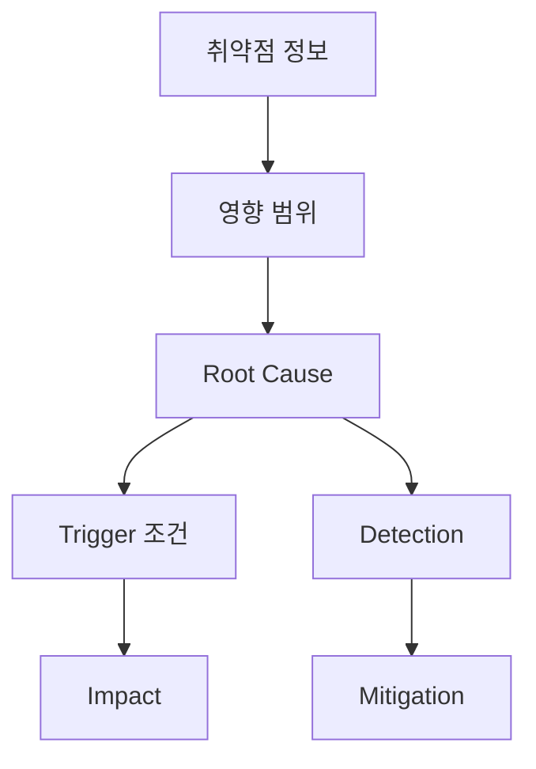

# Description

  
  Image: TimSon Foox / Pexels

## 구조 다이어그램

This is PoC for CVE-2025-48799, an elevation of privilege vulnerability in Windows Update service.

This vulnability affects windows clients (win11/win10) with at least 2 hard drives. When machine have multiple hard drives it is possible to change location where new content is saved using the Storage Sense. If location for new applications is changed to secondary drive, during the installation of new application the wuauserv service will perform arbitrary folder deletion without checking for symbolic links (if file is encountered the service will check final path using GetFinalPathByHandle) which leads to LPE.

This PoC utilise method (and some code) descibed in ZDI blog post: https://www.zerodayinitiative.com/blog/2022/3/16/abusing-arbitrary-file-deletes-to-escalate-privilege-and-other-great-tricks

## PoC

https://github.com/user-attachments/assets/5e8b2a59-b787-4ba7-a6dc-1c71a9b3ba12

