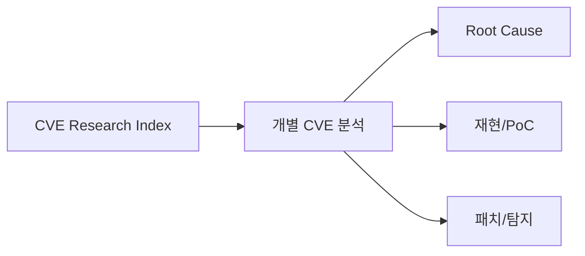

# 2026
## 구조 다이어그램

```mermaid
flowchart LR
    Index["CVE Research Index"] --> Entries["개별 CVE 분석"]
    Entries --> RootCause["Root Cause"]
    Entries --> Repro["재현/PoC"]
    Entries --> Defense["패치/탐지"]
```

CVE 목록입니다.

## CVEs
- [CVE-2026-21858](#/CVE-Research/2026/CVE-2026-21858/README)
