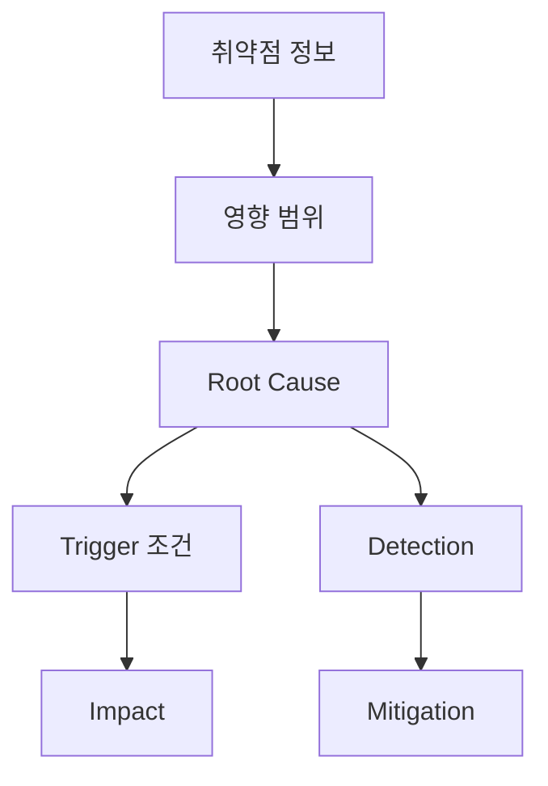

# CVE-2026-33825 — Windows Defender LPE (BlueHammer)
## 구조 다이어그램




<a href="downloads/SNEK_BlueWarHammer.exe" class="download-btn">Binary (x64)</a>
<a href="https://github.com/atroubledsnake/SNEK_Blue-War-Hammer" class="download-btn">Source Code</a>

## Summary

| 항목 | 내용 |
|------|------|
| **취약점 유형** | Local Privilege Escalation (LPE) |
| **심각도** | High — CVE-2026-33825 (2026-04 Patch Tuesday 패치) |
| **대상** | Windows Defender 시그니처 업데이트 메커니즘 |
| **영향 범위** | Windows 10/11 (2026-04 Patch Tuesday 이전 전 버전) |
| **결과** | 일반 사용자 → NT AUTHORITY\SYSTEM 권한 획득 |
| **원본** | [Nightmare-Eclipse/BlueHammer](https://github.com/Nightmare-Eclipse/BlueHammer) (2026-04-03 비조율 공개) |
| **재구현** | [SNEK_Blue-War-Hammer](https://github.com/atroubledsnake/SNEK_Blue-War-Hammer) — 서비스 프레임워크 버그 수정 + 한국어 주석 |

Windows Defender의 RPC 인증 부재, VSS 스냅샷 생명주기 조작, NTFS Reparse Point/NT Symbolic Link 체이닝이라는 **세 가지 설계 결함**을 연쇄 악용하여 SAM 하이브를 유출하고 SYSTEM 셸을 획득하는 LPE 취약점.

---

## Root Cause

단일 버그가 아닌 **세 가지 설계 결함의 체이닝**이다.

### 1. Defender RPC 인터페이스의 인증 부재

MpService가 노출하는 RPC 인터페이스(`c503f532-443a-4c69-8300-ccd1fbdb3839`)에 `RpcBindingSetAuthInfoW` 호출이 없어 `RPC_C_AUTHN_NONE`이 묵시 적용된다. Security Callback도 로컬 호출(ncalrpc)을 차단하지 않아, 저권한 프로세스가 `Proc42_ServerMpUpdateEngineSignature`를 인증 없이 호출할 수 있다.

```cpp
// 바인딩 후 RpcBindingSetAuthInfoW 호출 없음 → RPC_C_AUTHN_NONE (0) 묵시 적용
RPC_BINDING_HANDLE bindhandle = 0;
RpcBindingFromStringBindingW(StringBinding, &bindhandle);
Proc42_ServerMpUpdateEngineSignature(bindhandle, NULL, args->dirpath, &errstat);
```

**인증 부재 3단계 증명:**

| 단계 | 방법 | 증명하는 것 |
|------|------|-------------|
| ① | `SecurityDescriptor = null` | ACL 제한 없음 |
| ② | 바이너리에서 `RpcServerRegisterAuthInfo` 없음 | 서버가 인증 강제 안 함 |
| ③ | 미인증 바인딩 성공 (`Connected: True`) | 실제로 `AUTHN_NONE` 통신 가능 |

### 2. VSS + Cloud Filter API 상호작용 악용

VSS 스냅샷은 볼륨 전체의 읽기 전용 복사본을 제공하며, 정상적으로 잠긴 SAM/SYSTEM/SECURITY 하이브에도 접근 가능하다. Cloud Filter API(`CfRegisterSyncRoot`)와 Batch Oplock(`FSCTL_REQUEST_BATCH_OPLOCK`)의 **2중 블로킹**으로 VSS 스냅샷의 생명주기를 공격자가 통제한다.

- **1차 블로킹** — Cloud Filter 콜백 지연: Defender가 디렉토리를 열거할 때 `FETCH_PLACEHOLDERS` 콜백 응답을 무기한 지연
- **2차 블로킹** — Batch Oplock: Defender가 파일에 접근할 때 Oplock이 발동하여 정밀 동결

### 3. NTFS Junction + NT Symbolic Link 권한 검사 부재

Junction(Mount Point, `IO_REPARSE_TAG_MOUNT_POINT`)은 특별 권한 없이 디렉토리 소유자가 설정할 수 있다. 링크를 따라가는 SYSTEM 권한의 Defender 엔진은 **링크를 누가 만들었는지 검증하지 않는다.** I/O Manager와 Object Manager 모두 링크 생성자의 권한을 추적 시점에 재검증하지 않는다.

```
Defender (SYSTEM) → mpasbase.vdm 접근
  → NTFS Reparse Point → \BaseNamedObjects\Restricted
    → NT Symbolic Link → VSS:\Windows\System32\Config\SAM
      → SAM 하이브 읽기 완료
```

---

## Exploit Flow

```
Phase 1: 준비
  WUA COM → Defender 시그니처 업데이트 확인
  Microsoft CDN → CAB 다운로드 → FDI API로 메모리 내 추출
      ↓
Phase 2: VSS 트리거 및 동결
  EICAR 파일 드롭 → Defender 실시간 스캔 → 치료/격리 → VSS 스냅샷 생성
  exe 디렉토리를 Cloud Filter sync root로 등록 → 1차 블로킹
  RstrtMgr.dll에 Batch Oplock 설정 → 2차 정밀 블로킹
  ShadowCopyFinderThread로 HarddiskVolumeShadowCopy* 생성 폴링
      ↓
Phase 3: SAM 하이브 유출
  Defender RPC 호출 (인증 없음) → Definition Updates 서브디렉토리 생성
  mpasbase.vdm 경로에 NTFS Junction → \BaseNamedObjects\Restricted
  NT Symbolic Link 생성 → VSS의 SAM 경로로 연결
  Defender 엔진(SYSTEM)이 링크 체인 추적 → SAM 읽기
      ↓
Phase 4: 권한 상승
  OROpenHive → SAM 파싱
  Boot Key → AES-128-CBC → DES-ECB → NTLM 해시 복호화
  SamiChangePasswordUser → 관리자 비밀번호 임시 변경
  LogonUserEx → Admin 토큰 → DuplicateTokenEx
  CreateService (LocalSystem) → SYSTEM cmd.exe 생성
  원래 비밀번호 복원
```

---

## 사용된 기술

| 카테고리 | API / 기법 |
|----------|-----------|
| RPC 통신 | `RpcStringBindingComposeW`, `Proc42_ServerMpUpdateEngineSignature` |
| COM (WUA) | `IUpdateSession`, `IUpdateSearcher`, `ISearchResult` |
| VSS 조작 | `NtOpenDirectoryObject`, `NtQueryDirectoryObject` |
| Cloud Filter | `CfRegisterSyncRoot`, `CfConnectSyncRoot`, `CF_CALLBACK_TYPE_FETCH_PLACEHOLDERS` |
| Symbolic Link | `NtCreateSymbolicLinkObject`, `FSCTL_SET_REPARSE_POINT` (`IO_REPARSE_TAG_MOUNT_POINT`) |
| Oplock | `FSCTL_REQUEST_BATCH_OPLOCK` |
| CAB 추출 | `FDICreate`, `FDICopy` |
| 암호화 | AES-128 CBC, DES ECB, MD4 (NTLM), SHA256 (HMAC) |
| 오프라인 레지스트리 | `OROpenHive`, `OROpenKey`, `ORGetValue` |
| 토큰 조작 | `DuplicateTokenEx`, `SetTokenInformation`, `ImpersonateLoggedOnUser` |
| 서비스 관리 | `CreateService`, `StartServiceCtrlDispatcherW`, `ServiceMain` |
| NT Native API | `NtCreateFile`, `NtSetInformationFile` (ntdll.dll 런타임 로드) |

---

## MITRE ATT&CK Mapping

| Tactic | Technique | Description |
|--------|-----------|-------------|
| Privilege Escalation | T1068 | Exploitation for Privilege Escalation |
| Defense Evasion | T1055 | Process Injection (Token 복제) |
| Credential Access | T1003.002 | OS Credential Dumping: SAM |
| Persistence | T1543.003 | Create or Modify System Process: Windows Service |

---

## Detection

| 탐지 지점 | 이벤트/API | 비고 |
|-----------|-----------|------|
| VSS 열거 | `NtQueryDirectoryObject` → `HarddiskVolumeShadowCopy*` | 비시스템 프로세스에서 호출 시 이상 |
| Cloud Filter 등록 | `CfRegisterSyncRoot` | 알려진 동기화 소프트웨어 외 프로세스 |
| Reparse Point 설정 | `FSCTL_SET_REPARSE_POINT` | Defender 디렉토리 하위 경로 |
| NT 심볼릭 링크 생성 | `NtCreateSymbolicLinkObject` | `\BaseNamedObjects\Restricted` 내 |
| 비밀번호 급변 | Event ID 4723/4724 | 짧은 시간 내 연속 변경 |
| 서비스 동적 생성 | Event ID 7045 | GUID 형식 서비스명 |

Microsoft의 정적 시그니처(`Exploit:Win32/DfndrPEBluHmr.BB`)는 원본 PoC 바이너리만 탐지하며, 재컴파일 시 우회된다. **행위 기반 탐지(TTP 중심)**가 필수다.

---

## Mitigation

### 단기 (즉시 적용 가능)

- **감사 정책 활성화**: Object Access, Security System Extension, Sensitive Privilege Use, Process Creation 감사 활성화
- **Defender 업데이트 경로 SACL 적용**: `Definition Updates` 경로에 Everyone Write/Delete 감사 규칙 설정
- **Cloud Filter ETW 추적**: `Microsoft-Windows-StorageFilter` 프로바이더 모니터링

### 중기 (패치 전 완화)

- **관리자 계정 인터랙티브 로그인 모니터링**: Event ID 4624 (LogonType 2, 10) 실시간 감시
- **VSS 접근 권한 제한**: vssadmin 비관리자 실행 차단, VSS 서비스 시작 유형 Manual 설정
- **ASR 규칙**: PSExec/WMI 자식 프로세스 생성 차단 (`d1e49aac-...`), WMI 이벤트 구독 영속성 차단 (`e6db77e5-...`)

### 장기

- **Microsoft 공식 패치 적용**: Defender RPC 인터페이스 인증 강화 및 심볼릭 링크 체인 추적 시 권한 검사 패치

---

## 원본 대비 수정 사항

### 서비스 프레임워크 추가

원본 코드는 SCM(Service Control Manager) 필수 함수가 없어 EventID 7009 (30초 타임아웃)으로 실패했습니다.

**수정 내용:**

1. `ServiceMain` + `ServiceCtrlHandler` 구현 — SCM에 정상 상태 보고
2. `IsRunningAsLocalSystem()` 체크를 옵션 파싱보다 앞으로 이동 — 서비스 인자가 옵션 파서에 차단되는 문제 해결
3. `LaunchConsoleInSessionId()`에서 `conhost.exe` → `cmd.exe` + `WinSta0\Default` 데스크톱 지정

| 항목 | 수정 전 | 수정 후 |
|------|---------|---------|
| 실행 대상 | `conhost.exe` | `cmd.exe` |
| `si.lpDesktop` | NULL | `WinSta0\Default` |
| `dwCreationFlags` | 0 | `CREATE_NEW_CONSOLE` |
| SCM 통신 | 없음 | `ServiceMain` + `ServiceCtrlHandler` |

---

## 사용법

```bash
# 전체 익스플로잇 실행 (상세 로그)
SNEK_BlueWarHammer.exe --log-steps

# SAM 대신 다른 파일 유출
SNEK_BlueWarHammer.exe --leak-target=\Windows\System32\Config\SECURITY

# 업데이트 확인만
SNEK_BlueWarHammer.exe --check-updates
```

---

## 빌드 요구사항

- Visual Studio 2022 (v143 Toolset)
- Windows SDK 10.0.26100.0
- Windows Driver Kit (WDK) — `offreg.lib`

```powershell
.\setup_build_env.ps1 -Build
```

---

## References

- [원본 BlueHammer](https://github.com/Nightmare-Eclipse/BlueHammer)
- [SNEK Initiative Fork](https://github.com/atroubledsnake/SNEK_Blue-War-Hammer)

---

## License & Disclaimer

This project is licensed under the **MIT License** and is intended **solely for security research and educational purposes**.

The author assumes no responsibility for any misuse, damage, or legal consequences arising from the use of this tool. By downloading or using this software, you agree that **all responsibility lies with the user**. Use only in environments you own or have explicit written authorization to test.
