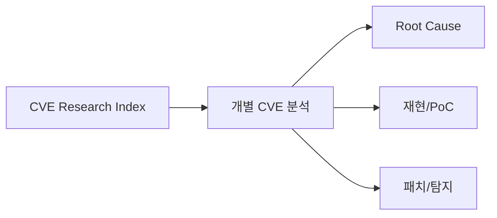

# CVE-Research
## 구조 다이어그램

연도별로 CVE 분석 자료를 정리했습니다.

## Years
- [2017](2017/README.md)
- [2024](2024/README.md)
- [2025](2025/README.md)
- [2026](2026/README.md)

## Highlights
- **CVE-2024-20656** — Visual Studio 기반 권한 상승
- **CVE-2025-14847** — MongoDB Exfiltration
- **CVE-2025-38063** — Windows IPv6 DoS/RCE
- **CVE-2017-10217** — Oracle WebLogic RCE

## Exploit PoC
- [CVE-2026-33825 — BlueHammer](CVE-2026-33825/README.md) — Windows Defender LPE: RPC 인증 부재 + VSS/Cloud Filter 악용 + NTFS Reparse Chain → SAM 유출 → SYSTEM 셸
