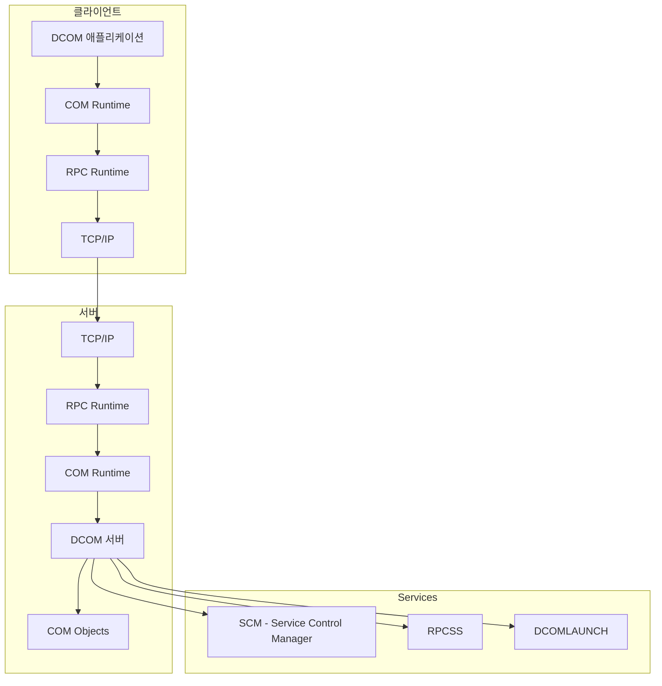
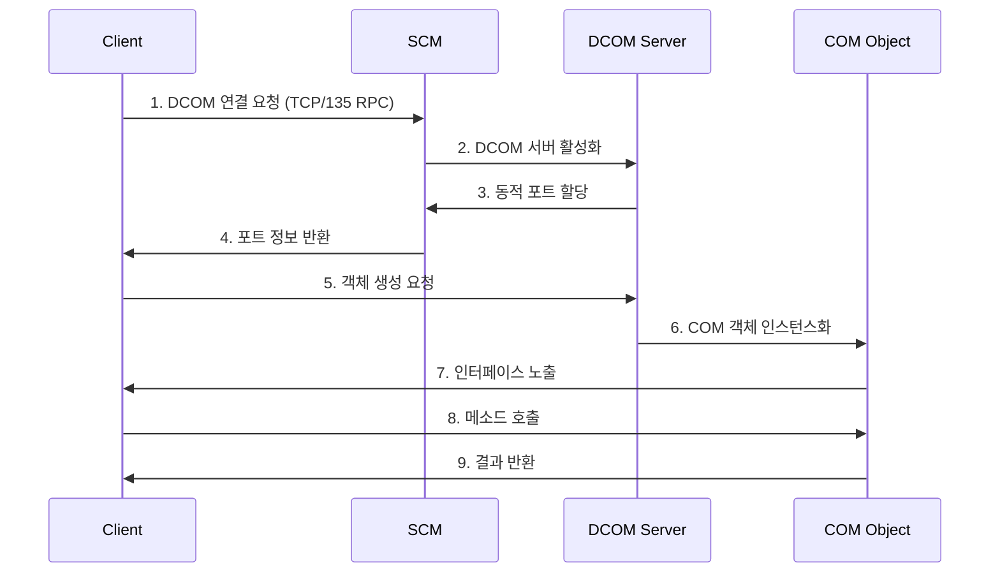

# DCOM

## 개요

DCOM은 서로 다른 컴퓨터에서 실행되는 COM 컴포넌트가 네트워크를 통해 통신할 수 있게 하는 Microsoft 기술입니다. 공격자는 원격 COM 객체 생성을 악용해 명령 실행이나 횡적 이동을 시도할 수 있습니다.

## 프로세스

## 주요 구성 요소

- COM Runtime: 객체 생성, 메서드 호출, 메모리 관리
- RPC Runtime: 네트워크 통신과 데이터 마샬링
- SCM: DCOM 서버 활성화, 포트 할당, 권한 검증
- RPCSS/DCOMLAUNCH: DCOM 실행 기반 서비스

## 탐지 포인트

- TCP/135 및 동적 RPC 포트 연결
- `dllhost.exe`, `mmc.exe`, Office COM 객체 등 원격 활성화 흔적
- `Microsoft-Windows-DCOM/Operational` 이벤트
- COM 객체 실행 후 발생하는 비정상 프로세스 생성

## 대응 방안

1. DCOM 원격 활성화 권한을 최소화합니다.
2. RPC 동적 포트 범위를 제한하고 관리 구간 외부 접근을 차단합니다.
3. DCOM 관련 이벤트와 `4688` 프로세스 생성을 상관 분석합니다.

## 참고자료

- [MS-DCOM Overview](https://learn.microsoft.com/en-us/openspecs/windows_protocols/ms-dcom/86b9cf84-df2e-4f0b-ac22-1b957627e1ca)
- [DCOM Security](https://learn.microsoft.com/en-us/windows/win32/com/dcom-security)
