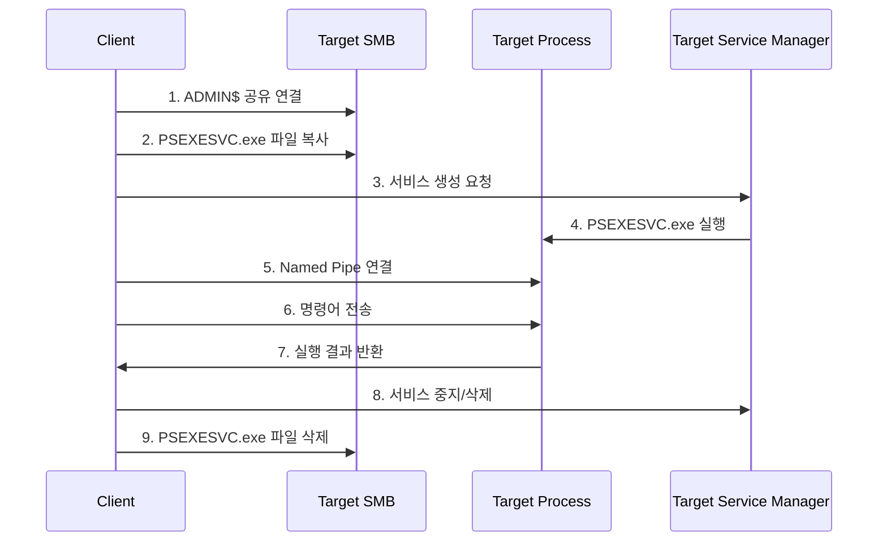
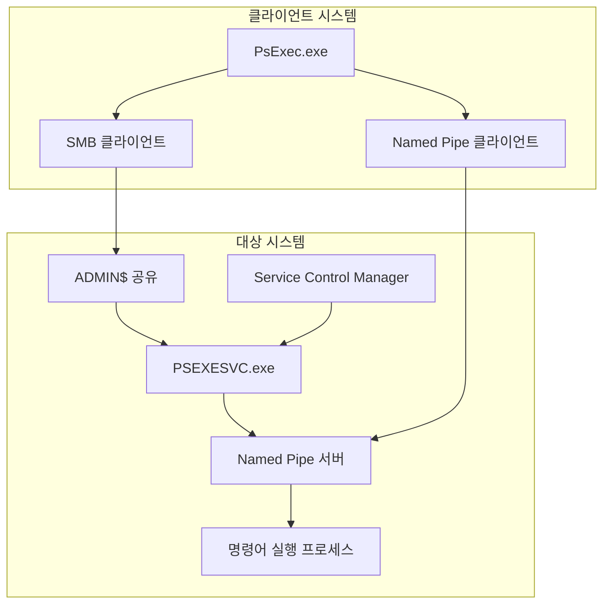

# PSEXEC

## 개요

PsExec는 Sysinternals Suite의 원격 실행 도구입니다. 원격 시스템의 `ADMIN$` 공유와 서비스 제어 관리자(SCM)를 이용해 임시 서비스를 배포하고 명령을 실행할 수 있어, 침해 사고에서는 원격 실행과 횡적 이동 흔적으로 자주 관찰됩니다.

## 동작 흐름





## 관찰 포인트

- `ADMIN$`, `IPC$` 공유 접근
- `PSEXESVC.exe` 파일 생성 및 삭제
- System 이벤트 로그 `7045` 서비스 생성
- Security 이벤트 로그 `4688`에서 `psexesvc.exe` 하위 프로세스 생성
- Named Pipe 기반 원격 명령 입출력

## 탐지 예시

```text
Event ID: 7045
Service Name: PSEXESVC

Event ID: 4688
Creator Process Name: psexesvc.exe
```

## 대응 방안

1. 로컬 관리자 권한과 관리 공유 접근 권한을 최소화합니다.
2. 원격 서비스 생성 이벤트를 SIEM에서 상시 모니터링합니다.
3. 관리 도구 사용 서버와 일반 엔드포인트 간 SMB 흐름을 분리해 봅니다.

## 참고자료

- [PsExec - Sysinternals](https://learn.microsoft.com/en-us/sysinternals/downloads/psexec)
- [Service Control Manager](https://learn.microsoft.com/en-us/windows/win32/services/service-control-manager)
