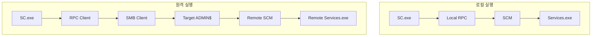
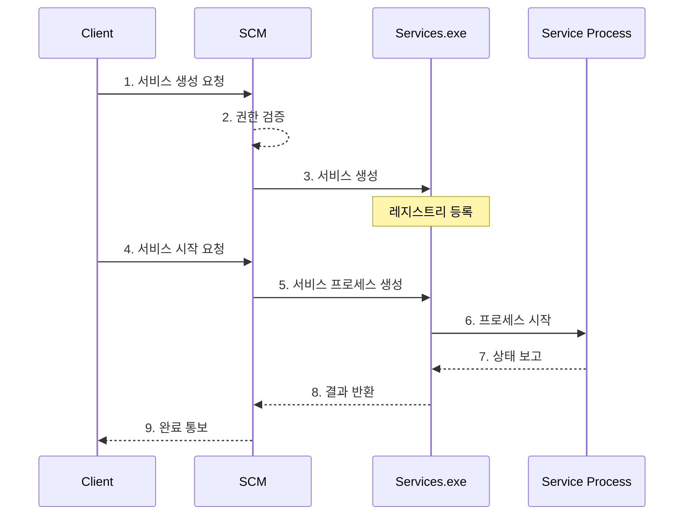

# SC

## 개요

`sc.exe`는 Windows 서비스 관리를 위한 명령줄 도구입니다. 로컬 또는 원격 시스템의 서비스 생성, 시작, 중지, 삭제를 수행할 수 있으며, 공격자는 이를 이용해 서비스 기반 원격 명령 실행을 시도할 수 있습니다.

## 프로세스





## 주요 흔적

- `HKLM\SYSTEM\CurrentControlSet\Services\[서비스명]` 신규 키
- System 이벤트 로그 `7045` 서비스 생성
- Security 이벤트 로그 `4688`에서 `sc.exe`, `services.exe` 관련 프로세스 생성
- 원격 실행 시 RPC, SMB 연결

## 명령 예시

```text
sc create "ServiceName" binpath= "C:\path\to\executable"
sc start "ServiceName"
sc query "ServiceName"
sc stop "ServiceName"
sc delete "ServiceName"
```

## 대응 방안

1. 서비스 생성 권한을 관리자 그룹으로 제한합니다.
2. `7045` 이벤트를 수집하고 비표준 서비스명, 임시 경로, 사용자 프로필 경로 실행을 탐지합니다.
3. 원격 서비스 생성이 필요한 관리 서버를 명확히 분리합니다.

## 참고자료

- [sc.exe create](https://learn.microsoft.com/ko-kr/windows-server/administration/windows-commands/sc-create)
- [Service Control Manager](https://learn.microsoft.com/ko-kr/windows/win32/services/service-control-manager)
