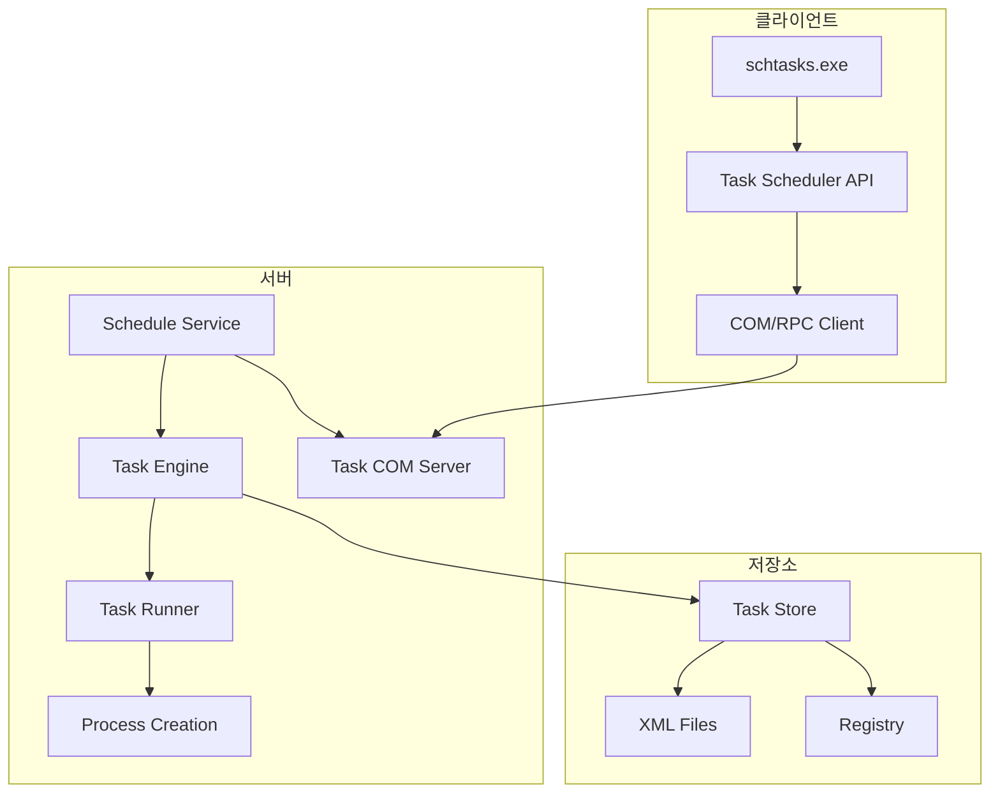
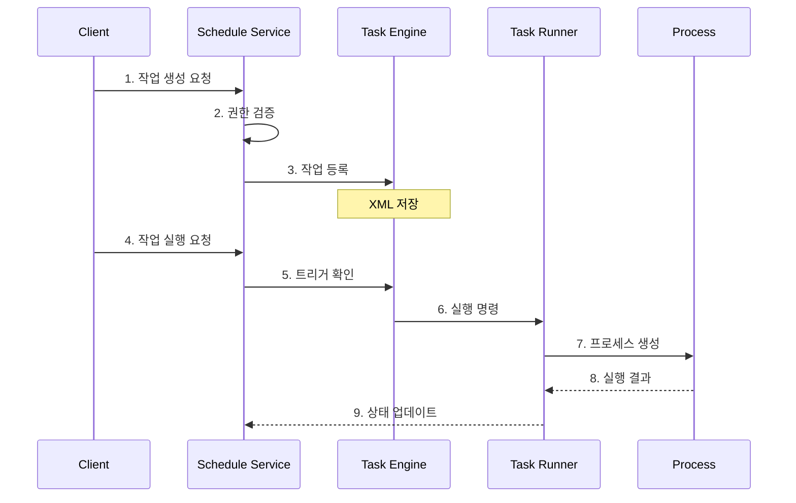

# Scheduler

## 개요

Windows Task Scheduler는 예약 작업을 관리하고 실행하는 서비스입니다. 공격자는 예약 작업을 이용해 명령 실행, 지속성 확보, 원격 실행을 시도할 수 있습니다.

## 프로세스





## 명령 예시

```text
schtasks /create /tn "TaskName" /tr "command" /sc once /st HH:MM
schtasks /create /s remote-pc /u username /p password /tn "TaskName" /tr "command" /sc once /st HH:MM
schtasks /run /tn "TaskName"
schtasks /delete /tn "TaskName" /f
```

## 탐지 포인트

- `Microsoft-Windows-TaskScheduler/Operational` 이벤트 `106`, `200`, `201`
- `C:\Windows\System32\Tasks\` 신규 XML 작업 파일
- `schtasks.exe` 원격 옵션 `/s`, `/u`, `/p`
- 작업 실행 직후 비정상 자식 프로세스 생성

## 대응 방안

1. 원격 작업 생성 권한을 관리 서버와 관리자 계정으로 제한합니다.
2. 예약 작업 생성 이벤트를 모니터링합니다.
3. 시작 시 실행, 로그온 시 실행 같은 지속성 트리거를 주기적으로 점검합니다.

## 참고자료

- [Task Scheduler](https://learn.microsoft.com/ko-kr/windows/win32/taskschd/task-scheduler-start-page)
- [Schtasks.exe](https://learn.microsoft.com/ko-kr/windows/win32/taskschd/schtasks)
