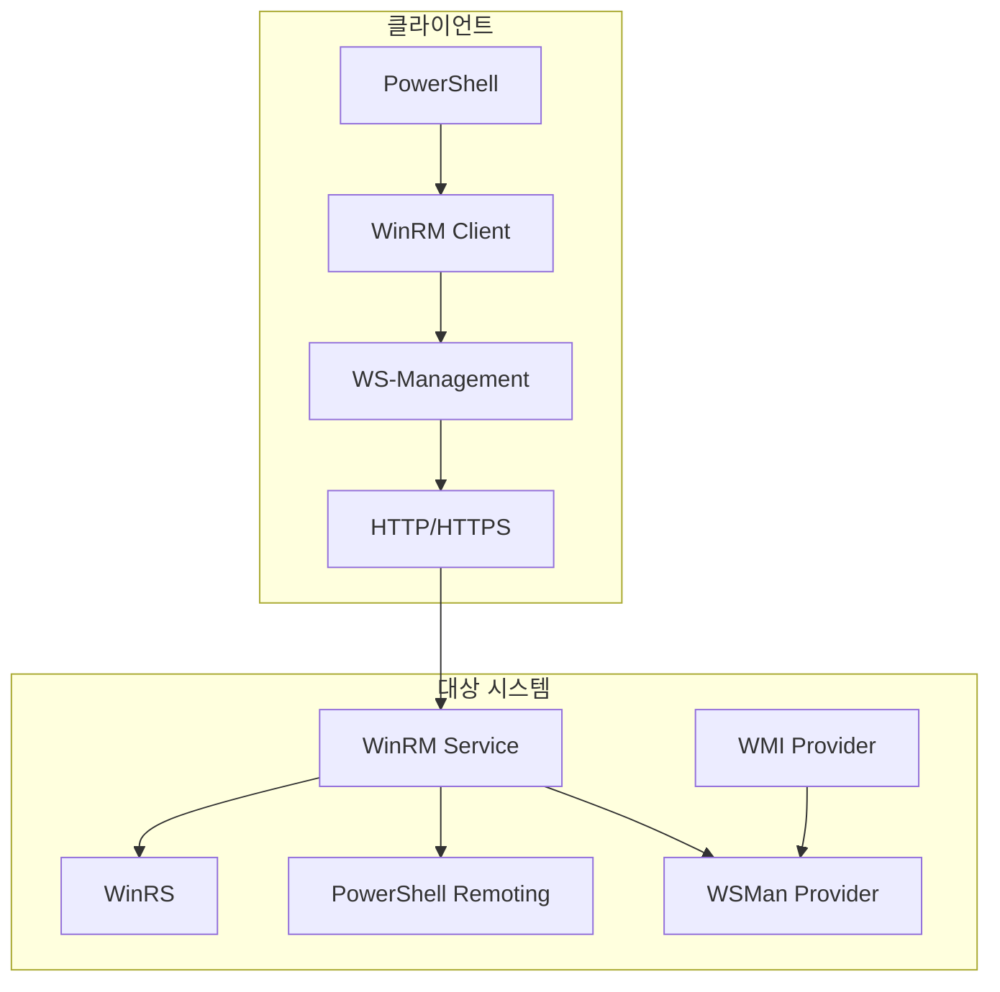
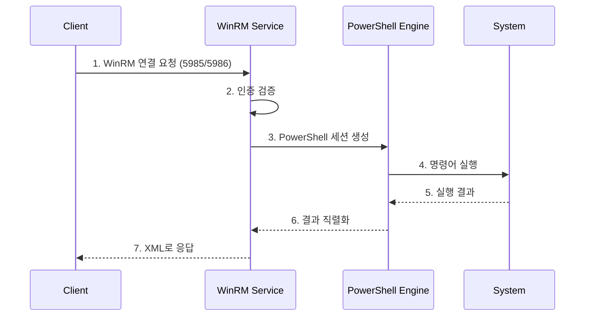

# WINRM

## 개요

WinRM은 Windows Remote Management의 약자로, Microsoft의 WS-Management 프로토콜 구현체입니다. PowerShell Remoting의 기반이며 HTTP/HTTPS를 통해 원격 시스템 관리를 가능하게 합니다.

## 프로세스





## 주요 포트와 인증

- HTTP: TCP/5985
- HTTPS: TCP/5986
- 인증: Kerberos, NTLM, Basic(HTTPS), CredSSP, Certificate-based

## 명령 예시

```powershell
Enter-PSSession -ComputerName target-pc
Invoke-Command -ComputerName target-pc -ScriptBlock { Get-Process }
winrs -r:target-pc "ipconfig"
```

## 탐지 포인트

- `Microsoft-Windows-WinRM/Operational` 연결 이벤트
- PowerShell 이벤트 `4103`, `4104`
- `wsmprovhost.exe` 생성과 비정상 자식 프로세스
- 관리 구간 외부에서 발생하는 TCP/5985, 5986 연결

## 대응 방안

1. HTTPS 사용을 강제하고 Basic/CredSSP 인증을 제한합니다.
2. TrustedHosts 설정을 최소화합니다.
3. PowerShell Script Block Logging과 WinRM Operational 로그를 활성화합니다.
4. JEA(Just Enough Administration)를 적용해 원격 세션 권한을 제한합니다.

## 참고자료

- [Windows Remote Management](https://learn.microsoft.com/en-us/windows/win32/winrm/portal)
- [PowerShell Remoting Security Considerations](https://learn.microsoft.com/en-us/powershell/scripting/learn/remoting/winrmsecurity)
