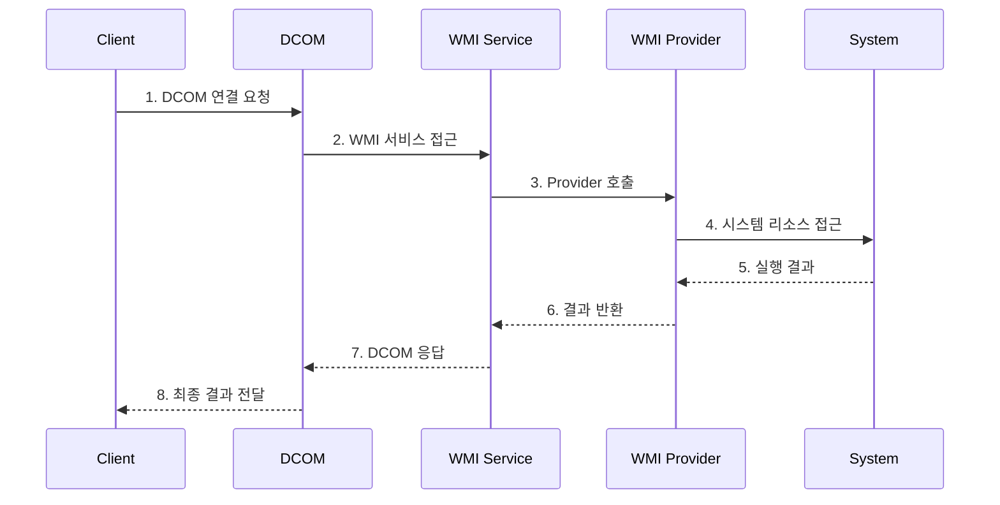
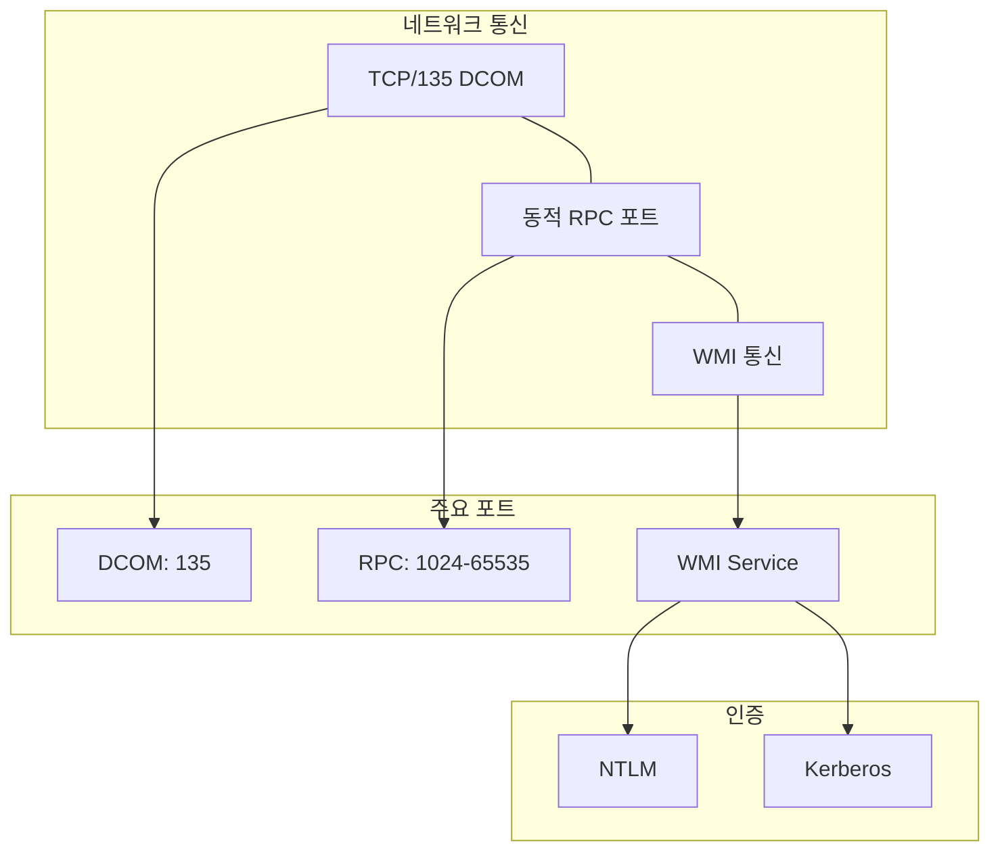

# WMIC

## 개요

WMIC는 WMI(Windows Management Instrumentation)의 명령줄 인터페이스입니다. 시스템 정보 수집부터 원격 프로세스 생성까지 다양한 관리 작업에 쓰이며, 침해 상황에서는 `wmiprvse.exe`를 통한 원격 실행 흔적으로 나타날 수 있습니다.

## 기본 아키텍처





## 명령 예시

```text
wmic os get caption,version,osarchitecture
wmic process list brief
wmic process call create "notepad.exe"
wmic /node:"targetcomputer" process call create "cmd.exe /c command"
```

## 탐지 포인트

- WMI Activity 이벤트 `5857-5861`
- Security 이벤트 `4688`에서 `wmiprvse.exe` 하위 프로세스 생성
- TCP/135 및 동적 RPC 포트 연결
- `wmic.exe` 실행과 원격 노드 지정 인자

## 대응 방안

1. WMI 원격 접근 가능 계정을 최소화합니다.
2. WMI Activity 로그를 활성화하고 중앙 수집합니다.
3. 관리 구간 외부에서 발생하는 DCOM/WMI 트래픽을 차단합니다.

## 참고자료

- [WMI Documentation](https://learn.microsoft.com/en-us/windows/win32/wmisdk/wmi-start-page)
- [WMIC](https://learn.microsoft.com/en-us/windows/win32/wmisdk/wmic)
