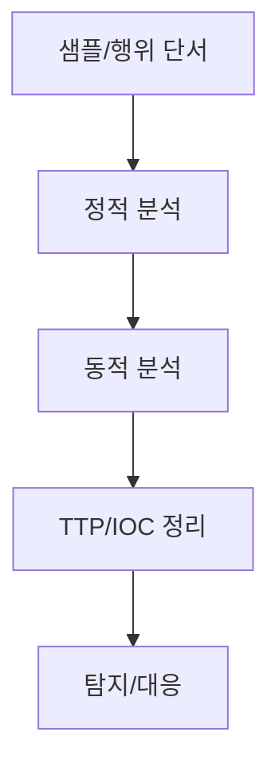

# Malware Analysis Notes
## 구조 다이어그램

악성코드 분석 보고서로 정리하기 전 단계의 기술 메모를 모으는 공간입니다.

---

## 예정 주제

- PE 구조와 Import Table 기반 행위 추정
- 문자열 복호화 루틴 분석 패턴
- IOC 추출 체크리스트
- YARA/Sigma 룰 작성 메모
- Ghidra/x64dbg 분석 워크플로우

정식 분석 보고서는 상위 [Malware-Analysis](../../Malware-Analysis/README.md) 섹션에 정리합니다.
