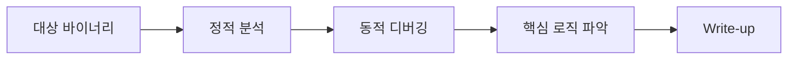

# Reverse Engineering

  
  Image: Nemuel Sereti / Pexels

## 구조 다이어그램

Dreamhack, CTF, 교육용 바이너리 분석을 통해 정적 분석, 디컴파일러 검증, 조건 분기 추적, 런타임 검증 과정을 기록합니다.

---

## Writeups

| 문제 | 주제 | 핵심 포인트 |
|------|------|-------------|
| [Dreamhack rev-basic-0](Dreamhack-rev-basic-0.md) | 입력 검증 루틴 분석 | 문자열 Xref, `strcmp`, 조건 분기, 성공 경로 추적 |

---

## Tool Notes

- [Reversing Tools - GDB / WinDbg / Ghidra](../Toolbox/Reversing-Tools.md)

---

## 작성 기준

- 정답보다 분석 근거를 우선 기록합니다.
- 함수 VA/RVA, 주요 분기, 비교 루틴, 호출 인자를 가능한 범위에서 남깁니다.
- 플래그나 전체 해답을 그대로 노출하기보다 분석 방법 중심으로 정리합니다.
