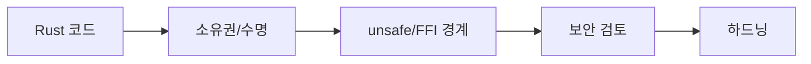

# Rust Security

  
  Image: Nemuel Sereti / Pexels

## 구조 다이어그램

Rust 기반 보안 도구, 탐지 엔진, 시스템 프로그래밍 학습 내용을 정리하는 공간입니다.

---

## 예정 주제

- Rust CLI 보안 분석 도구
- 파일 해시/문자열 기반 탐지 엔진
- YARA/IOC 연동 구조
- Windows/Linux 이벤트 수집기 설계
- unsafe Rust와 FFI 보안 고려사항

리버스 엔지니어링 트랙을 완료한 뒤 Rust 기반 보안제품 개발 트랙에서 본격적으로 확장합니다.
