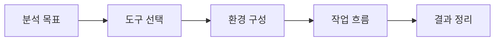

# Toolbox Notes

  
  Image: Nemuel Sereti / Pexels

## 구조 다이어그램

Notion의 `도구 모음`에 정리되어 있던 분석 도구 사용법을 포트폴리오용 기술 노트로 분리했습니다.  
실제 분석 업무에서 반복적으로 쓰는 도구의 설치, 기본 조작, 관찰 포인트를 빠르게 확인하기 위한 섹션입니다.

## Notes
- [Reversing Tools - GDB / WinDbg / Ghidra](Reversing-Tools.md)
- [GNS3 네트워크 시뮬레이션](GNS3.md)
- [Canary File](../MITRE-ATTACK/Defense/Canary-File.md)
