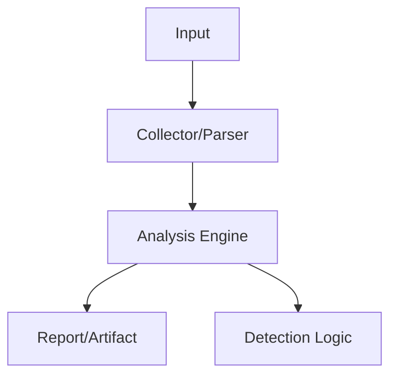

# CVE-Scanner
<p class="doc-hero">
  
  <span class="doc-hero-caption">Image: Nemuel Sereti / Pexels</span>
</p>
## 구조 다이어그램




<a href="downloads/cveScanner-window.exe" class="download-btn">Windows (x64)</a>
<a href="downloads/cveScanner-linux" class="download-btn">Linux (x64)</a>

## 개요

NVD(National Vulnerability Database)에서 제공하는 CVE 데이터와 시스템에 설치된 프로그램 목록을 비교하여, 보안 취약점을 자동 식별하는 CLI 도구입니다.

| 항목 | 내용 |
|------|------|
| **플랫폼** | Windows / Linux (크로스 빌드) |
| **입력** | NVD CVE JSON 데이터 디렉토리 |
| **출력** | 취약 프로그램 및 매칭된 CVE 목록 |
| **매칭 방식** | REGEX 기반 소프트웨어명/버전/벤더 매칭 |

---

## 동작 방식

```
[NVD CVE JSON 데이터 로드]
        ↓
[시스템 설치 프로그램 목록 수집]
        ↓
[REGEX 매칭 (소프트웨어명, 버전, 벤더)]
        ↓
[매칭된 CVE 결과 출력]
```

1. NVD에서 다운로드한 CVE JSON 데이터를 파싱
2. 시스템에 설치된 소프트웨어 이름, 버전, 벤더 정보 수집
3. CVE 데이터의 CPE(Common Platform Enumeration) 정보와 REGEX 매칭
4. 매칭된 취약점 정보를 사용자에게 출력

---

## 사용법

```bash
# Windows
cveScanner-window.exe <CVE_DATA_DIR> <OUTPUT_DIR>

# Linux
./cveScanner-linux <CVE_DATA_DIR> <OUTPUT_DIR>
```

- `CVE_DATA_DIR`: NVD CVE JSON 데이터가 저장된 디렉토리
- `OUTPUT_DIR`: 스캔 결과 출력 디렉토리

---

## 활용 시나리오

- PoC 테스트 환경 사전 점검 시 취약 소프트웨어 식별
- BAS 시나리오 설계를 위한 타겟 취약점 선정
- 보안 점검 자동화 파이프라인에 통합
