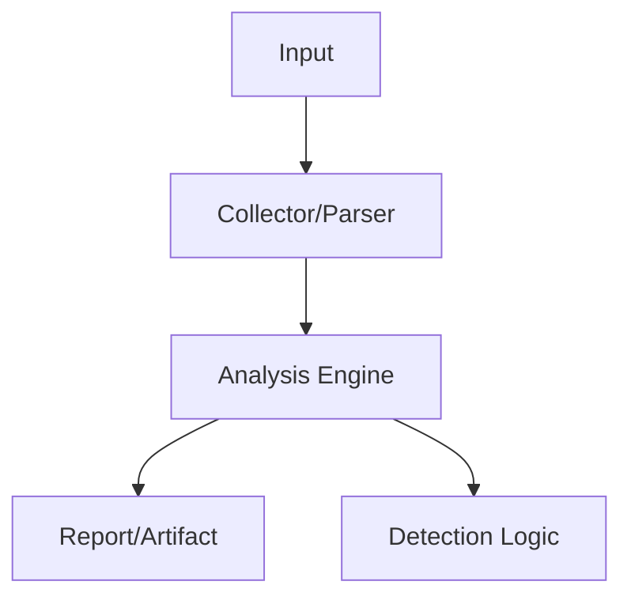

# Chrome Password Recovery
<p class="doc-hero">
  
  <span class="doc-hero-caption">Image: Nemuel Sereti / Pexels</span>
</p>
## 구조 다이어그램




<a href="downloads/cpr_fix.exe" class="download-btn">Windows (x64)</a>

## 개요

Google Chrome에 저장된 웹사이트 자격증명(URL, 사용자명, 비밀번호)을 복구하는 도구입니다.  
BAS(Breach & Attack Simulation) 시나리오에서 **Credential Access (T1555.003 — Credentials from Web Browsers)** 단계를 시뮬레이션하기 위해 개발되었습니다.

| 항목 | 내용 |
|------|------|
| **언어** | Go |
| **플랫폼** | Windows Only |
| **대상** | Chrome Login Data (SQLite) |
| **암호화** | DPAPI + AES-256-GCM (v10) / DPAPI + ChaCha20-Poly1305 (v20) |

---

## 기술 상세

### 지원 Chrome 버전

| 버전 | 암호화 방식 | 키 소스 |
|------|------------|---------|
| < 80 | Windows DPAPI | - |
| 80+ (v10) | AES-256-GCM | `Local State` → `os_crypt.encrypted_key` (DPAPI 보호) |
| 최신 (v20) | AES-256-GCM | `Local State` → `os_crypt.app_bound_encrypted_key` (SYSTEM DPAPI + ChaCha20) |

### 동작 흐름

```
[Chrome Login Data 파일 복사 (잠금 우회)]
        ↓
[SQLite에서 origin_url, username, password 추출]
        ↓
[패스워드 prefix 확인 (v10 / v20 / legacy)]
        ↓
[Master Key 획득]
  ├── v10: Local State → Base64 → DPAPI Decrypt
  └── v20: Local State → Base64 → SYSTEM DPAPI → User DPAPI → ChaCha20
        ↓
[AES-256-GCM 복호화 (Nonce + Ciphertext)]
        ↓
[평문 자격증명 출력]
```

### 핵심 구현

**SYSTEM 토큰 획득 (v20 App-Bound Encryption)**

v20 암호화는 SYSTEM 컨텍스트에서 DPAPI 복호화가 필요합니다. `lsass.exe` 프로세스의 토큰을 복제하여 SYSTEM으로 Impersonate합니다.

```go
// lsass.exe에서 SYSTEM 토큰 획득
func getSystemToken() (windows.Token, error) {
    processHandle, _ := findLsassProcess()
    windows.OpenProcessToken(*processHandle, TOKEN_DUPLICATE|TOKEN_QUERY, &token)
    windows.DuplicateTokenEx(token, TOKEN_ALL_ACCESS, nil,
        SecurityImpersonation, TokenPrimary, &duplicatedToken)
    return duplicatedToken, nil
}
```

**활성 사용자 세션 자동 탐지**

서비스(Session 0)에서 실행될 때도 활성 사용자 세션의 Chrome 데이터에 접근할 수 있도록 WTS API로 세션을 탐지합니다.

```go
func GetCurrentUserSessionId() (windows.Handle, error) {
    sessionList, _ := WTSEnumerateSessions()
    for i := range sessionList {
        if sessionList[i].State == windows.WTSActive {
            return windows.Handle(sessionList[i].SessionID), nil
        }
    }
    return windows.Handle(WTSGetActiveConsoleSessionId()), nil
}
```

---

## MITRE ATT&CK Mapping

| Tactic | Technique |
|--------|-----------|
| Credential Access | T1555.003 — Credentials from Web Browsers |
| Credential Access | T1539 — Steal Web Session Cookie |
| Privilege Escalation | T1134 — Access Token Manipulation |

---

## 참고자료

- [Chrome Login Data 구조](https://www.nicehash.com/blog/post/browser-password-encryption-in-chromium)
- [DPAPI 문서](https://docs.microsoft.com/en-us/windows/win32/api/dpapi/)
- [Chrome App-Bound Encryption](https://security.googleblog.com/2024/07/improving-security-of-chrome-cookies-on.html)
