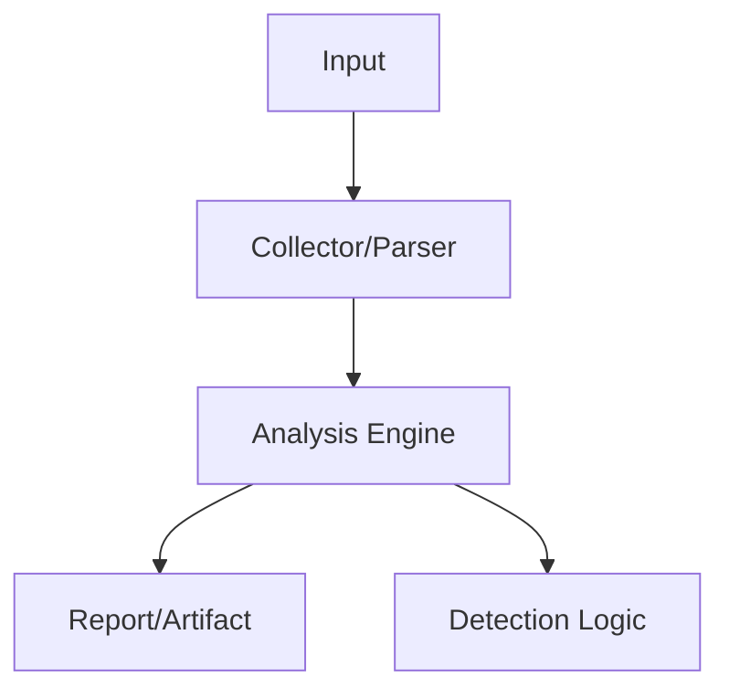

# Tools

  
  Image: Nemuel Sereti / Pexels

## 구조 다이어그램

보안 분석, 취약점 점검, 공격 시뮬레이션을 위해 개발한 도구 모음입니다.

---

## 개발 도구 목록

| 도구 | 언어 | 용도 | 플랫폼 | 다운로드 |
|------|------|------|--------|----------|
| [CVE-Scanner](CVE-Scanner.md) | Go | NVD 기반 시스템 취약점 스캐너 | Windows / Linux | <a href="downloads/cveScanner-window.exe" class="badge badge-blue">Win</a> <a href="downloads/cveScanner-linux" class="badge badge-green">Linux</a> |
| [Chrome Password Recovery](Chrome-Password-Recovery.md) | Go | Chrome 저장 자격증명 복구 (BAS용) | Windows | <a href="downloads/cpr_fix.exe" class="badge badge-blue">Win</a> |
| [hping3 Static Builder](hping3-Static-Builder.md) | Docker / Alpine | 정적 링크 hping3 빌드 시스템 | Linux | <a href="downloads/hping3_static" class="badge badge-green">Linux</a> |
| [BlueHammer (CVE-2026-33825)](../CVE-Research/CVE-2026-33825/README.md) | C++ | Windows Defender LPE — SAM 유출 → SYSTEM 셸 | Windows | <a href="downloads/SNEK_BlueWarHammer.exe" class="badge badge-blue">Win</a> <a href="https://github.com/atroubledsnake/SNEK_Blue-War-Hammer" class="badge badge-purple">Source</a> |

---

## License & Disclaimer

본 페이지의 모든 공개 도구는 **MIT License** 하에 배포되며, **보안 연구 및 교육 목적**으로만 제공됩니다.

도구의 오용, 손해, 법적 결과에 대한 책임은 전적으로 **사용자에게** 있습니다. 본인 소유이거나 명시적 서면 허가를 받은 환경에서만 사용하십시오.

---

## 기타 내부 도구 (비공개)

Career 섹션에 기술된 SOMMA 내부 개발 도구:

- **Banner Scraper** — 서비스 배너/버전 자동 수집, 취약 버전 식별
- **Packet Generator** — 커스텀 패킷 생성/전송, 네트워크 취약점 검증
- **AD 내부 정찰 도구** — LDAP API 기반 도메인 열거, Trust 관계 매핑
- **Excel-to-Cheiron 변환 도구** — API 연동 템플릿 자동 변환
- **Malware Dropper** — 시나리오용 페이로드 드롭퍼 (Python/Rust)
