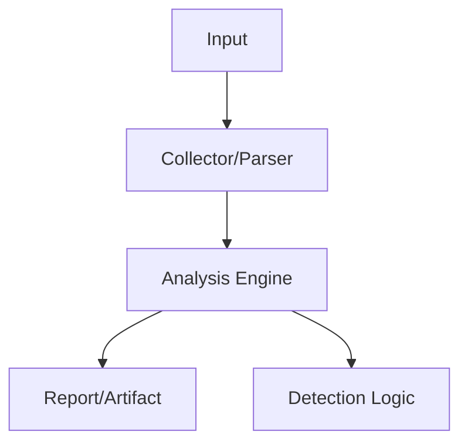

# hping3 Static Binary Builder
<p class="doc-hero">
  
  <span class="doc-hero-caption">Image: Nemuel Sereti / Pexels</span>
</p>
## 구조 다이어그램




<a href="downloads/hping3_static" class="download-btn">Linux Static Binary</a>
<a href="downloads/hping3-Dockerfile" class="download-btn">Dockerfile</a>

## 개요

**hping3**를 완전한 정적 링크(static link) 바이너리로 빌드하여 어떤 Linux 배포판에서도 실행 가능하도록 만드는 Docker 기반 빌드 시스템입니다.

| 항목 | 내용 |
|------|------|
| **빌드 환경** | Docker + Alpine Linux (musl libc) |
| **출력** | 단일 정적 바이너리 (~1.4MB) |
| **용도** | 보안 테스트, 방화벽 테스트, DDoS 시뮬레이션 |
| **라이선스** | GPL v2 (hping3 원본) |

---

## 왜 Static 빌드인가?

| 일반 빌드 (Dynamic) | Static 빌드 |
|---------------------|-------------|
| 라이브러리 의존성 필요 | 독립 실행 가능 |
| 시스템마다 실행 안될 수 있음 | 모든 Linux에서 작동 |
| 배포 시 의존성 관리 필요 | 파일 하나만 복사 |
| 파일 크기 작음 (~500KB) | 파일 크기 큼 (~1.4MB) |

BAS 테스트 환경에서 다양한 Linux 배포판에 hping3를 빠르게 배포해야 하는 요구사항에서 개발되었습니다.

---

## 빌드

```bash
# Docker 이미지 빌드
docker build -t hping3:latest .

# 바이너리 추출
docker create --name temp-hping3 hping3:latest
docker cp temp-hping3:/usr/local/bin/hping3 ./hping3-static
docker rm temp-hping3
chmod +x ./hping3-static

# Static 빌드 검증
ldd ./hping3-static
# 출력: "not a dynamic executable"
```

### 빌드 프로세스 (Dockerfile)

```
Alpine Linux (musl libc 기반)
  ↓ git clone hping3 repository
  ↓ BPF 헤더 경로 패치
  ↓ delaytable 선언 패치
  ↓ Makefile: -static 플래그 추가, TCL 의존성 제거
  ↓ make && strip
  ↓ Static 링크 자동 검증
  ↓ Multi-stage build → 런타임 이미지 (~8MB)
```

---

## 활용 시나리오

### 네트워크 보안 테스트

```bash
# TCP SYN Flood 시뮬레이션 (격리 환경)
sudo ./hping3-static -S -p 80 --flood --rand-source 192.168.1.100

# 방화벽 룰 테스트
sudo ./hping3-static -A -p 80 -c 5 192.168.1.100    # ACK 패킷
sudo ./hping3-static -S -p 80 -f -c 5 192.168.1.100  # Fragment 패킷

# 포트 스캔
for port in 22 80 443 3306 8080; do
    sudo ./hping3-static -S -p $port -c 1 192.168.1.100
done
```

### Docker 격리 테스트 환경

```bash
# 격리 네트워크 구성
docker network create --subnet=172.20.0.0/16 testlab

# 타겟 서버
docker run -d --name target --network testlab --ip 172.20.0.10 nginx:alpine

# 공격 실행
docker run --rm --network testlab --cap-add=NET_RAW \
  hping3:latest -S -p 80 -c 10 172.20.0.10
```

---

## 성능

| 항목 | 값 |
|------|-----|
| 최대 PPS | ~100,000+ (--flood) |
| CPU 사용률 | 1 코어 ~80% (@flood) |
| 메모리 사용 | ~5MB |
| 빌드 시간 | ~2-3분 |
| 런타임 이미지 | ~8MB |
| 바이너리 크기 | ~1.4MB |

---

## 참고자료

- [hping3 원본 (antirez)](https://github.com/antirez/hping)
- [Alpine Linux](https://alpinelinux.org/)
- [musl libc](https://musl.libc.org/)
